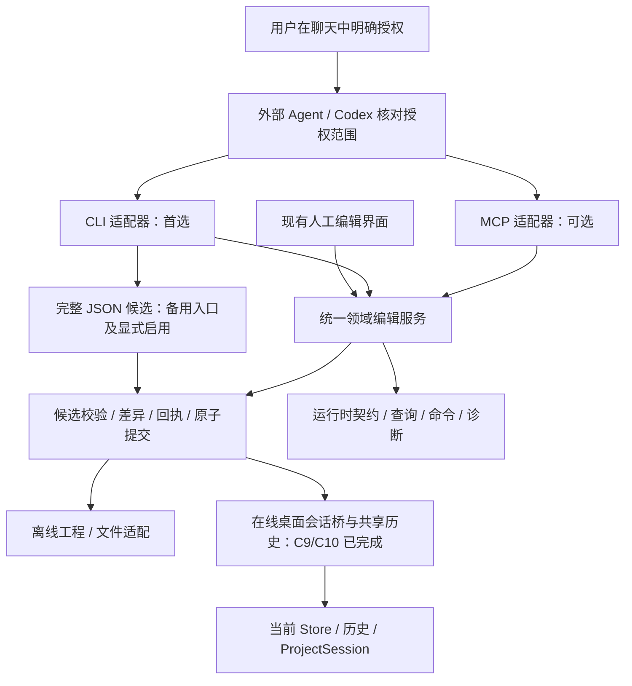

# 外部 Agent 工程编写与编辑接口开发建议

方案日期：2026-10-08；C5 完成：2026-10-09。初始核对基线：`88f649f` / `1.0.0-beta`；当前结果见实施报告。

**当前状态：CLI C1–C10 已完成。** A1/A2 离线首版与 A3 在线会话/历史均已交付，后续进展见下方。已按用户要求收敛为供 Codex 等外部 Agent 使用的接口；不开发软件内 AI 调用、模型提供方或聊天面板。CLI 提供独立只读命令、工程/层级/资源、完整 FSM/演出图编辑、调用上下文、离线事务、聊天授权约定下的备用 JSON 编辑及 Windows x64 配套发行。见 [C1](./CLI_C1_Implementation.md)、[C2](./CLI_C2_Implementation.md)、[C3](./CLI_C3_Implementation.md)、[C4](./CLI_C4_Implementation.md)、[C5 报告](./CLI_C5_Implementation.md)及 [实际使用说明](./CLI_Agent_Usage.md)。MCP、模板/布局增强和模拟器仍为计划。

具体离线首版范围、目录、工具选择、命令、事务/IO、C1–C5 实施顺序与验收见 [CLI 首版开发建议](./CLI_Implementation_Plan.md)。C1–C5 是原 A1/A2 的执行拆分；A3 的在线 epoch、整批 GUI 撤销及 CLI 历史已由 C8–C10 验收。

**2026-10-09 后续进展：C6–C10 已完成**。当前 22 个入口、47 种领域操作；层级删除、永久资源删除、兼容转换、授权覆盖、Windows 在线原子编辑及 CLI history list/undo/redo 均已交付，见 [C10 报告](./CLI_C10_Implementation.md)。GUI/CLI 共用历史，实际桌面与 CLI 包按协议 2 配套验收。最高权限统一按 [CLI 方案 §1.3](./CLI_Implementation_Plan.md#13-下一阶段最高权限扩展用户已确认)；面板、导航、偏好不增加指令。

**用户新增的必需约束（2026-10-08）**：所有 CLI 新建资产的 `assetName` 必须由外部明确传入，包含根 Stage、自动产生的初始状态、克隆/模板内部资产；不能从 name/ID/翻译/模板默认值推导。编辑已有对象未传该字段时保留原值，不替旧数据自动补名。目前没有 assetName 的对象不新增该文件字段，范围和检查细则由上述 CLI 文档 §1.1 维护。

**完整 JSON 能力**：开放全部 `.puzzle.json` 只读，包括文件包装、业务数据和 editorState，另提供原文读取；独立完整 JSON 候选编辑作为备选。按 2026-10-09 用户澄清，最高权限由用户在 Agent 聊天中明确授予，Agent 仅在授权项目/任务/范围内直接编写或修改 JSON；已有范围内授权不重复询问。详细规则唯一维护在 [CLI 文档 §1.2](./CLI_Implementation_Plan.md#12-用户已明确的要求完整-json-可读直接编辑须先获聊天授权)。不开发桌面审批窗口、一次性批准凭据或审批宿主；CLI 的显式启用声明不是聊天授权真实性证明。

## 目标与判断

让外部 Agent 能发现工程和可用资源，以少量明确操作创建/编辑谜题，取得可修正的诊断，保存有效的 `.puzzle.json` 并导出运行时文件。在线模式再提供当前编辑器会话修改、撤销和保存。减少模型猜字段、猜引用、覆盖未保存内容、重复创建和留下半成品的机会。

**如果第一版只选一种入口，建议先提供 CLI。** 当前重点是本地项目文件创建和编辑，CLI 便于脚本复现、命令行排错和自动回归；Codex 本身可运行命令。MCP 的主要增益是客户端发现工具、读取参数说明并调用结构化接口，适合后续降低接入成本。Codex 支持连接本地 STDIO MCP；参考 [Codex CLI](https://learn.chatgpt.com/docs/codex/cli)、[Codex MCP](https://learn.chatgpt.com/docs/extend/mcp?surface=cli)。

| 判断维度 | CLI | MCP |
| --- | --- | --- |
| 本地文件与批处理 | 直接指定输入/输出，可保存完整调用记录 | 可支持同一流程，需要 MCP 客户端连接 |
| Agent 如何认识功能 | `describe --json`、帮助、使用指南 | 工具发现、输入 Schema、服务说明 |
| 调用和反馈 | 命令参数或计划文件 + JSON 结果 + 退出码 | 结构化工具参数和结果 |
| 当前桌面工程实时修改 | 需要桌面会话桥 | 同样需要桌面会话桥 |
| 项目正确性 | 取决于共用领域规则、事务与验证 | 取决于同一套规则，不因采用 MCP 自动提高 |

开发顺序为 **统一领域编辑服务 → 最小 CLI → 按需增加桌面会话桥 / MCP**。A1/A2 就能交付外部 Agent 的文件工作闭环；在线编辑和 MCP 是独立的后续选择，不要求同时开发两个入口。如果目标客户端只能调用 MCP，或实际使用更重视自动发现工具，可以在核心稳定后优先交付 MCP 适配器。

CLI 是命令行入口；MCP 是工具发现、调用和上下文提供的协议。MCP Server 暴露应用能力，不自动提供模型或保证生成的玩法正确。MCP 官方定义工具的输入/输出 Schema、结构化结果与执行错误；资源可提供项目和规范上下文。参考 [Tools](https://modelcontextprotocol.io/specification/2025-11-25/server/tools)、[Resources](https://modelcontextprotocol.io/specification/2025-11-25/server/resources)。这里引用已发布章节；实际开发时锁定并验证 SDK/客户端组合。

本软件只负责执行和验证；理解自然语言需求、选择模型、账号登录、生成计划和向用户解释由外部 Agent 承担。使用本项目的 CLI/MCP 不要求 Puzzle Editor 配置 AI API Key。

## 当前基础与缺口

| 当前源码 | 可复用部分 | 尚需补齐 |
| --- | --- | --- |
| `utils/projectImport/` | 共同四格式转换、未知字段拒绝、固定导入上下文；C7 CLI 回执重建已交付 | 后续新格式仍需明确迁移依据与验收 |
| `utils/validation/` | 命名、结构、引用、作用域、生命周期、临时参数、删除/导入检查及机器诊断 | 现有规则未穷举玩法正确性 |
| `store/editorStore.ts` / reducer / actionPolicy | 同步 Store、单调 epoch、原子提交和 GUI/CLI 共享历史 | 跨重启历史明确不在本轮 |
| `store/commands/automation/` / `contracts/automation/` | 47 种领域操作、严格输入、共同权限、文件/在线/历史契约 | 新需求须继续扩展共同契约，不能直接暴露任意 Action |
| `services/projectSession.ts` / `onlineSession.ts` | 保存队列、切换/关闭保护、字段屏障、在线并发与授权限制 | 完整历史跨进程持久重放不在本轮 |
| Electron 文件服务 | 原子替换、排他创建、文件指纹、C8 所有权及 C9/C10 本地在线桥 | 首轮仅验 Windows；其他平台须独立实现并验证 |
| `syncExternal` | 只合并资源状态，保留本地未保存内容 | 不支持外部整份文件修改的实时完整合并 |

已有 TypeScript 类型不能替代运行时输入检查。在线普通批次通过受限 COMMIT_AUTOMATION 一次提交，不能从外部逐个派发任意 Store Action 冒充事务。公开 token 使用独立 contentEpoch；历史恢复的 document.revision 不替代跨进程版本或文件所有权。

## 直接生成工程文件与领域 CLI 的区别

两种方式最终都可以生成合法的 `.puzzle.json`。直接生成时，Agent 负责构造完整存储结构；领域 CLI 则让 Agent 描述创建/修改意图，由软件的公共服务构造和检查工程。C1–C5 已完成离线领域写接口，C9/C10 已完成在线 GUI 提交及共享历史。“操控编辑器”不要求模拟鼠标点击，也不要求离线任务启动 GUI。

| 维度 | Agent 直接生成整份文件 | Agent 使用领域 CLI |
| --- | --- | --- |
| 格式知识 | 需了解文件封装、必需字段、默认值及关联结构 | 需了解命令契约；序列化与非 assetName 默认值由软件维护，资产名始终由外部提供 |
| ID 与引用 | Agent 或它编写的生成脚本分配 ID、填充引用 | 服务生成 ID，支持同批别名，校验所有关联 |
| 编辑已有工程 | 全量重写可能误改无关内容；定向 JSON 编辑可降低风险 | 提交目标 ID 和局部计划，可由服务端执行 scope 限制 |
| 错误发现 | 可先生成候选再导入/校验；直接写入并不代表自动校验 | 接口执行前检查参数，提交前校验完整候选，返回可修正诊断 |
| 失败与并发 | 需额外实现候选文件、版本检查、原子写入和重试规则 | 由共用事务、token 和 IO 服务统一处理这些规则 |
| 当前软件会话 | 外部文件改动不自动纳入当前 Undo 或未保存状态 | 仅增加在线桥后才能进入当前 Store、Undo 和保存流程 |
| 玩法正确性 | 正确 JSON 不保证谜题符合设计或引擎脚本正确 | 结构和领域校验同样不能保证全部玩法；仍需场景/引擎验证 |
| 开发成本 | 提供格式说明、示例和校验即可开始尝试 | 需维护命令契约、实现业务操作并覆盖回归；适合持续自动编辑 |

例如创建一个 Door 谜题及 Locked/Open 两个状态：直接生成要自行维护 Puzzle、FSM、状态、初始状态和迁移之间的所有 ID 关联；CLI 可接收创建谜题、添加状态、设置事件条件和连接状态的同批命令，并返回实际实体 ID。Agent 仍负责决定需要哪些状态、事件和条件，软件负责把设计落成有效结构。

如果 CLI 只是接收 AI 生成的整份 JSON 并写盘，优势主要只有调用便利；若补上 validate，则增加自动校验，但仍未解决结构构造。实现领域命令、局部查询、原子提交和冲突保护后，才获得本计划希望的编辑优势。直接生成候选文件再使用统一校验保留为备用入口，但写入必须经过最高权限及 Agent 聊天明确授权，不能用“导入”名称绕过；不能把 CLI 包装本身当作可靠性保证。

## 复杂层级与图结构如何编辑

### 现有模型与对象定位

CLI 只负责接收请求，复杂数据仍由既有领域模型和公共服务维护。当前 [Stage](../../types/stage.ts) 是 `rootId + stages[id]` 的扁平表，通过 `parentId/childrenIds` 表达嵌套；[PuzzleNode](../../types/puzzleNode.ts) 通过 `stageId` 挂在任意层级 Stage 下，并通过 `stateMachineId` 关联 FSM。当前不存在 PuzzleNode 再包含 PuzzleNode 的层级，不因引入 CLI 擅自增加这个模型。

[FSM](../../types/stateMachine.ts) 使用 `states[id]`、`transitions[id]` 和 `initialStateId`；每条迁移表达端点、优先级、多个触发器、递归条件、演出、事件与参数修改。[演出图](../../types/presentation.ts) 使用 `nodes[id]`、`startNodeId`、`nextIds` 和边视觉属性；调用其他图通过 Graph binding 表达。CLI 能直接操作这些对象及关系，不受终端是否能绘制画布的限制。

对象更新使用类型、所属图/阶段和稳定 ID。人类可读路径用于展示和搜索；名称重复时返回候选，不按路径字符串或名称猜对象。字段未出现在局部更新中表示保持原值，清空必须采用契约规定的显式操作；不能把精简查询结果当作完整对象重新写回。

### 按需要读取上下文

`inspect` 应支持工程摘要、指定深度的 Stage 子树、某 Stage 下的 Puzzle 列表、某 Puzzle 的 FSM、指定状态的相邻迁移、演出图的节点/连线、引用和资源候选。可返回结构化 JSON、状态/邻接摘要以及只读 Mermaid 表示，图形输出只辅助理解，正式操作仍使用 ID。

每组读取返回同一候选快照身份/token；分页和多次读取若跨版本，要求重新读取，避免 Agent 把不同时刻的状态拼成一个计划。大型工程不必每次读取全部：先选范围，再读取目标和影响对象。局部变量上下文包含祖先 Stage、当前 Puzzle 及实际调用位置；同一个演出图被多处绑定时，必须检查每个受影响调用位置，不能仅根据图 ID 推断可见变量。

### 操作目录和维护责任

| 对象 | 领域操作示例 | 公共服务必须处理的关联 |
| --- | --- | --- |
| Stage 层级 | 创建、移动子树、重排、设置解锁条件/触发器 | 旧/新父节点关系、禁止移动到自身/后代、根保护、初始项、子树变量可见性 |
| Puzzle | 创建、移动、修改属性/监听器/局部变量 | `stageId`、关联 FSM、排序、生命周期脚本与作用域；移动不重新生成已有实体 ID |
| FSM | 添加/删除状态、设置初始状态、增加/修改/重定向迁移、编辑条件/触发器/参数/演出 | 端点和初始状态有效、迁移效果及绑定保持、资源分类/类型/作用域正确；允许正常循环 |
| 演出图 | 添加/修改节点、连接/断开/重定向边、指定分支出口、设置入口、绑定脚本或子图 | 后继关系、True/False 槽位、边属性、入口、所有调用位置的参数/作用域和引用影响 |

Stage 当前按子项顺序维护首项初始状态。移动/重排使某阶段成为初始项时，可能影响其原解锁条件/触发器，预览必须列出这些变化；不得悄悄丢失配置。离开祖先 Stage 后失效的变量引用，返回具体位置及原因，由 Agent 提交显式修正，服务不擅自把局部变量提升到 Global。

当前演出图 UI 把 `nextIds[0]` 解释为 True，`nextIds[1]` 解释为 False。对外可提供 `port: "true"/"false"` 的命名出口，由服务映射到现有槽位，而不是让 Agent 自己改数组顺序；删除/替换一条边不得把另一条分支改成相反含义。Parallel 的后继集合与执行/汇合语义不能混为一谈；CLI 沿用已确认引擎契约，不从画布几何猜运行时语义。

共享演出图修改要在预览中列出所有绑定位置。如果需求仅影响一个谜题，可以显式克隆图、为克隆对象重新分配 ID，再只重绑定目标调用处；不能自动修改公共图而宣称其他使用者不受影响。

### 复杂请求通过批量计划传入

命令行入口保持简单，接收 `--plan` 文件或 stdin。AI 编写的是操作计划；Stage/图的存储结构、默认字段、关联和最终序列化由软件生成。以下保留最初方案的概念示例，**不是当前可执行契约**；正式的 operation、scope、token 和 alias 格式以 `describe` 及 [Agent 使用说明](./CLI_Agent_Usage.md)为准：

```json
{
  "baseToken": "<inspect 返回的工程 token>",
  "commands": [
    {
      "op": "move_stage",
      "stageId": "stage-lab",
      "newParentId": "stage-chapter-2"
    },
    {
      "op": "update_transition",
      "fsmId": "fsm-door",
      "transitionId": "transition-unlock",
      "changes": { "priority": 10 }
    },
    {
      "op": "set_branch_target",
      "graphId": "graph-door-opening",
      "nodeId": "branch-check",
      "port": "false",
      "targetId": "show-locked"
    },
    {
      "op": "update_presentation_node",
      "graphId": "graph-door-opening",
      "nodeId": "wait-before-opening",
      "changes": { "duration": 0.5 }
    }
  ]
}
```

这组操作可跨层级、跨图，但在同一候选中执行和验证。`preview` 返回层级变化、迁移变化、分支变化及受影响引用；`apply` 核对源工程与计划，再提交相同结果。移动 Stage 造成非法作用域等问题时，整批不提交。正式目标需要哪些直接/关联修改范围，应在计划授权范围中明确；越界时返回需要哪些额外范围，不自行扩大权限。

递归条件使用与现有 `ConditionExpression/ValueSource` 对应的结构化表达式，例如 And 包含 Comparison 和 Or，Or 再包含 Comparison/ScriptRef。输入契约检查每层结构、运算符、常量类型和引用；字符串形式的条件只有在正式实现明确的解析器后才开放，不能直接执行任意 JavaScript 或脚本。

### 大型创建与日常修改采用不同粒度

新建几十个状态或整张演出图时，允许通过一个类型化批次声明状态/节点和连线，利用批次内 alias 先分配全部 ID，再建立引用并设置入口；不要求每个字段或每条边独立启动一次进程。声明使用共用契约中的实体配置/条件/绑定，避免再维护另一套完整 Puzzle 文件格式。未定义 alias、重复 alias 和引用到错误图的实体均报错。跨批次使用上一批返回的正式 ID，alias 不冒充长期身份。

修改已有复杂图时，优先提交增量操作，保留未触及实体、ID、坐标、端点和绑定。拆分一条迁移时，必须明确原触发器/条件、演出、事件和参数修改归属哪一段，以及第二段如何触发；软件不能擅自复制效果导致执行两次。以后如提供整图替换/同步，需要明确保留/删除列表和版本前提，不按“声明中没出现”自动删除已有对象或绕过生命周期。

自动布局是独立操作：可只布局新节点，或明确选择全图；位置和边方向的变化不能改状态迁移、分支顺序或资源绑定。复杂工程可以按 Stage/Puzzle/Graph 分成多个可验证批次；每批保证事务，但多批提交不宣称整个长任务已经成为一个全局事务。

### 实施验收边界

第一版领域命令应覆盖实际常用 Inspector 配置，并用嵌套 Stage、不同层级 Puzzle、多触发器/递归条件/重试循环的 FSM、True/False/Parallel/子图绑定的演出图完成真实 Agent 编辑任务。特别验证移动后作用域失效、初始项配置变化、False 槽位保持、共享图影响、删除入口/状态、迁移拆分效果归属、局部修改保留无关属性及预览版本冲突。现有数据表示和编辑器校验是基础，不把它们称为完整运行时仿真。

## 共同架构与单一维护入口



图表达职责归属，不表示 CLI 子进程直接持有桌面 Store。在线调用通过桌面桥转发到正在运行的同一个 Store/ProjectSession；离线模式装配独立 Store 和文件平台。两者使用相同核心服务，只有 IO/会话装配不同。

独立 `contracts/`、`services/automation/`、`cli/` 维护契约、核心和协议适配；只有选择 MCP/在线编辑时才新增相应适配和桌面工程桥。备用 JSON 编辑仍走共同校验和文件服务，不新增应用内审批宿主。聊天授权由外部 Agent 根据用户消息与范围判断；核心不依赖 React、MCP SDK 或某个 AI 提供商，不读取聊天记录。

运行时契约作为新接口的唯一维护入口，由同一契约推导 TypeScript 类型、CLI 帮助、MCP inputSchema/outputSchema 和示例。现有 ProjectData 类型与导入 Reader 的收敛渐进进行，保留已验证迁移规则；禁止新增第三份手写字段表。借助差分检查确认旧/新入口的合法输入与错误行为一致。不要简单从 TS 导出 Schema 后声称作用域、跨实体引用和生命周期已全部覆盖。

文件格式版本和自动化 API 版本分别管理。当前导入器会拒绝未知字段，不能直接在现有文件中加入 `schemaVersion` 等字段；如以后引入文件格式版本字段，必须同时设计兼容读取、迁移和往返测试。

## 查询、命令与上下文

对外提供摘要、实体搜索、实体详情、可见变量、可绑定资源、引用查询和诊断。返回稳定 ID、类型、所属 Stage/Node、资源状态、版本 token。局部查询按范围和分页读取，重名时返回候选与歧义错误，不能自动取第一项。同时开放显式的完整原始 JSON 读取，不裁剪字段、不迁移、不因已有业务错误拒绝；不能以局部查询代替完整只读能力。

写入口表达业务意图，例如：

- `create_stage`：要求外部 assetName，创建阶段并维护父子关系。
- `create_puzzle`：要求 Puzzle 及必要初始状态各自的外部 assetName，创建 PuzzleNode/FSM/状态并返回全部分配的 ID。
- `add_state` / `add_transition`：新增 State 要求外部 assetName，检查所属图、端点、触发器和条件；Transition 沿用现有模型。
- `create_presentation_graph` / `add_presentation_node` / `connect_presentation_nodes`：维护入口、后继关系与边属性，支持当前 PresentationNode、Wait、Branch、Parallel 类型。
- `define_variable` / `define_event` / `declare_script`：assetName 外部必填，检查类型、名称、作用域与分类；新资源从 Draft 开始。
- `bind_presentation` / `bind_lifecycle_script` / `configure_listener` / `modify_parameter`：选择已有资源并验证可见性、分类及参数。
- `update_entity` / `move_stage` / `remove_entity`：按实体类型限制可修改字段，并维护层级、初始项和引用；避免提供任意对象覆盖。
- `mark_resource_for_delete`：沿用软删除；永久删除遵循已有生命周期与引用保护。

普通领域命令不调用任意 reducer Action，也不接受 JSON Pointer 全局写入。独立 `json read/preview/apply` 提供完整只读和备用直接编辑：Agent 获得聊天明确授权后准备完整候选，经共同校验、差异和回执提交。不能通过整文件导入、迁移或其他文件写工具绕过用户的授权范围及工程约束。

一组命令支持临时别名：先创建变量/节点，后续通过别名引用，由服务端分配正式 ID 并返回 alias → ID 映射。这样 AI 不需要猜 ID 或先发十几个查询。相同 create 请求的重试不能产生重复实体。

MCP 阶段可围绕 `describe_capabilities`、`create_project`、`query_project`、`preview_edit`、`apply_edit`、`validate_project`、`export_project` 复用 CLI 的同类入口；另提供完整 JSON 读取和受限候选预览/提交，写入执行同一聊天授权约定和核心校验，MCP 客户端的工具自动批准不能代替用户授予的 JSON 编辑权限。在线模式再增加会话连接和 `save_project`。领域命令放在 batch 契约中，避免每个字段都变成一个工具。提供 Schema、示例、规则、资源目录等 Resources；关键上下文也有 Tools 查询入口，因为不能假定所有客户端自动读取 Resources。

## 事务、预览与并发

推荐流程：读取摘要和 token → 提交命令计划 → 在独立候选上执行 → 返回差异和诊断 → 检查前提并一次提交 → 按明确保存策略保存 → 返回实际结果。

1. **原子批量**：在隔离候选上解析别名、应用所有命令，然后校验最终状态。中间引用未建立不能造成可见半成品。计划解析、命令执行或最终校验失败时，不修改当前工程、历史或输出文件；普通在线批次成功后一次内容提交、一个撤销条目，包含受保护资源永久删除的事务按共同政策形成历史边界。提交服务加入 actionPolicy/history 的共同机制，不另建 AI 专用历史栈。在线提交成功后保存失败，应明确返回“已提交但未保存”；响应丢失时不能把未知结果直接视为未提交。
2. **预览可追溯**：返回 `planId`、baseToken、新增/修改/删除实体、影响的引用、诊断和计划指纹。预览在独立候选中分配 ID，回执记录 alias → ID 和重建结果必需的信息，不向当前工程写入或预占实体。正式提交确认这些 ID 仍可用，并使用同一计划与映射，防止预览与提交内容不同。
3. **版本检查**：在线 token 包含会话身份及单调推进的内容 epoch，Undo/Redo、外部资源同步和项目切换都使旧计划失效。不能只比较可回退的历史 revision。发现变化返回 `REVISION_CONFLICT`，AI 重新读取、再预览。
4. **草稿与错误基线**：结构/引用等硬约束不能绕过。工程可能已有业务诊断，普通修改可按稳定规则/实体比较错误基线，不因无关旧问题阻断全部编辑，也不放过新增 error。明确标注的未完成草稿保持可编辑；存在 error 时继续沿用导出阻断。规则和诊断基线在服务端定义，不能依靠模型自报。
5. **幂等**：`requestId` 绑定操作内容指纹与工程身份；同请求重试返回既有结果，同 ID 不同内容报错。在线首版明确缓存生命周期，进程重启不假装已经实现可靠重放；跨重启幂等需增加与提交协调的持久记录和故障恢复测试。
6. **保存**：离线 apply 明确写入指定输出文件，并返回路径、内容指纹和诊断。在线保存继续走现有队列与版本确认；apply 表示修改已入当前会话，不等同于已写盘，返回 dirty、savedToken 和实际路径。自动保存遵守现有设置及忙碌政策，并在共同保存入口执行 Agent 覆盖权限限制，不能将未获覆盖许可的 Agent 改动自动回写原文件；具体方案见 C9。

C5 仍不开放受保护资源永久删除，备用 JSON 编辑也不能隐藏这类变更。用户现已将它纳入 C6：与覆盖保存、直接 JSON 编辑同属聊天明确授权的最高权限，按实际效果组合检查，并保留生命周期、引用及事务规则；共同规范见 CLI 方案 §1.3。普通领域命令按普通任务授权执行，已有范围内聊天许可不重复询问。不增加应用内审批弹窗；在线编辑自身的 UI 仍遵循 `UI_Standards.md`。

## 离线 CLI 与在线桌面桥

第一版提供七组常规命令及一组独立 JSON 能力，优先形成可完整执行的工作闭环：

| 命令组 | 具体能力 | 对 Agent 的帮助 |
| --- | --- | --- |
| `describe` | 返回接口版本、支持的操作、参数 Schema、示例、作用域与资源状态规则 | 不必阅读整个源码或猜项目字段 |
| `create` | 外部指定根 Stage 的 assetName，创建最小合法工程和必要元数据；支持同批填充内容 | 新建工程无需手写完整 JSON 骨架 |
| `inspect` | 工程摘要；按 ID/类型/所属范围查询实体、引用、可见变量与可绑定资源 | 精确理解现状，重名时返回候选 |
| `preview` | 在候选上执行计划；返回语义差异、引用影响、错误、源文件指纹与计划指纹 | 修改前可判断影响，预览零写入 |
| `apply` | 同一计划整批创建/修改 Stage、Puzzle、FSM、黑板和演出图；补必要非资产名默认值 | 无需逐字段维护关联；失败零提交；assetName 均外部传入 |
| `validate` | 校验文件格式和领域规则，返回稳定错误 code、实体 ID、字段路径、修正提示 | Agent 能依据反馈修正计划后重试 |
| `export` | 沿用当前运行时导出规则，检查 error 并输出指定文件 | 创建、编辑、保存、引擎导出流程完整 |
| `json` | `read` 完整只读；`preview/apply` 处理完整候选，Agent 须先获聊天明确授权，提交显式启用备用写入 | 可读全部信息，在授权范围内执行备用编辑；普通写权限不自动包含此能力 |

更新对象用稳定 ID；名称只用于搜索。类型/参数、条件表达式和枚举由接口提供明确结构，数字 0 和布尔 false 不能被当作缺省值丢失。脚本命令只声明元数据，不生成或执行 C# 实现。

首版命令示例（以下命令已由 C1–C5 实现；`puzzle` 为名称占位，开发时替换为 `node dist-cli/cli.js`，独立包使用 `puzzle.cmd`；计划文件须使用实际契约）：

```text
puzzle describe --json
puzzle create --name Demo --root-asset-name DemoRoot --out "Demo.puzzle.json" --plan "create-plan.json" --json
puzzle inspect "Demo.puzzle.json" --json
puzzle validate "Demo.puzzle.json" --json
puzzle preview "Demo.puzzle.json" --plan "edit-plan.json" --receipt-out "preview.json" --json
puzzle apply "Demo.puzzle.json" --plan "edit-plan.json" --receipt "preview.json" --out "Demo-edited.puzzle.json" --json
puzzle export "Demo-edited.puzzle.json" --out "Demo_export.json" --json
puzzle json read "Demo.puzzle.json" --json
```

自动化参数应支持 stdin/文件，避免 Windows shell 拼接大段 JSON。stdout 只输出机器结果，日志写 stderr；退出码区分成功、输入/业务错误、冲突、IO 失败及备用写入未显式启用。CLI 命令不弹文件选择器或授权提示，Agent 在聊天中核对/申请权限后调用；不把 stdin 的 y 当作用户授权。

离线首版排他写入明确的新文件，拒绝覆盖已有目标；直接 JSON 编辑即使另存副本，也须先获用户聊天授权。预览回执绑定源、候选和目标，验证提交内容一致，不充当人工批准。内容变化需重新预览；是否补充授权取决于有无超出用户许可范围，不以 hash 改变本身触发重复询问。响应丢失后核对稳定目标与指纹，不生成随机副本或把内存缓存称为持久提交记录。

C8 已将原地写入作为明确选项，在聊天覆盖授权及共用工程所有权/文件锁规则下开放，写前核对内容指纹并核验备份、写后重读。原子替换不等同于并发控制；指纹检查也不能保证不遵守锁的第三方程序不会在检查与替换之间修改源文件。

正在桌面打开的工程以当前内存为准，包括未保存修改。CLI/MCP 应显式选择离线文件或在线会话，不能静默从一个切换到另一个。对于已由编辑器持有的工程，离线原地修改应拒绝或转为显式在线调用。

Windows 首版可使用受当前用户访问控制保护的 named pipe 桥，主进程负责连接、目标窗口/工程和请求来源，转发到渲染器应用服务。所有修改最终在原 Store 中产生版本、Undo、dirty 和 UI 更新；Inspector 未提交输入应在一致的编辑屏障中提交并检查 token，不能被 AI 操作覆盖。多个 AI 客户端及手工修改共享同一提交协调器；取消/断开明确区分提交前取消与提交已完成后结果丢失。

## 可选 MCP 接入与 Agent 使用指引

本地首版建议 stdio：外部 AI 客户端启动 MCP 子进程，子进程转发到共用服务/桌面桥。日志不进入协议 stdout。MCP 标准提供 stdio 和 Streamable HTTP 两种传输；本项目先选 stdio 是部署范围判断，并非协议要求。需要远端/多机连接时再增加 HTTP、认证及协议要求的 Origin 检查，避免第一版承担无关部署范围。参考 [Transports](https://modelcontextprotocol.io/specification/2025-11-25/basic/transports)。

仅暴露用户允许的工程/会话与领域命令，不提供任意 shell、脚本执行或无范围文件写入。核心统一校验声明、数据、路径和删除政策；Agent 负责依据聊天消息识别真实用户授权。MCP hints、工具自动批准及调用参数不能证明用户已授权 JSON 编辑；CLI 不承担聊天身份认证或操作系统隔离。

发布时提供随软件可用的运行入口和客户端配置说明，测试无 Node 开发环境的机器。开发阶段可以采用 Node 入口；生产交付选择附带运行时或 Electron 专用无窗口模式时，要验证不会创建编辑窗口、自动恢复用户工程或向 stdout 混入启动日志。

CLI 首批同时交付简短 Agent 使用指南和完整创建/编辑示例：先读能力与上下文 → 生成领域命令计划 → 预览 → 修正诊断 → 提交 → 校验与导出。针对局部任务传入 `scope`（允许修改的 Stage/Node/Graph 范围），服务端拒绝越界操作，避免“只修改这个谜题”变成整份工程重写。需要向外部资源新增声明时，必须在计划中列明允许修改的对应范围。

增加参数化模板和自动布局可减少重复构建。模板由软件产生当前格式的合法实体、非资产名默认值和连接；外部 Agent 提供每个新资产的 assetName 映射、显示名称、事件、变量及逻辑参数，遗漏资产名拒绝实例化。先提供一个最小模板，再逐步增加经过验证的常用示例。自动布局只调整位置/边视觉属性，不偷偷改变触发器、条件或后继关系。这些能力也可通过 CLI 交付，不要求 MCP 或软件内 AI 界面。

MCP `structuredContent` 是服务器结果结构；仍需服务端领域验证。CLI/MCP 共用机器结果：成功返回实际变更、alias → ID、目标身份、token/内容指纹、诊断与保存状态；失败返回 `code`、实体 ID、字段路径、原因、建议及是否可重试。MCP 工具执行失败按协议返回 `isError`。例如变量超出作用域时，返回可用变量或合法声明位置；名称有多个匹配时返回候选 ID。API 不自行猜测用户的玩法设计，必要澄清由外部 Agent 处理。

## 降低玩法错误的后续能力

先补齐静态检查：缺失/不可达初始状态、无入口/断开的图、错误作用域和类型、失效绑定、分支无有效路径等。状态机正常重试循环不能一概视为错误，演出/跨资源循环也应按实际语义分类。

随后增加有限的无画面场景验证：事件序列、变量初值、期望状态和禁用路径断言。例如给定 KeyObtained 事件后 Door 才能到达 Open，缺少事件时仍停留在 Locked。运行规则应对齐已确认的引擎契约；自定义脚本视为黑盒，用明确测试替身或返回“不可判定”，不能假装验证 Unity 中的效果。

本仓库仍是编辑器前端。Unity 脚本实现、运行时正确性和美术/音频资源不是创建 `.puzzle.json` 的自动保证；需要另行联调，不扩展为未经确认的引擎功能。

## 分批开发与验收

| 批次 | 内容 | 完成标准 |
| --- | --- | --- |
| A1 | 契约/诊断规范、领域查询与命令、离线候选事务及 token | 一个完整小谜题可由命令计划创建；非法批次不改变源工程；公共业务操作与旧格式/既有回归保持；在线历史提交在 A3 验收 |
| A2 | 七组常规 CLI、完整 JSON 只读、最高权限备用候选编辑及聊天授权约定、离线文件适配、Agent 指南 | Agent 遵守聊天许可及范围；无启用声明零写入；预览零写入；失败/重试无重复；冲突拒绝覆盖；无开发环境也可独立运行 |
| A3（C8–C10 已完成） | 桌面会话桥、工程所有权、未保存输入、在线事务和共享历史 | Agent 与人工交错修改不丢内容；切换工程使旧计划失效；在线修改立即可见，可 Undo/Redo；save 遵守队列、dirty 与聊天覆盖权限 |
| A4（按需） | MCP Tools/Resources、stdio、打包及客户端兼容 | Codex 实际发现/查询/创建/编辑/纠错/导出成功；CLI 与 MCP 同输入同结果；stdout 协议纯净；断开/重连和错误结果验证通过；可只连接离线服务 |
| A5 | 外部 Agent 的参数化模板、自动布局与易用性完善 | 模板实例化不缺引用；局部 scope 确实生效；布局不改业务逻辑；使用指南/契约/示例同步，无第二套规则 |
| A6 | 静态诊断扩充、有限场景模拟、任务评测 | 固定成功/失败事件序列可复验；黑盒脚本边界明确；记录首次成功率、纠错成功率、耗时、调用成本和人工介入数 |

各批先做对应 UX 与技术设计，再实现和回归，不一次性重构全部目录。**第一版范围是 A1+A2**；A3 解决在线协作，A4 解决 MCP 接入，两者不互为必需前置。A5/A6 按实际使用中的问题逐步补齐。上述批次均不包含软件内调用 AI。

验收包括外部 assetName 必填及无自动补名、完整读取、备用写入缺少启用声明、旧回执和换候选/目标、非法 ID、重试、末步失败、并发源变化、软删除和永久删除、IO 失败、源文件保持及导出往返。Agent 工作流另验收未授权不使用备用编辑、聊天明确授权后执行、已有范围内授权不重复询问、超范围或撤回时停止；CLI 测试不冒充聊天真实性证明。在线阶段另验收 Undo/Redo 旧 token、工程切换及适配器一致性。

## 当前实施范围

前期完成范围和方案整理。2026-10-08 完成 A1/A2 拆分中的 C1，只读 CLI、严格契约/命名片段、共用 Node IO、机器诊断及纯导出准备通过当批 271 项回归。随后 C2 交付 22 种领域操作及 create/preview/apply/export、外部资产名、alias/scope、候选回执和排他另存。C1/C2 已提交推送为 `511701b`，其后 C3 增加 9 种完整 FSM 领域操作与引用/删除保护；C3 当批完整 **364 项回归**（C3 54 项）、前端构建、Electron 文件会话/关闭保护及 CLI→GUI 手工编辑保存→CLI 校验/导出对照通过。C3 改动尚在工作区；当时演出图、审批与发行仍需 **C4–C5**，完整首版尚未完成。详见 [CLI 实施计划](./CLI_Implementation_Plan.md)、[C1 完成报告](./CLI_C1_Implementation.md)、[C2 完成报告](./CLI_C2_Implementation.md)、[C3 完成报告](./CLI_C3_Implementation.md)。

2026-10-09 继续完成 C4，累计 42 种领域命令；演出图与共享调用影响、统一引用和 GUI 槽位修复通过当批完整 417 项回归及浏览器往返。C4 验收时后续为 C5，见 [C4 完成报告](./CLI_C4_Implementation.md)。

2026-10-09 用户明确确认入口为 Agent 聊天框，先修订授权设计，随后完成 C5：raw 候选预览/校验/原文另存、启用声明、共同命名和资源生命周期、内容回执、Agent 指引及 Windows 独立包。新增 50 项真实子进程回归，全量 467 项、包验证 41 项、生产构建、Electron 文件会话/关闭保护及 GUI 保存/导出等效对照通过。C1–C5 离线首版完成，C3–C5 尚未另行提交推送；在线 epoch/Undo 仍归 A3，MCP 归 A4。见 [C5 完成报告](./CLI_C5_Implementation.md)。

2026-10-09 根据用户下一步要求完成 C6–C10 计划和权限规范同步。新增计划涵盖层级删除、兼容转换、获授权的覆盖/永久删除和 A3 在线历史；UI 操作命令明确排除。本次仅文档更新，尚未实现新命令，C5 验收与发行快照保留。

2026-10-09 C6–C10 分批完成：当前 22 个入口/47 种操作，669 项全量回归、45 项真实双实例在线检查及实际配套发行验收通过。详见 [C10 完成报告](./CLI_C10_Implementation.md)；本节上方记录保留各阶段当时状态。
