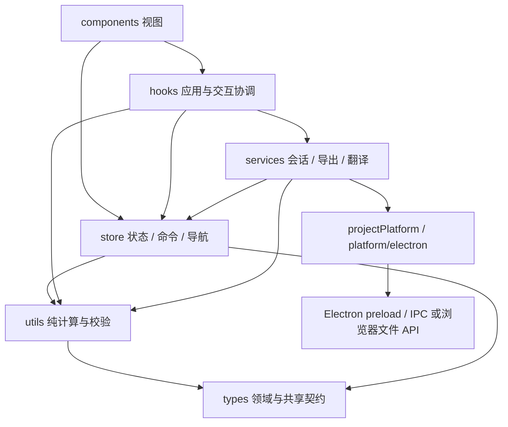

# 架构指南（Architecture Guide）

> 本文档描述项目的整体架构设计、分层结构与开发规范，用于指导后续阶段的功能实现。  
> **版本**: 1.2.23 | **更新时间**: 2026-10-09 | **本次同步**: CLI C10 共享历史、恢复权限与 Windows 配套发行；验证见 C10 报告

**C6–C10 已完成**。在线应用服务复用领域候选、Store 和 ProjectSession，Windows 发现/传输受当前用户 ACL 与 HMAC 保护；CLI history 与 GUI 使用同一历史，配套 CLI/桌面在线协议为 2。见 [C10 报告](./CLI_C10_Implementation.md)。

---

## 1. 项目概览

本项目是一款 **侦探解谜游戏 Web 可视化编辑器**，采用 React + TypeScript 技术栈，遵循以下核心原则：

- **前端主导的资源管线**：编辑器是逻辑定义的唯一来源。
- **资源生命周期保护**：普通删除对已实现资源标删；GUI 确认或 Agent 明确聊天授权的 purge 才永久删除受保护资源，且形成历史边界。
- **多层级可视化**：树（Stage）→ 卡片（PuzzleNode）→ 画布（FSM/Presentation）。
- **隐式持久化**：编辑器内定义的变量/状态默认需要存档。

---

## 2. 目录结构

```
puzzle-editor/
├─ types/              # 领域模型类型定义
│  ├─ identity.ts      # ID/Key 别名，当前为 string
│  ├─ common.ts        # ResourceState、ValueSource 等
│  ├─ project.ts       # 项目顶层结构
│  ├─ blackboard.ts    # 黑板资源（变量、事件）
│  ├─ manifest.ts      # 脚本/触发器清单
│  ├─ stage.ts         # 阶段树
│  ├─ puzzleNode.ts    # 解谜节点
│  ├─ stateMachine.ts  # 状态机
│  ├─ presentation.ts  # 演出子图
│  ├─ validation.ts    # 项目诊断条目契约
│  └─ graphUI.ts       # 图上下文菜单契约
│
├─ store/              # 全局状态管理
│  ├─ context.ts       # Context / 读取 Hook，开发期保留 Context 身份
│  ├─ StoreProvider.tsx # 每个 Provider 独立 Store 与项目会话
│  ├─ types.ts         # Store 状态与 Action 定义
│  ├─ reducer.ts       # 主 Reducer（含 Undo/Redo）
│  ├─ commands/        # 由领域意图生成 Action；automation 为隔离候选执行入口
│  ├─ navigation/      # 引用/诊断转导航与选择 Action
│  └─ slices/          # 领域 Reducer 切片
│     ├─ index.ts      # 统一导出
│     ├─ fsmSlice.ts
│     ├─ presentationSlice.ts
│     ├─ nodeParamsSlice.ts
│     ├─ blackboardSlice.ts
│     ├─ navigationSlice.ts
│     ├─ projectSlice.ts
│     ├─ uiSlice.ts
│     └─ runtimeSlice.ts  # Electron 运行时状态
│
├─ services/           # 应用协调与 IO 服务
│  ├─ projectSession.ts # 会话、切换保护、串行保存与导出
│  ├─ projectFiles.ts   # 项目序列化与候选准备
│  ├─ projectExport.ts  # GUI 导出协调：面板、消息、选择器与 IO
│  ├─ projectExportPreparation.ts # 纯导出校验、命名与序列化，时间可注入
│  ├─ automation/      # CLI 查询、快照、候选预览/提交与文件交付协调
│  ├─ projectPlatform.ts # 注入式桌面/浏览器项目 IO 适配
│  ├─ autoSaveScheduler.ts # 自动保存调度
│  └─ translation/     # 网络翻译服务与提供方
│
├─ platform/
│  ├─ node/            # Node 通用文件 IO，独立编译到 dist-node
│  └─ electron.ts      # 渲染进程 IPC 封装，不依赖 Store 或 UI
│
├─ contracts/automation/ # CLI 严格输入、结果、权限、命名片段与能力目录
├─ cli/                # 参数与输出适配；独立构建到 dist-cli
│
├─ electron/           # Electron 主进程代码
│  ├─ main.ts          # 主进程入口
│  ├─ preload.mts      # 预加载脚本（暴露 API 到渲染进程）
│  ├─ types.ts         # Electron 类型定义（IPC 通道、API 接口）
│  └─ ipc/             # IPC 处理器
│     ├─ handlers.ts    # 统一注册 IPC 处理器
│     ├─ preferencesService.ts  # 用户偏好管理
│     └─ fileService.ts # 文件操作服务
│
├─ components/         # UI 组件
│  ├─ Layout/          # 整体布局（Header, Breadcrumb, Sidebar 等）
│  ├─ shared/          # Dialog/Menu/Badge/ResourcePreview、主题、控件样式及浮层关闭规则
│  ├─ Explorer/        # 阶段树/节点浏览
│  ├─ Canvas/          # 画布编辑器（FSM/Presentation）
│  │  ├─ Elements/     # 画布元素（StateNode, ConnectionLine 等）
│  │  ├─ shared/       # 通用图节点、边、框选和菜单
│  │  └─ presentation/ # 演出节点内容、节点层、边层和手柄
│  ├─ Inspector/       # 属性面板
│  │  ├─ condition/    # 条件编辑器组件
│  │  ├─ localVariable/ # 局部变量子组件
│  │  └─ presentation/  # 演出绑定子组件
│  └─ Blackboard/      # 工具栏、四页签、创建菜单与资源卡片
│
├─ hooks/              # 应用协调与可复用交互（列出主要入口）
│  ├─ useBlackboardData.ts       # 筛选数据与引用统计
│  ├─ useBlackboardActions.ts    # 黑板创建/选择/导航
│  ├─ useResourceReorder.ts      # 同组资源重排生命周期
│  ├─ usePresentationCanvas.ts   # 演出画布手势协调
│  ├─ useCanvasNavigation.ts    # 画布平移，尚无独立缩放
│  ├─ useGraphInteraction.ts     # 通用图交互
│  ├─ useGraphKeyboardShortcuts.ts # 取消选择与模式提示
│  └─ useProjectActions.ts       # 转发项目会话请求
│
├─ utils/              # 工具函数
│  ├─ constants.ts          # 常量定义
│  ├─ geometry.ts           # 几何计算
│  ├─ debug.ts              # 调试工具
│  ├─ resourceLifecycle.ts  # 软删除状态机
│  ├─ variableScope.ts      # 作用域解析
│  ├─ blackboard.ts         # 黑板纯筛选、分组和排序
│  ├─ blackboardReferences.ts # 按实体汇总五类黑板引用计数
│  ├─ conditionBuilder.ts   # 条件构造器
│  ├─ presentation.ts        # 演出节点规范化
│  ├─ presentationGeometry.ts # 演出节点尺寸、锚点与临时曲线
│  ├─ projectImport/       # unknown 输入识别、领域结构校验与有依据的迁移
│  ├─ projectNormalizer.ts  # 已校验 ProjectData 的编辑辅助字段恢复
│  ├─ translation/localDictionary.ts # 本地字典纯转换
│  └─ validation/           # FSM/演出图等校验与引用扫描
│
└─ overview/           # 设计文档
   ├─ Project_Overview.md
   ├─ UX_Flow.md
   ├─ Task_Breakdown.md
   └─ dev/
      ├─ Domain_Model.md
      ├─ Architecture_Guide.md  # 本文档
      ├─ Interaction_Guide.md   # 交互规范
      └─ Phase1/ Phase2/ Phase3/ # 各阶段文档
```

---

## 3. 分层架构

### 3.1 依赖关系图



箭头表示使用关系。`StoreProvider` 是装配入口，创建 Store 并注入 `ProjectSession` 与平台实现；Reducer/命令/导航保持同步纯逻辑。偏好设置和目录选择等 UI 当前仍可调用 `platform/electron` 包装，完整项目读写与导出必须经过会话服务。未使用的 `api` 和旧 `src/electron` Hook/barrel 已移除。

内部弹窗统一使用 `components/shared/Dialog.tsx` 与 `dialog.css`。未保存、删除、新建、项目设置、偏好组件只提供内容和业务回调；不得再各自维护遮罩、配色表、焦点限制或操作区规格。共同支持 Portal、最上层键盘交互、busy、内容滚动及焦点恢复；确认与表单宽度、危险/警告语义色保留差异。系统选择器和渲染器不可用时的关闭兜底使用原生平台弹窗。后续 UI 维护范围见 [弹窗统一与样式排查](./Dialog_Unification_and_UI_Style_Audit.md)。

全部 UI 修改遵循 [UI 组件与样式维护规范](./UI_Standards.md)。菜单、表单、语义色、提示/预览、标题/卡片、图节点/边标签均只有一个维护入口；业务层只传数据、动作、变体及布局。`theme.css/uiTokens.ts/ui.css` 定义公共规格，StateNode/ResourceDetailsCard 仅适配业务接口。`npm run check` 包含 `check:ui` 与反向探针，防止恢复多份外观。完整迁移和证据见 [实施报告](./UI_Consistency_Implementation.md)。

### 3.2 依赖规则

| 层级 | 可依赖 | 禁止依赖 |
|------|--------|----------|
| `types/` | 领域及共享契约 | Store、UI、服务、平台和实现工具 |
| `contracts/automation/` | Zod、领域命名等纯规则 | React、UI、Hook、Electron、浏览器全局 |
| `utils/` | `types/`、其他纯工具 | React、Store、Hook、服务、平台、Electron、直接浏览器/网络 IO |
| `store/` 纯逻辑 | `types/`、`utils/` | 组件、文件 IO；Provider/Context 的 React 装配单独处理 |
| `platform/` | IPC 契约、平台 API | React、Store、Hook、服务、组件 |
| `services/` | 类型、纯工具、Store 接口、平台适配 | 组件实现 |
| `services/automation/`、`cli/` | 自动化契约、领域纯工具、Node IO | React、DOM、GUI 平台实例、Electron 运行时 |
| `hooks/` | React、Store、服务、类型和纯工具 | 组件实现 |
| `components/` | 视图、Hook、Store、契约和纯工具 | 直接修改状态或绕过会话读写项目 |

ESLint 自动拦截领域/纯工具反向依赖、Store/服务/Hook 对组件的依赖、平台对应用层的依赖；`check:guards` 验证规则会失败。项目 IO 必须经过会话的调用链还由服务测试和代码审查保护。`services/translation` 承担网络请求，本地字典保持在 `utils/translation`。

### 3.3 CLI、在线应用服务与共用维护入口

C9/C10 的 `contracts/automation/sessionSchemas.ts` 是 session/history 参数、token、在线请求与回执的唯一契约，能力表同源生成帮助；`cli/session.ts` 共用一个认证客户端。`services/onlineSession.ts` 是依赖 Store/ProjectSession 的在线应用装配层，不能放入受无界面依赖约束的 automation core。`domainCandidate.ts`、`projectDiff.ts`、查询/权限/校验仍由浏览器和 Node 共用；`transactionData.ts` 仅保留 Node hash/文件契约解析适配。

`editorStore.ts` 在唯一同步 dispatch 入口推进 contentEpoch 并提供 compareAndDispatch；它不随 Undo 的 document.revision 回退。`COMMIT_AUTOMATION` 只接收已校验内容，通过 reducer 一次提交，复用 manifest、选择协调、历史/no-op/永久删除规则，不以 INIT_SUCCESS 伪装编辑。限制修订 ID 随历史内容恢复，ProjectSession 只认可实际保存快照中的限制；自动保存检查捕获内容和执行时状态。

C10 的 `store/documentHistory.ts` 是记录/恢复规则的唯一维护入口。HistoryEntry 将内容快照与稳定 operation 元数据分开；GUI/Agent 共用 entryId、source、summary、requiredCapabilities 和 50 条 past/future。Undo/Redo 移动时保持同一 operation，元数据不进入 serializer。`services/onlineHistory.ts` 只做历史摘要及共同权限分析的适配；`onlineSession.ts` 检查 token/顶部 entryId/requestId，最终通过内部 `RESTORE_AUTOMATION_HISTORY` 同步提交，reducer 再核对顶部。未获本次 overwrite 许可的 Agent 恢复新增独立限制标记，不能重用已被保存认可的旧标记，也不清除目标原有未授权限制。实际永久移除受保护资源仍清空历史。

`hooks/editBarrierDom.ts` 是原生关闭/在线字段提交的共同维护入口，`services/editBarrier.ts` 提供无 DOM 的状态契约；名称有效性、异步翻译和图交互登记在同一屏障，业务组件不维护另一套 blur 或授权弹窗。`hooks/useOnlineSession.ts` 只装配 Provider 生命周期。

`platform/node/sessionSecurity.ts` 设置并读回 Windows 当前 SID 的发现目录和管道 ACL，额外用第二个连接只读核验后续管道实例，并拒绝 Network SID。`sessionTransport.ts` 仅负责带 HMAC 的有界本地传输；`electron/sessionBridge.ts` 限制登记窗口/主框架/来源/代际，preload 只提供受限订阅和响应。32 MiB 消息、30 秒连接、10 分钟/256 条应用幂等结果，窗口重载失效，不开放任意 Action 或文件写入。访问核验失败关闭桥；不放宽 ACL 或回退 TCP。

在线专项运行 `npm run test:electron:online`，使用两个完整生产页面、真实字段和 GUI Undo/CLI Redo、独立 CLI 子进程、断线重试及真实一分钟自动保存定时器。C10 为 45 项检查；实际发行配对由 `run-packaged-smoke.mjs --cli-zip` 检查 ASAR/EXE 与独立 ZIP。协议 2 拒绝旧 C9 协议 1，登记目录/管道的 v1 端点命名保持以便发现并报告不兼容。当前结果见 C10 报告，下文 C8 发行检查仅为历史基线。

C1 已交付 `describe/inspect/validate/json read`，C2 已交付 `create/preview/apply/export`，C3 补齐完整 FSM，C4 补齐演出图与跨资源影响，累计 42 种领域操作；C5 交付 `json preview/apply` 和独立 Windows CLI 包，离线首版完成；C6 增加 Stage/Puzzle 删除和三类资源 purge，累计 47 种领域操作；C7 增加 import preview/apply，累计 12 个命令入口。离线 CLI 读取磁盘快照，候选命令只操作隔离状态，不持有或修改 GUI Store、历史、dirty、最近项目和偏好；C9 session 命令按上文显式处理内存会话。完整原文读取绕开迁移，结构化视图复用 `utils/projectImport` 与 `utils/validation`。实体由类型、ID、所属上下文定位；跨页一致性使用源字节 SHA-256，领域诊断路径明确标注规范化基准。

`contracts/automation/schemas.ts`、`planSchemas.ts`、`rawSchemas.ts` 派生 TypeScript 和 JSON Schema，`primitives.ts` 管理唯一命名基础片段，`capabilities.ts` 是命令、权限和帮助的唯一目录；CLI 参数命名由输入字段转换。assetName 新增身份片段复用共用格式规则并要求非空、无空白，所有创建入口必须外部输入，不能自行生成名字。稳定诊断 code 在原规则产生处维护，不解析英文消息重建规则。

`store/commands/automation/execute.ts` 是应用层可导入的唯一候选执行入口，内部复用领域 Slice、工厂和生命周期；不能直接开放 reducer Action。`context.ts` 集中预留源/同批实体 ID、解析 alias 和检查源快照 scope，创建先于编辑，引用转换只处理白名单字段。FSM 命令在 `automation/fsm.ts` 内验证唯一 Puzzle owner 和其 scope、同 FSM 端点及 alias 归属，再调用 fsmSlice。删除初始项/关联边必须显式处理，最后状态受保护；部分更新与 redirect 保留无关字段。C4 的 automation/presentation.ts 在同一执行入口检查图 scope、节点归属、显式入口和关联边策略；不开放通用 nodes/nextIds/Action 替换。

`utils/fsmFactories.ts` 是画布、Puzzle 初始状态和 CLI 的 State/Transition 默认构造入口；ID 与资产名由调用方提供。`initialState.alias` 是计划辅助字段，只参与分配和引用，不进入工程。`automation/bindings.ts` 统一转换触发器/递归条件/监听器/参数/演出引用，常量 JSON 不做通用字符串替换。新字段应进入共用 schema、转换器和工厂，不在 GUI/CLI 各写一套格式。C4 的 utils/presentation.ts 为演出图/节点工厂，presentationEditing.ts 为 Branch 槽位、Parallel 顺序与边样式的唯一修改规则；Slice 与画布/CLI 命令共同使用。

`services/automation/writeService.ts` 将领域执行、结构校验和固定回执组合；`candidateValidation.ts` 是领域/备用 JSON 共用的业务错误基线入口，`transactionData.ts` 维护差异与计划解析，`fileCommit.ts` 维护路径/输入保护与排他发布。领域回执绑定源、计划、时间、分配和候选 hash，提交重新执行校验，既有同字节输出只能核验为 `already-applied`。普通计划只准修改声明字段，不能加入通用 Patch、JSON Pointer 或替换对象。

C6 的删除唯一入口是 `utils/hierarchyDeletion.ts`，由 GUI projectSlice 与 CLI 共用子树、FSM 所有者检查、顺序和初始项规范化。`utils/projectResources.ts` 统一资源枚举、owner 身份比较与唯一变量搬移识别；raw 生命周期、权限分析和 Store 历史边界都复用它。`utils/deletionReferences.ts` 使用既有引用索引拒绝残留引用及同 ID 祖先隐式改绑，共享图按仍存调用上下文判断。GUI Hook 负责共享 Dialog/消息预检，Slice 重算删除集合并清理失效 UI。

`contracts/automation/permissions.ts` 是能力名称、声明、等级和策略版本的唯一来源，`services/automation/permissions.ts` 从实际差异计算 requiredCapabilities/permanentDeletions。三项能力均可执行。当前回执绑定 C10 策略及能力集合；缺声明拒绝，旧回执重新预览，不能凭回执取得许可。`store/documentHistory.ts` 对所有内容变动检查受保护资源实际移除，清空 past/future；普通删除沿用 Undo/Redo。

C7 的 `importSchemas.ts` 唯一维护转换请求、精确实体名称映射及 import-preview 回执。`importService.ts` 复用原文审计、共同 importer/serializer、旧错误基线、输入指纹与排他发布；`importNames.ts` 使用实体索引与共同 isNamedAsset，只能改明确资产的 assetName。全局变量映射不依赖导入生成的项目 ID，局部变量/状态要求具体 owner。既有 Implemented 声明原样保留，转换不合并到已有工程，也不产生新命名业务资产。

`ImportContext` 接收可选 now/runtimeProjectId，预览固定并在 apply 重用；GUI 默认仍生成当前 UUID/时间。已有 meta.id/createdAt 不被替换，缺失时间在同一 context 补齐。`utils/projectEditorState.ts` 是无 editorState 时的共用默认入口，GUI 可传现有面板尺寸，CLI 使用默认尺寸并报告 UI 信息缺失。合法 Wait=0 的运行时导出与非负时长校验一致，不再改成 1 秒。

C5 引入的 `rawWriteService.ts` 负责完整候选的预览、回执和原文字节发布；`rawPolicy.ts` 用所属实体身份检查新增/改名和资源前后状态，生命周期限制复用 `utils/resourceLifecycle.ts` 的自动化策略。raw 候选必须已是共用导入器的规范形态；需修正时返回差异并拒绝提交，不静默补值。raw 回执独立于领域回执，绑定源/候选路径及 hash，输出为 create-new 或 overwrite-source 模式。提交前重读核对，只有显式授权的 in-place 模式可覆盖源工程。直接编辑权限由用户在 Agent 聊天中明确授予；Agent 核对范围，CLI 要求 `--allow-raw-json-write`，缺少时在 IO 前返回 6。声明和回执均不认证聊天，不新增桌面审批宿主。详细约定见 [CLI 方案 §1.2](./CLI_Implementation_Plan.md#12-用户已明确的要求完整-json-可读直接编辑须先获聊天授权)。

领域校验必须覆盖 UI 选择器约束：局部变量命名按所属容器判重，脚本按类别/生命周期目标匹配，参数运算及来源类型由 `utils/parameterCompatibility.ts` 同时供组件、画布局部校验与工程校验器使用；值匹配方法同时用于 CLI 变量和 Temporary 常量。Temporary 变量来源须在当前调用上下文内可见且类型相同。外部 ID 字典查找使用 `ownEntry`，不能将原型成员当成资源。共用规则变化需更新合法测试夹具并验证旧工程诊断，不能通过跳过测试维持“全绿”。

`platform/node/files.ts` 提供严格 UTF-8/快照和共用临时写入/排他发布，独立编译到 `dist-node`；Electron 引用生成 JS 与类型声明，保持 `electron/` rootDir 和 `dist-electron/main.js` 入口。`electron:compile/cli:build/typecheck` 先构建 Node 模块，Electron 打包必须收录 `dist-node`。新增编译产物忽略，不能把构建输出作为第二份可编辑实现。

C8 的 `overwriteSchemas.ts` 是模式互斥与文件身份回执的唯一契约。`overwriteService.ts` 只冻结源前提；领域/raw 服务均调用 `platform/node/projectOverwrite.ts` 完成备份、持久阶段记录、临时文件 fsync、发布前核验、替换与已知结果重试，不能各自实现一套覆盖。未获能力声明不能创建事务目录。新文件排他发布继续由原 fileCommit 维护；import/export 不接收覆盖声明。持久事务不是 Undo 历史，也不提供无条件回滚。

`platform/node/projectOwnership.ts` 统一规范路径、dev/ino 身份和 Windows OS named pipe lease。路径锁与文件身份锁共同持有，禁止硬链接工程；协议元数据只读，无外部写接口，不通过删除 PID 锁恢复。桌面 `projectOwnershipService.ts` 按 webContents 串行管理 active/pending，ProjectSession 在 Store commit 前 claim；新建/另存成功才激活，失败释放候选并保留旧会话，实际销毁才释放全部所有权。主进程保存、导出和兼容创建入口同样经过该服务。窗口来源在 IPC 主框架检查；偏好/监听失败不撤回已经成功的所有权转移。非 Windows 暂不支持 CLI in-place；C9 在线桥使用本节前述独立维护入口。

`projectExportPreparation.ts` 只接受工程和时间，返回诊断、规范化内容、建议文件名；`projectExport.ts` 保留 GUI 外壳。Node CLI 构建关闭 public 静态资源复制，并阻断 UI/Electron 进入依赖图。只复制 `dist-cli` 即可由兼容 Node 运行。`scripts/package-cli.mjs` 从实际 CLI 能力读取 phase，按 `cli/runtime-lock.json` 校验官方运行时并生成 Windows x64 ZIP，随包附启动器、许可证和指纹；`cli-package-io.mjs` 唯一维护包脚本的目录边界与临时目录清理。`CLI_Distribution_Guide.md` 是包内 AGENTS.md 的唯一源，不能在产物内手改。`verify-cli-package.mjs` 在仓库外中文空格目录、无全局 Node 的 PATH 验证实际 ZIP。查询/编辑限制与实例见 [使用说明](./CLI_Agent_Usage.md)，最新验证见 [C10 报告](./CLI_C10_Implementation.md)。

---

## 4. 核心模式

### 4.1 状态管理

- **双 Context 模式**：`StateContext` 与 `DispatchContext` 分离；`editorStore.ts` 同步执行 Reducer，由 `useSyncExternalStore` 发布状态，连续操作可读取刚提交的修改。
- **React 导出边界**：`StoreProvider.tsx` 仅导出组件；`context.ts` 定义读取 Hook、状态/派发/会话 Context。开发期使用 Vite hot.data 保留 Context 身份，避免消费者与 Provider 在热更新过程中引用不同对象；Store/会话仍由每个 Provider 独立创建。
- **类型边界**：前端和 Electron 均启用 strict。外部 JSON 从 unknown 收窄，领域数据用 JsonValue 保留待校验原值，显式变量编辑返回标量 VariableValue；作用域纯计算只接收 ProjectData。Inspector 使用明确字段或 Partial 领域模型，不构造不完整 EditorState。
- **Undo/Redo**：主 Reducer 委托 `documentHistory.ts` 管理最多 50 条 `{ content, revision }` 快照。恢复后保留最新保存时间，并清理已失效的 UI 选择和导航。
- **Action 类型及策略**：类型定义于 `store/types.ts`，领域、是否改内容、历史及只读规则统一登记于 `store/actionPolicy.ts`，使用穷尽映射防止遗漏。只读校验在切片和 Undo/Redo 之前执行。
- **保存版本**：`document` 仅在内存中保存会话与编辑/保存版本。内容变化推进版本；Undo/Redo 恢复版本；`PROJECT_SAVE_SUCCEEDED` 只确认保存开始时捕获的会话、路径和版本。`isDirty` 由当前版本和保存基线统一派生。
- **历史边界**：Draft 普通删除和软删除可撤销；永久移除非 Draft 资源，以及实际改变内容的外部资源状态同步，会清空 past/future。无效目标或同值更新不产生版本，也不清除 redo。
- **项目会话**：每个 Provider 创建一个 `ProjectSession` 并由独立 Context 共享。UI、快捷键、自动保存通过 `useProjectActions` 或 `useProjectSession` 发出请求；不要在组件中回读/写入项目文件或直接切换项目路径。
- **平台 I/O**：`services/projectPlatform.ts` 包装选择、读取、写入、导出、激活与下载，`projectFiles.ts` 管理序列化且只接收需要的 UI 字段。`ProjectSession` 共用队列协调保存和导出；`projectExport.ts` 处理运行时校验、后缀保护与规范化。下载/导出不确认完整项目保存。
- **外部数据边界**：`utils/projectImport` 将 JSON 解析为 unknown，由 readers/domain/legacy/index 分别负责收窄、领域结构、历史迁移及封装识别。只认当前工程/运行时格式、有结构证据的原始数据和旧 Manifest；未知重要字段、结构损坏、层级环与超深链拒绝，错误保留字段位置。
- **候选校验与提交**：`projectFiles.prepareProject` 在候选上运行既有业务校验，结构有效但未完成的工程仍可编辑。INIT_SUCCESS 一次提交内容和问题列表，取消/失败不影响原诊断；运行时/历史数据作为副本另存。外部资源同步也经过相同结构校验，仅合并资源状态。
- **规范化与修复导航**：`projectNormalizer` 只补齐已校验数据的坐标/参数辅助信息，演出节点与 Reducer 共用规范形态。`store/navigation/validationNavigation.ts` 把诊断解析为导航 Action；引用导航位于同目录。项目诊断条目定义于 `types/validation.ts`，FSM/演出图校验只接收 `ProjectData`。Validate Project、Recheck 与导出复用同一业务校验器。
- **引用与调用上下文**：`resourceReferences.ts` 是白名单引用字段遍历的唯一 owner；黑板计数、兼容 find*References、CLI 和 impacts 共用。新增引用字段只在此处扩展，禁止计数/列表各自维护。`presentationUsage.ts` 统一根调用、子图传播与最近祖先变量解析。批量查询显式复用 createResourceReferenceIndex，不能为每个资源重建或全局缓存可变项目。`useBlackboardData` 保持 Hook 内 project 身份缓存，过滤/选择不重扫，编辑/历史变化重算；语义预期见 C4 领域测试，性能夹具验证批量结果和枚举次数。
- **原生关闭保护**：`electron/windowCloseGuard.ts` 拦截窗口 close / 应用 before-quit，经受限 preload / platform 接口交给 `useWindowClose` 与 `ProjectSession.requestClose`。先提交当前字段草稿（包含后台窗口不产生 focusout 的情况），复用保存队列、版本确认与 committing 冻结；只接受当前窗口主框架和请求 ID 的答复。取消退出恢复编辑；主进程不维护另一份 dirty。正常关闭不使用 destroy/exit 强制绕过保护。
- 详细设计与边界见 [第一批](./Architecture_Repair_Batch1.md)、[第二批](./Architecture_Repair_Batch2.md)、[第三批](./Architecture_Repair_Batch3.md)、[第四批](./Architecture_Repair_Batch4.md)、[第五批](./Architecture_Repair_Batch5.md)、[第六批](./Architecture_Repair_Batch6.md) 和 [关闭保护](./Window_Close_Protection.md)。独立缩放仍待完成。

### 4.2 领域切片（Slices）

复杂领域逻辑拆分到独立 Slice（共 9 个切片）：

- **fsmSlice**: 状态机、状态、转移的 CRUD
- **presentationSlice**: 演出图、节点、连线的 CRUD
- **nodeParamsSlice**: 节点局部变量管理
- **blackboardSlice**: 全局变量、事件、脚本的 CRUD 与软删除
- **navigationSlice**: 视图切换、面包屑导航
- **projectSlice**: Stage 树、Node 更新
- **projectMetaSlice**: 项目元信息编辑与重置
- **uiSlice**: 选择状态、面板大小、消息堆栈
- **runtimeSlice**: Electron 运行时状态（当前项目路径、偏好加载状态）

```ts
// store/slices/fsmSlice.ts
export type FsmAction = ActionForDomain<'fsm'>;
export const isFsmAction = (action: Action): action is FsmAction => isActionForDomain(action, 'fsm');
export const fsmReducer = (state: EditorState, action: FsmAction): EditorState => { ... }
```

主 Reducer 通过类型守卫分发：

```ts
if (isFsmAction(action)) return fsmReducer(state, action);
if (isPresentationAction(action)) return presentationReducer(state, action);
if (isNodeParamsAction(action)) return nodeParamsReducer(state, action);
if (isBlackboardAction(action)) return blackboardReducer(state, action);
if (isNavigationAction(action)) return navigationReducer(state, action);
if (isProjectAction(action)) return projectReducer(state, action);
if (isProjectMetaAction(action)) return projectMetaReducer(state, action);
if (isUiAction(action)) return uiReducer(state, action);
if (isRuntimeAction(action)) return runtimeReducer(state, action);
```

### 4.3 软删除状态机

资源状态流转：`Draft` → `Implemented` → `MarkedForDelete`

```ts
// utils/resourceLifecycle.ts
resolveDeleteAction(current: ResourceState): DeleteResolution
```

### 4.4 作用域解析

变量引用必须携带作用域信息：

```ts
// utils/variableScope.ts
collectVisibleVariables(project, stageId, nodeId): VisibleVariables
```

---

## 5. 开发规范

### 5.1 类型优先

- 领域与跨层契约在 `types/` 定义；局部组件 Props 与服务接口靠近所属模块。
- ID 当前是 string 别名，新建资源由 `resourceIdGenerator` 生成前缀与计数，不自行解析或截断导入的 ID。
- 变量引用必须携带 `scope` 字段。
- **AssetName 字段**：脚本、变量、事件、Stage、PuzzleNode 等资源均支持可选的 `assetName` 属性，用于代码生成。命名规则：字母/下划线开头，只含字母数字下划线。

### 5.2 中文注释

- 核心模块必须包含中文文件头注释。
- 关键逻辑段落使用中文注释解释意图，避免 JSX 内嵌长注释。

### 5.3 组件设计

- 组件通过 `useEditorState` 获取状态。
- 组件通过 `useEditorDispatch` + Action 修改状态。
- 禁止组件直接修改状态；项目操作经会话 Hook，偏好设置/目录等平台交互使用明确适配接口。

### 5.4 工具函数

- 工具函数必须是纯函数。
- 提供完整的 TypeScript 类型标注。
- 在 `utils/` 下按功能域组织。

---

## 6. 扩展指南

### 6.1 添加新的领域实体

1. 在 `types/` 定义类型接口。
2. 更新 `types/project.ts` 的 `ProjectData`。
3. 更新 `store/types.ts` 的 `EditorState` 与 `Action`。
4. 在 `store/actionPolicy.ts` 登记每个新 Action 的领域、内容、历史与只读规则；如需独立处理，创建新的 Slice，并从策略表派生 Action 类型和守卫。
5. 为新的内容操作验证 Undo/Redo、保存版本、只读与空操作行为；不要在切片或组件中直接修改 `isDirty`。

### 6.2 添加新的 IO 能力

1. 桌面能力在 `electron/types.ts` 定义契约，由主进程处理器、`preload.mts` 与 `platform/electron.ts` 逐层接入。
2. 项目文件能力扩展 `ProjectPlatform` 并提供浏览器路径；使用注入接口验证失败/取消，不另建无人调用的 Mock/HTTP 服务层。
3. 在 `services/` 协调校验、快照与错误消息，经 `ProjectSession` 串行提交；Context/Provider 只负责装配。
4. 网络服务按业务放在 `services/`，纯数据变换留在 `utils/`；覆盖适用的超时/失败与回退路径。

### 6.3 添加新的编辑视图

1. 在 `components/` 创建视图组件。
2. 复用 `hooks/useGraphInteraction.ts` 处理交互。
3. 遵循 [交互规范](./Interaction_Guide.md) 的快捷键约定。

---

## 7. 代码质量与最佳实践

### 7.1 组件拆分原则

按数据计算、应用操作、临时交互与展示拆分；文件长度用于发现问题，不以减少行数验收。

- **Blackboard**：主面板组合工具栏与四页签；数据 Hook/纯选择器负责筛选与引用统计，动作 Hook 负责创建与导航，共用重排 Hook 管理同组拖拽。筛选/折叠仅以 Store 为准。
- **PresentationCanvas**：协调 Hook 管理手势，命令模块生成 typed Action；节点、边、内容、手柄分别渲染，几何参数共用纯工具。
- **ConditionEditor**：递归组合、组操作 Hook、组头与子列表分离；根级空态和单叶规范化由纯函数处理。
- 已独立的 `LocalVariableEditor`、脚本/图绑定、叶子条件等保留其职责边界，不为了长度继续拆碎。

**Canvas 元素组件化**：
- `Canvas/Elements/` 目录包含可复用的画布元素
- `StateNode.tsx`、`ConnectionLine.tsx` 等独立组件
- 每个元素组件添加 `displayName` 以便 React DevTools 调试

### 7.2 样式管理

- **固定样式复用主题**：第五批已迁移黑板菜单、演出画布和条件组的固定布局/配色到 CSS 与主题变量；动态位置、尺寸、路径和条件层级配色保持明确的 style 接口。其他旧组件随实际维护继续整理。
- **语义化 CSS 类名**：如 `.trigger-editor-container`、`.trigger-card`
- **复用全局样式**：画布上下文菜单、连线手柄等使用全局样式

### 7.3 常量管理

- **常量靠近领域**：跨画布通用尺寸在 `utils/constants.ts`，演出几何在 `utils/presentationGeometry.ts`，只提取有明确含义或共享用途的常量。
- **避免重复定义**：如 `STATE_NODE` 尺寸由 `constants.ts` 统一定义，`geometry.ts` 引入复用
- **导出派生常量**：如 `export const STATE_WIDTH = STATE_NODE.WIDTH`

### 7.4 Hooks 规范

画布相关 Hook 包括：

- `useCanvasNavigation`: 画布平移；独立缩放尚未实现，不能用浏览器页面缩放代替 UX 要求
- `useCuttingLine`: Ctrl+拖拽剪线交互
- `useGraphInteraction`: 通用图形节点交互
- `useGraphKeyboardShortcuts`: Escape 取消多选、Ctrl/Shift 模式提示；删除与撤销由 `GlobalKeyboardShortcuts` 统一处理
- `useStateNodeInteraction`: 状态节点专用交互
- `usePresentationCanvas`: 演出图临时手势、菜单与选中状态协调

### 7.5 调试支持

- **debug.ts 工具**：提供统一的日志输出函数
- **React.memo displayName**：所有 memo 组件必须添加 `displayName` 属性
- **校验逻辑集中**：FSM 校验放置在 `utils/validation/fsmValidation.ts`；演出图校验与其他工程规则在同一目录组织。

### 7.6 自动检查

提交前运行 `npm run check`：严格 UTF-8、前端/Electron/CLI 类型、ESLint、渐进格式、UI 所属规则、故意错误拦截和行为回归。另运行 `npm run build`；文件会话相关改动还应运行 `npm run test:electron`。类型/lint 不排除业务源码；领域类型不能反向导入 Store/UI/服务/实现工具，Store 不能导入组件。Hook 不得条件调用，依赖数组按实际闭包列出。

`format:check` / `format` 的清单位于 `scripts/source-files.mjs`，C10 后覆盖 291 个配置/工具/服务、组件及测试文件，不代表全仓库格式统一。反向拦截覆盖 7 项类型、15 项 lint/依赖、3 项编码与 1 项格式错误，另含 10 项错误/2 项合法 UI 探针；累计 38 文件 / 669 个回归用例，UTF-8 检查覆盖 382 份源码/配置。`test:cli` 和 `test:run` 先构建 CLI，再执行含真实子进程的测试；C2–C10 驱动共用 `tests/cli/processHarness.ts`；直接 `npm test` watch 前先构建 CLI。`test:electron` 顺序构建后包含 11 项文件会话检查、完整生产页面上的 7 个关闭场景及 C8 双桌面实例/独立 CLI 的 21 项所有权检查；每个退出场景使用独立进程、项目和偏好目录。C10 的 `test:electron:online` 顺序构建 CLI、前端和 Electron 后执行 45 项完整双实例联动。发行配对另用 `node tests/electron/run-packaged-smoke.mjs <桌面 EXE> --ownership --cli-zip <ZIP>` 验证实际成品；执行时不重建共用 dist 目录。发行相关修改还须构建 ZIP 并运行 `test:cli:package`；C8 独立包增加领域/raw 覆盖、备份与权限组合检查。详见 [关闭保护验收](./Window_Close_Protection.md)和 [C10 验收](./CLI_C10_Implementation.md)。

### 7.7 性能基准

`tests/performance/fixtures.ts` 生成确定性中/大型项目，`renderer.tsx` 在真实生产 React 组件及 Store 上测量同步提交；`run.mjs` 在隔离、隐藏的 Electron 窗口运行并保存原始结果。使用 `npm run bench -- 标签`；追加 `--legacy` 可运行第五批旧引用 Hook 对照。基准测试工具与旧 Hook 不进入正式应用包。

保持前后夹具和测量入口一致，分开记录首次值、预热样本分布和 GC 堆；不要把同步提交等同于端到端响应/FPS，也不要从小幅未改模块波动推导优化效果。先测再决定是否收窄订阅、建立索引或引入虚拟化。本轮只优化已确认的黑板逐资源重复扫描；设备、规模、预算、原始结果与重跑方式见第六批记录。

---

## 8. 相关文档

- [领域模型](./Domain_Model.md) - 数据结构详细定义
- [交互规范](./Interaction_Guide.md) - 快捷键与交互约定
- [当前修复计划](./Architecture_Repair_Plan.md) - 批次状态与后续范围
- [Phase3 代码审查](./Phase3/P3_Code_Review_3.md) - 历史质量评估

---

## 9. 消息堆栈（Message Stack）

- Store 持有 `ui.messages: UiMessage[]`，支持 `ADD_MESSAGE` / `CLEAR_MESSAGES`；所有全局提示（加载/导入/校验/保存等）必须写入堆栈，禁止仅输出控制台。
- Header 负责展示 Messages 下拉列表，显示 info / warning / error 三级，按时间倒序，可一键清空。
- 其他模块如 API/加载流程应通过派发消息写入堆栈，保证可追溯。
