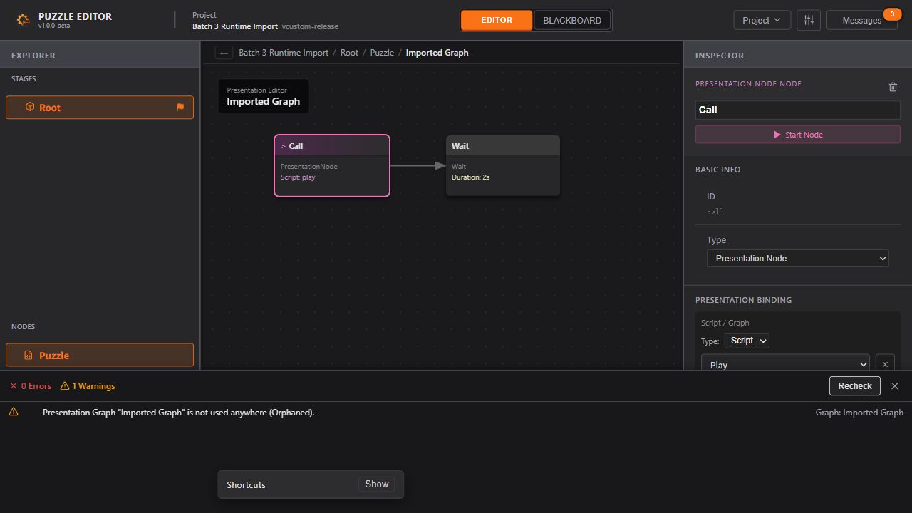

# 第三批修复：导入校验与兼容边界

> 2026-10-07。状态：已完成并验收。承接 [修复计划](./Architecture_Repair_Plan.md) 第三批；保留前两批未提交的工作区改动。以下先保留实施前设计，再记录实际结果与限制。

## 目标与 UX 约束

对应 P2-T01（加载及兼容）、P2-T08（语义往返）、P4-T06（工程切换）、P5-T01/T03（校验与修复导航）。按 UX §2.1 将导入结果写入 English Messages；保留 §4–6 的阶段、FSM、演出图与参数编辑能力，以及待删除资源的可见性和导出阻断规则。设计原文保持只读。

## 实施前设计

### 1. 导入边界

流程为 JSON 解析为 `unknown` → 明确识别封装 → 校验字段容器和必要根结构 → 有依据的旧字段转换 → 补齐许可缺省 → 业务校验 → 构建候选 → 第二批会话保护及原子提交。仅成功提交后发布该候选的兼容提示与校验结果。

- `utils/projectImport/`：按职责拆分字段读取、领域结构、旧格式迁移和封装识别；不引入校验依赖。错误使用 JSON 字段路径及 English 原因。
- `utils/projectNormalizer.ts`：只接收已经通过结构校验的 `ProjectData`，处理编辑器辅助字段，不再猜测文件格式，也不把任意对象变成空工程。
- `services/projectFiles.ts`：生成候选并运行既有 `validateProject`，明确保存路径与待另存状态。打开、最近项目、字符串导入、启动恢复沿用统一入口；外部资源同步也经过同一结构边界。
- Store 的 INIT_SUCCESS 可携带校验结果，一次提交工程、路径、导航、历史、保存基线及问题列表。失败不改原数据、路径、Undo/Redo、导航或 dirty。

### 2. 兼容清单与依据

| 格式/规则 | 依据 | 处理 |
| --- | --- | --- |
| 当前 `puzzle-project` | `types/project.ts`、当前 `overview/example_project/BubbleHorror.puzzle.json`、当前序列化器 | 必须有 project/meta/stageTree 及可解析根阶段；UI 可省略 |
| 当前 `puzzle-export` | 当前导出器与 `Export_Format_Changes.md` | manifestVersion 1.0.0；恢复被导出剥离的坐标、参数辅助 ID/kind；新建编辑元信息，始终待另存 |
| 原始 ProjectData | 当前类型与实际项目文件的 project 部分 | meta 与有效 stageTree 联合识别；作为导入副本，待另存 |
| 旧 ExportManifest 封装 | `648e9d7^:types/project.ts` 与当时 `api/mockService.ts` 的真实生成结构 | 仅接受 manifestVersion/exportedAt/project 的已知封装，继续校验内部结构，待另存 |
| 旧大写条件 AST | `88477b7:overview/example_project/BubbleHorror_export.json` 与当时类型 | AND/OR/NOT/COMPARISON/LITERAL/SCRIPT_REF 转为当前表达式；比较操作数中的 VARIABLE_REF/LITERAL 转为 ValueSource，保持引用、作用域、常量与顺序 |
| 独立旧布尔变量条件 | 同一历史样例 TRANS_11 与当前样例的对应条件 | 仅当变量已知为 boolean 时转换为 VariableRef == true；无法确定类型或类型有歧义时拒绝 |
| 空的旧 triggers 清单 | 同一历史样例的 `data.triggers: { triggers: {} }` | 明确提示后移除；非空清单缺乏无损映射依据，拒绝而非丢弃 |

保留一个从 Git 历史提取的原始导出夹具，记录来源和哈希；不把仅存在于旧注释中的格式声明当作兼容证据。不能无损表达的旧条件操作数、未知节点类型或重要字段返回具体错误。

`meta.version` 是用户可编辑的项目版本，不决定 Schema。`editorVersion` 是生产软件版本，结合已知结构检查并提示差异；`manifestVersion` 是运行时格式版本，目前只支持 1.0.0。未知 fileType 禁止回退。不会在本批擅自新增写出格式版本。

### 3. 拒绝、缺省与业务问题

- 拒绝：null/数组/无关对象、未知封装或版本、错误容器/基本类型、实体映射键与 ID 不一致、必要根阶段丢失、会令现有遍历失效的阶段环、不能识别且可能丢失的重要字段。
- 已知可缺省集合补为空，缺少初始状态/startNodeId 补 null；缺失坐标生成确定性的网格布局；可选 UI 字段使用现有默认/尺寸约束。缺省与迁移记录字段位置，不改有值的排序、ID、引用或参数常量。
- 缺初始状态、悬空业务引用、名称问题、待删除资源等继续调用现有业务校验，允许打开并展示可导航的问题列表；导出仍按既有 error 规则阻断。
- 结构读取限制过深嵌套以避免递归崩溃；记录型 ID 禁止原型保留键。未知字段不静默删除。JSON 常量值不套用实体字段白名单。
- 历史迁移后的工程需要保存；运行时、原始数据和旧 Manifest 导入不绑定源路径。当前完整工程保留正常保存/重开行为。

### 4. 界面与导航

沿用项目菜单、Messages、现有 ValidationPanel，无新路由。兼容提示展示位置与转换原因；业务校验失败可编辑。核对问题列表跳转，修正当前 NODE 缺 stageId、STATE/TRANSITION 混用 nodeId/fsmId、黑板资源未处理等实际问题，使导入后能定位修复。

浏览器验收时补充：现有 Footer 中的 Check 未挂载到 MainLayout，修复后无法刷新问题列表，关闭后也无法再打开。增加 Project → Validate Project 和问题面板 Recheck；手动校验写入 Messages，导出时同步刷新同一问题列表，保持原有导出阻断级别。

### 5. 验证计划

- 回归前两批全部用例；增加识别/拒绝矩阵、嵌套错误路径、根结构、旧 AST/真实历史样例、参数语义、排序/ID、缺省、未知字段/版本、源输入不变。
- 当前示例及已知历史样例：加载→保存→重开；导出→导入→再导出对比业务语义与 UI 恢复。
- 所有加载入口的失败保护、导入业务问题展示与导出阻断、修复导航、外部同步拒绝损坏文件。
- 浏览器实际选择文件，验证拒绝时项目/导航/dirty 保留，允许有业务问题的项目继续编辑，运行时导入的图与参数可见；运行真实 Electron 临时文件链路。
- 最后执行测试、前端/Electron 类型检查、构建、UTF-8、差异与开发文档链接核对，再记录实际结果和未覆盖项。

## 实施结果

### 模块与行为

- `projectImport/readers.ts` 负责从 unknown 收窄、字段路径、容器/基本类型和深度检查；`domain.ts` 定义领域结构；`legacy.ts` 只做有来源依据的迁移；`index.ts` 识别封装并组织流程。新增生产导入模块不使用 any。
- `projectNormalizer.ts` 只处理已校验的编辑辅助字段。坐标按原有顺序生成网格；参数辅助 ID 避免与已存在 ID 冲突，Temporary 参数依据 tempVariable 恢复 kind，保留 false、引用及描述。演出节点与编辑 Reducer 共用规范化函数，修复重开后仅点击节点也产生 dirty 的问题。
- `prepareProject` 在候选上完成业务校验。打开、最近项目、字符串导入、启动恢复与外部同步共用结构边界；错误或取消保留原项目、保存路径、文档版本、历史、导航、dirty 和原校验列表。INIT_SUCCESS 原子提交候选问题列表。
- 只为完整工程且来源扩展名为 `.puzzle.json` 的文件绑定保存路径。运行时、原始数据、旧 Manifest 和其他扩展名来源进入待另存状态；兼容迁移后的完整工程标记待保存。浏览器完整文件正常重开仍为 clean，下载保留第二批定义的 dirty 语义。
- 迁移提示进入 Messages，单次最多逐项展示 20 条，剩余数量汇总；有业务问题的工程可以打开并编辑，error 仍阻止导出。Project → Validate Project、面板 Recheck 和导出共用既有业务校验器。
- `validation/navigation.ts` 集中解析诊断归属，修复 NODE 的 stageId、STATE/TRANSITION 的 nodeId/fsmId 上下文、黑板筛选遮挡及局部变量拥有者定位；失效对象不生成错误选择。
- 当前/历史样例和 TriggerEditor 都会保留切换类型前的 eventId/scriptId。这些已知字段经过类型校验后保留；未知重要字段仍拒绝。浏览器发现的 Breadcrumb 同名 ID React key 冲突改为“对象类型 + ID”。
- JSON 嵌套和阶段链最大深度为 128，父链与子链循环均拒绝。阶段检查缓存剩余链深度，避免因实体映射插入顺序而把超长链当作多段短链。

### 兼容夹具来源

原始夹具为 [legacy-88477b7.export.json](../../tests/fixtures/imports/legacy-88477b7.export.json)，直接取自 Git 对象 `88477b7:overview/example_project/BubbleHorror_export.json`，未修改其内容。大小 60,274 字节；SHA-256：

`c1e1334c7c224f92a96df5bb951ef20c9a0388987f3c7ecd21e2567f678e57cf`

旧 ExportManifest 的封装依据为 `648e9d7^:types/project.ts` 及同版本 `api/mockService.ts` 的生成代码。当前夹具继续使用仓库 `overview/example_project/BubbleHorror.puzzle.json`。两类来源均纳入自动往返校验；兼容并不表示项目已有的业务问题全部消失。

## 实际验收

### 自动化、类型与构建

2026-10-07 最后一轮执行结果：

| 检查 | 结果 |
| --- | --- |
| `npm test -- --run` | 9 个文件、140 个用例通过；包含前两批 84 个回归 |
| `npx tsc --noEmit` | 通过；不表示前端已启用 strict |
| `npm run build` | 通过；1,854 个模块，主 JS 627.28 kB / gzip 164.18 kB |
| `npm run test:electron` | Electron 类型编译及 11 项真实 IPC/磁盘链路检查通过 |

207 个 TypeScript/TSX/MTS 文件及本轮同步的 6 份开发文档通过 UTF-8 检查，未发现替换字符；开发文档内 31 个本地链接通过校验。`git diff --check` 无空白错误；Electron 编译产物仍有仓库现有的 LF/CRLF 提示。

本批新增 56 个用例：导入识别/结构/兼容与往返 41 个，诊断导航 6 个，会话加载失败与候选提交 7 个，导出阻断与重新校验 2 个。覆盖未知 JSON/版本/重要字段、错误容器、嵌套错误路径、根结构、阶段环与深度、保留 ID、历史 AST、源数据不变、参数语义、坐标/顺序/UI、各加载入口及外部同步失败保护。收尾的乱序深层阶段树和失效演出诊断用例先复现失败，再验证修复。

Vite 仍提示主包超过 500 kB；拆包与性能测量按第六批处理，不把成功构建解释为没有性能问题。

### Electron 实际文件链路

在第二批 8 项基础上增加：损坏导入保留原文档/历史/路径；运行时源要求另存为工程；另存副本重开后语义一致且源文件字节不变。实际使用 Electron、preload、IPC、磁盘和文件监听；项目及偏好均隔离在临时目录。

最终证据目录：`D:\Temp\puzzle-batch2-electron-ZJ9w98`。沿用第二批验收脚本的目录前缀；[结果副本](./verification/batch3-electron-result.json) 保留完整 11 项检查。日志中的 EEXIST 是排他新建失败保护的预期注入，不是未处理失败。

本轮没有手动操作 Electron 原生文件选择器；选择路径由测试适配器提供，读写、监听和 IPC 使用真实实现。未声称完成原生 UI 全流程手测。

### 浏览器直接操作

使用本地 Vite 页面及独立测试文件，实际执行：

1. 打开结构合法但缺少初始状态、引用缺失事件的工程：显示 3 个 error、2 个 warning，仍可进入编辑。
2. 点击事件诊断，定位正确 FSM/连线；将触发器改为 Always。随后导入 nodes 为数组的文件，以及 manifestVersion 2.0.0 的文件：Messages 分别给出字段路径/版本错误，原项目、当前连线及未保存修改保留。
3. 导入剥离坐标与参数辅助字段的运行时文件：FSM 和演出节点可见；Temporary 参数 Flag 的 Boolean/False 值保留。
4. 通过诊断定位、修改触发器、设置初始状态、Recheck，将 error 从 3 → 2 → 0；保留 1 个预期的孤立演出图 warning。点击该 warning 能定位正确图。
5. 关闭问题面板，通过 Project → Validate Project 重新打开；实际下载完整工程和运行时导出，检查 JSON 中状态、参数、保存 UI，以及运行时字段剥离结果。
6. 重新打开下载的完整工程，恢复演出图；点击节点、Recheck 后仍为 clean。完整重载后的该轮检查未捕获新增 warn/error。
7. 打开真实旧导出夹具，BubbleHorror 阶段/节点与问题列表可见，显示其已有的 19 个业务 error，并以待另存副本打开；未修改原始夹具。
8. 收尾核对移除 TableItem 内残留的旧导航实现，将行点击接到统一解析器。使用独立 `navigation.puzzle.json`，实际点击 Script 命名错误进入 Scripts 页签及对应 Inspector；点击没有 contextId 的 State 命名错误进入所属 FSM 与正确状态。分别修复 assetName 并 Recheck 后 error 从 2 降到 0，见 [导航验收截图](./verification/batch3-diagnostic-navigation.jpg)。

浏览器临时夹具目录为 `D:\Temp\puzzle-batch3-browser-lk1SHe`；实际下载位于当前用户 Downloads 下的 `Batch 3 Runtime Import.puzzle.json` 和 `Batch 3 Runtime Import.export.json`。下面截图记录修复并重开后的图和校验面板，0 error / 1 个孤立图 warning 为此临时项目的预期状态。

## 对应 UX 与后续边界

- UX §2.1：Project 菜单、Messages、失败反馈与项目保护；§4–6：导入后的 Stage/FSM/演出与参数可继续编辑；P5-T01/T03：业务诊断、导出阻断与定位修复已覆盖本批影响范围。
- 非空旧 trigger 清单、不能无损表达的复杂旧条件、未知重要字段和未支持的 manifestVersion 明确拒绝；没有猜测转换或静默删数据。业务校验器自身规则的全面扩展不在本批范围。
- 原生窗口关闭/应用退出的未保存确认仍是独立待办；没有打包安装、Unity 联调、多进程文件合并或大工程性能验收。
- 开发过程中 Context 依赖热更新曾出现 StoreProvider/createRoot 错误；完整重载后导入、导航与校验正常，最终重载没有新增 warn/error。热更新兼容尚未作为本批独立修复项处理。
- 第四至六批尚未实施。下一批按计划补齐 React 类型、收紧前端 strict 并建立统一自动检查。
