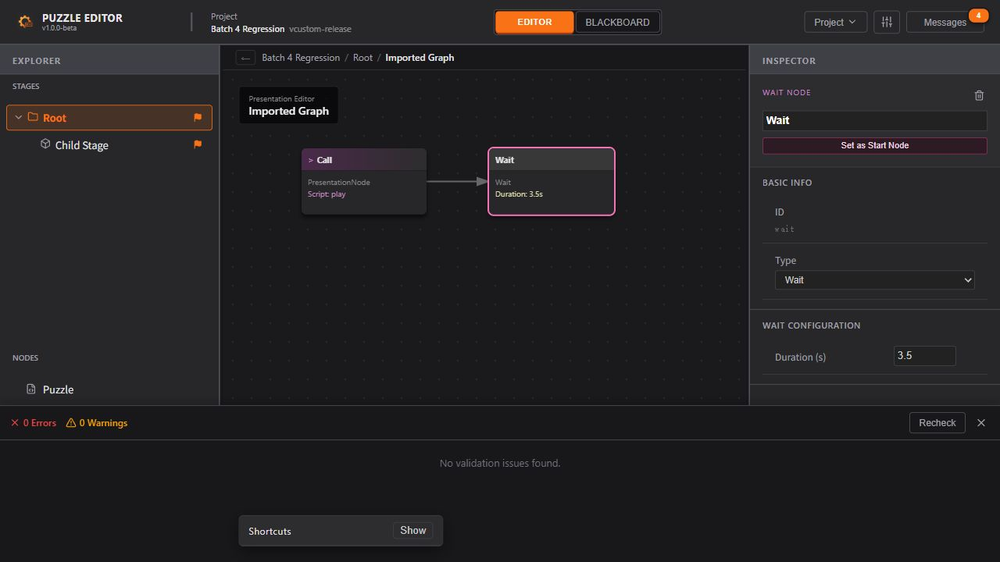

# 第四批修复：类型保障与自动检查

> 2026-10-07。状态：已完成并验收。承接 [修复计划](./Architecture_Repair_Plan.md) 第四批。前三批工作区基线备份：`D:\Temp\puzzle-batch4-baseline-B9e0II`（292 个文件）；保留原有改动，未创建提交。

## 目标与约束

补齐 React 19 类型、启用前端 strict，消除关键数据流中的 any 和伪造 Store，建立可重复检查。对应 P1-T08/T09 的模块边界、单向更新与交互约束，以及 P2-T01/T08 的加载和文件语义。保留 UX §2.1 的项目、消息与导航；§3–6 的黑板、阶段、FSM、演出 Inspector；§6.3/7 的变量作用域、常量、临时参数和监听器行为。界面保持 English，设计原文只读。

## 实施前技术设计

1. **依赖与范围**：按现有 React 19.2、TypeScript 5.8、Node 24 选择并锁定匹配的 React 类型、ESLint、typescript-eslint、React Hooks 插件与 Prettier。不升级 React/Electron 运行时。根配置开启 strict，覆盖现有业务、测试与工具 TS；排除的只有依赖、生成物和发布产物。Electron 继续单独检查。实施时核对维护状态和 peer 范围后选择 ESLint 10。
2. **类型边界**：Context 和 Store 保留显式 EditorState/Action/ProjectSession；Action 联合与策略映射做编译期反向断言。JSON 输入保留 unknown 校验边界，序列化数据采用明确 JSON 联合，编辑值/归一化结果采用标量联合，不为消除诊断静默改值。Inspector 更新使用 keyof + 对应字段类型或 Partial 领域模型；条件/触发器按判别字段收窄。
3. **最小接口**：画布 Hook 只接收其需要的坐标、连接、选择信息；变量作用域收集只依赖 ProjectData，不再构造缺少 document/runtime 的伪 EditorState。必要的引用和 IPC 回调使用现有领域类型。组件拆分与大范围分层迁移仍属第五批。
4. **Hook 与空值**：修复 React 类型暴露的 RefObject、事件、初始化、可选字段和条件 Hook 问题；依赖数组按实际闭包处理，不能批量禁用规则。只在已解释且真实稳定的特殊订阅模式上使用局部例外。
5. **检查入口**：typecheck（前端 + Electron）、lint（所有生产/测试 TS 的基本正确性、显式 any、Hook 调用/依赖、类型层和 Store 的依赖限制）、format:check（配置、检查脚本、本批新建源文件）、check:encoding（所有维护的源码与配置严格 UTF-8）、test:run，合并为 check。构建和真实 Electron 冒烟另行执行。第五批按被整理的子系统扩展 Prettier，不做无关全仓格式重排。
6. **风格约定**：现有 4/2 空格混用不在本批全量重排；新工具/配置由 Prettier 固定。固定主题配色/间距应复用现有 CSS 变量/类，画布位置、尺寸、缩放可使用类型明确的动态 style；现有固定内联样式按第五批拆组件时整理，不做机械禁止。
7. **验收**：先记录安装 React 类型后的真实 strict 诊断，再分组修复。通过反向类型断言、故意非法编码和 lint 示例验证检查确实拦截错误。保留前三批 140 个行为回归，增加必要的参数/作用域/Hook 回归。运行 check、构建、真实 Electron 文件链路；浏览器直接验证导入、黑板/Inspector 切换、参数编辑、图节点操作、Undo/Redo 与校验导航。开发热更新问题若与 Context 导出边界直接相关，在本批一起验证。

## 工具依据

React 的 JSX/Hook 类型依赖独立类型包，见 [React TypeScript 文档](https://react.dev/learn/typescript)。strict 开启一组严格类型检查，见 [TypeScript strict 文档](https://www.typescriptlang.org/tsconfig/strict.html)。ESLint flat config 按 [typescript-eslint 指南](https://typescript-eslint.io/getting-started/) 配置；格式配置依据 [Prettier 文档](https://prettier.io/docs/configuration)。具体版本以本仓锁文件和实际兼容检查为准。

## 实施与验收记录

### 类型与接口

- 锁定 `@types/react` 19.2.18、`@types/react-dom` 19.2.7；补齐类型后实际 strict 基线为 41 条诊断，已归零。前端和 Electron 均为严格检查，没有排除业务文件或添加 `@ts-ignore`。修复 React 19 可空 Ref、回调参数、可选字段及空值分支。
- `types/json.ts` 区分 `JsonValue` 与有效编辑标量 `VariableValue`。导入边界仍由 unknown 开始收窄；已导入但业务类型不匹配的 JSON 值保留给校验器，不通过类型迁移静默丢失数据。变量编辑、Inspector 的 Partial 更新、Action、图节点、连线与引用使用明确类型。
- `collectVisibleVariables` 改为只依赖 `ProjectData`，保留全局、祖先阶段、当前阶段、节点的可见性；删除 Inspector 中构造不完整 EditorState 再强转的写法。
- 删除没有调用方、依赖已废弃 `ScriptDefinition.parameters` 的 `PresentationParamEditor.tsx`。现行 `PresentationBindingEditor` 和 Temporary 参数流程保留。移除未使用的连线 `onCut` 传递及空实现，实际 Ctrl 拖拽剪线仍由现有 Hook 处理。

### React 与交互修复

- StageOverview、StageInspector 的缺失对象返回移到所有 Hook 之后；修复画布、筛选和参数编辑中的依赖数组，清理失效字段访问、未使用导入和局部变量。卡片使用实际 ID；FSM 搜索使用所属 PuzzleNode 名称。
- 名称编辑 Hook 根据实体 ID、名称和资产名同步：同一对象的其他更新保留输入草稿，切换同名对象时正确重置。局部变量引用信息按位置字符串传给确认/删除流程；布尔、数值、空字符串保持对应值语义。
- `store/StoreProvider.tsx` 只导出组件，`store/context.ts` 提供 Context 与读取 Hook。浏览器实测发现仅拆分仍会在 Context 重建时丢失会话；现通过开发期 `import.meta.hot.data` 保留 Context 身份，生产环境直接创建 Context，每个 Provider 的 Store 和 ProjectSession 仍独立。实现依据 [Vite HMR data](https://vite.dev/guide/api-hmr#hot-data)，并兼容测试环境无 hot.data 的情况。

### 检查入口与覆盖范围

| 命令 | 当前检查范围 |
| --- | --- |
| `npm run typecheck` | 前端全部 TS/TSX/MTS 和独立 Electron strict |
| `npm run lint` | 全部维护源码/测试；禁止显式 any，检查无用变量、Hook 顺序/依赖、领域类型和 Store 的基本导入边界；0 warning |
| `npm run check:encoding` | 226 个源码/配置文件：严格 UTF-8、替换字符、文件中部 BOM；只读设计文档不在扫描范围 |
| `npm run format:check` / `npm run format` | 配置、检查脚本、本批新增文件共 14 个；清单位于 `scripts/source-files.mjs` |
| `npm run check:guards` | 5 条 lint 规则、7 个类型契约、3 种编码错误、1 个格式错误的反向拦截；使用虚拟源码，不污染工作区 |
| `npm run check` | 依次运行编码、类型、lint、格式、反向拦截及所有回归测试 |
| `npm run build` / `npm run test:electron` | 生产构建 / 真实 Electron IPC、文件与监听冒烟，单独运行 |

工具版本为 ESLint 10.12.0、typescript-eslint 8.71.1、React Hooks 插件 7.1.1、Prettier 3.9.9、jsdom 27.4.0。jsdom 只服务于组件测试，使用真实 React DOM；没有替换运行时 React、Vite、Electron。`package.json` 已记录工具链所需 Node 范围，本机验证为 Node 24.15.0。

格式范围有意渐进推进，现有组件不是全仓 Prettier 达标；固定颜色/间距复用主题样式，画布坐标/缩放保留动态 style。仅文件名过滤中的控制字符正则有一处注明原因的局部 lint 例外，没有批量禁用 Hook 或类型规则。尚未配置 CI 自动触发，提交前应运行上述入口。

### 自动回归与实际运行

| 检查 | 结果 |
| --- | --- |
| `npm run check` | 全部通过；11 个测试文件、154 个用例 |
| 反向检查 | 错误 Action、错误载荷、遗漏策略、空状态、错误 Hook 返回/派发与保存结果均被拒绝；lint/编码/格式反例均被拦截 |
| `npm run build` | 通过；1,855 个模块，主 JS 626.83 kB / gzip 164.04 kB |
| `npm run test:electron` | 类型编译与 11 项真实 IPC/磁盘检查通过 |

保留前三批 140 个用例，新增 14 个：6 个真实 React DOM 组件用例和 8 个作用域/标量用例。覆盖阶段存在→缺失→恢复、名称草稿与同名对象切换、失焦提交、带引用的局部变量删除、布尔 False、数值 0/空字符串、祖先阶段可见性和标量归一化。重写非法输入夹具时暴露的 1 个夹具路径错误已修正；收尾回归全部通过。

最终 `git diff --check` 通过；本批同步的 5 份开发文档通过严格 UTF-8 与 33 个本地链接检查。项目概览、任务分解、UX 设计与 AGENTS 文件和实施前备份字节一致。仓库既有 LF/CRLF 转换提示不属于空白检查失败。

Electron 证据目录：`D:\Temp\puzzle-batch2-electron-xSmfnx`，完整结果见 [batch4-electron-result.json](./verification/batch4-electron-result.json)。保留原验收脚本的目录前缀；EEXIST 是预期的排他创建失败注入。原生文件选择器路径由适配器提供，未声称手动完成原生对话框全流程。

### 浏览器直接验收

使用本地 Vite 页面和 `D:\Temp\puzzle-batch4-browser-VOPGQE` 中的隔离夹具，实际完成：

1. 导入包含阶段、PuzzleNode、FSM、演出图、全局/局部变量和 Temporary 参数的工程，进入阶段 Inspector。
2. 阶段整数 0→7，黑板显示 7；节点局部字符串由空值改为 checked；全局 False→True 后 Undo→False、Redo→True。
3. Graphs 页显示正确 FSM/ID，按 Puzzle 名称筛选；双击打开 FSM，修改转移优先级为 4，拖动 End 节点，连线随节点位置更新。
4. 演出 Temporary 参数 False→True→Undo 恢复 False；Wait 时长 2→3.5。项目校验为 0 error / 0 warning。
5. Context 与 Provider 同时热更新，初次复现会话 Context 丢失，随后补齐实例保留。修复后再次实际触发两模块热更新及恢复源码：项目、未保存内容、选择与 Undo/Redo 历史保持；12:52 UTC 后的复测未捕获新增 warn/error。保留 [修复前后浏览器日志](./verification/batch4-browser-log.json)，其中修复前错误单独记录。
6. 热更新修复后重新完成 Counter=7、Wait=3.5，实际下载 `Batch 4 Regression.puzzle.json`，核对 JSON 中上述数值、Temporary=false、保存的图导航；原始夹具仍为 Counter=0、Wait=2。
7. 重开下载副本，验证浏览器下载仍保留未保存保护，选择 Discard 后成功载入；图视图与时长恢复，无 dirty 标记，Recheck 仍为 0 error / 0 warning。

## UX 覆盖与后续边界

- 已覆盖本批影响的 UX §2.1 项目菜单/保存保护/消息，§3 黑板与图导航，§4–6 阶段/FSM/演出 Inspector、图拖动、撤销重做，§6.3/7 变量作用域、常量及临时参数。组件测试补充了浏览器普通流程难以稳定触发的缺失实体生命周期。
- 第五批继续模块边界、重复业务逻辑、大型组件和固定样式整理；第六批进行性能测量。生产构建仍提示主包超过 500 kB，本批未做拆包优化。
- HMR 验收覆盖 Context/Provider 更新及组件依赖刷新，不承诺任意状态结构变更都能无损热更新。原生窗口关闭保护、安装包与引擎联调仍未验收。
- 安装工具时 npm 提示依赖审计问题；本批未进行跨版本依赖安全升级，也未把类型/lint 通过解释为依赖安全审计通过。
