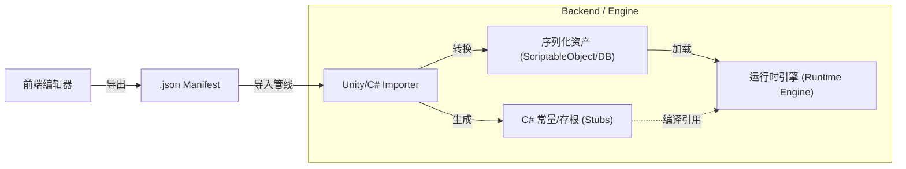

# 后端运行时与管线协同规范 (Backend Runtime & Pipeline Specification)

> 本文档指导后端开发人员实现数据导入管线与核心运行时引擎，确保游戏能够正确解析并执行编辑器产生的数据。  
> **版本**: 1.0.0 (Draft) | **对应前端版本**: 1.2.0

---

## 1. 概览 (Overview)

后端系统需承担两大核心职责：**静态代码生成**与**动态运行时构建**。

### 1.1 数据流向 pipeline



### 1.2 核心目标

1.  **类型安全 (Type Safety)**：通过生成的 C#常量/枚举，确保代码中引用变量 ID、事件 ID 时不会出现拼写错误。
2.  **动态构建 (Dynamic Construction)**：游戏启动时，根据 JSON/Asset 数据在内存中重建 Stage 树、FSM 和演出图。
3.  **前端主导 (Frontend Authority)**：任何逻辑结构的变更（如新增状态、修改条件）必须在前端完成，后端不得手动修改导出的数据文件。

---

## 2. 数据结构映射 (Data Schema Mapping)

后端需建立与前端 TypeScript 类型对应的 C#数据模型。

### 2.1 基础类型

| TypeScript (前端) | C# (后端建议) | 说明 |
| :--- | :--- | :--- |
| `string` (ID) | `string` / `Hash128` | 运行时可优化为 Hash 以提升性能 |
| `ResourceState` | `enum ResourceState` | Draft / Implemented / MarkedForDelete |
| `VariableType` | `enum VariableType` | Boolean / Integer / Float / String |
| `VariableScope` | `enum VariableScope` | Global / StageLocal / NodeLocal / Temporary |
| `Vector2` | `Vector2` (Unity) | 用于 FSM/Graph 节点坐标（仅编辑器复用或调试用） |

### 2.2 核心模型映射

建议使用 **组合模式 (Composition Pattern)** 而非继承，以匹配前端的 JSON 结构。

#### StageNode -> RuntimeStage
```csharp
public class RuntimeStage {
    public string ID;
    public RuntimeStage Parent;
    public List<RuntimeStage> Children;
    public Dictionary<string, RuntimeVariable> LocalVariables;
    public RuntimeCondition UnlockCondition;
    
    // 逻辑组件
    public RuntimeLifecycleHandler Lifecycle; // 处理 OnEnter/OnExit
    public List<RuntimeEventListener> EventListeners;
}
```

#### PuzzleNode -> RuntimePuzzleNode
```csharp
public class RuntimePuzzleNode {
    public string ID;
    public RuntimeFSM FSM; // 每个节点持有一个 FSM 实例
    public Dictionary<string, RuntimeVariable> LocalVariables;
}
```

#### StateMachine -> RuntimeFSM
```csharp
public class RuntimeFSM {
    public RuntimeState CurrentState;
    public Dictionary<string, RuntimeState> States;
    // Tick 方法每帧调用，检查 Transitions
}
```

---

## 3. 核心子系统设计 (Core Systems Design)

### 3.1 变量与作用域 (Scoping Resolution)

必须实现**责任链模式**来进行变量查找。

*   **查找逻辑**：`GetValue(varId, scope)`
    1.  若 scope 为 `NodeLocal` -> 查当前 Node.LocalVariables
    2.  若 scope 为 `StageLocal` -> 查当前 Node 所属 Stage.LocalVariables (及其父级链?) *注：前端设计中 Stage 变量通常只在 Stage 自身或其子 Stage 可见，具体需确认 Stage 继承规则。当前设计是 StageLocal 仅指当前 Stage。*
    3.  若 scope 为 `Global` -> 查 GlobalBlackboard

### 3.2 脚本绑定与反射 (Script Binding)

前端仅通过 `ScriptId` (如 `script-playsound`) 引用逻辑，后端需提供具体实现。

**建议方案：特性标记 (Attribute) + 注册表**

后端代码：
```csharp
// 定义脚本逻辑
[PuzzleScript("script-playsound", Category.Performance)]
public class PlaySoundScript : IPuzzleScript {
    public async Task Execute(ScriptContext context) {
        string audioFile = context.GetParam<string>("AudioFile");
        AudioManager.Play(audioFile);
    }
}
```

**运行时绑定**：
1.  游戏启动时扫描所有带 `[PuzzleScript]` 特性的类。
2.  建立字典 `Dictionary<string, Type> ScriptRegistry`。
3.  解析 JSON 时，遇到 `script-playsound`，则实例化对应的 C# 类。

### 3.3 条件系统 (Condition System)

需实现一个能够递归求值的表达式树。

```csharp
public abstract class RuntimeCondition {
    public abstract bool Evaluate(Context ctx);
}

// 组合节点
public class AndCondition : RuntimeCondition {
    public List<RuntimeCondition> Children;
    public override bool Evaluate(Context ctx) {
        return Children.All(c => c.Evaluate(ctx));
    }
}

// 比较节点
public class ComparisonCondition : RuntimeCondition {
    public IValueSource Left; // 支持变量引用或常量
    public IValueSource Right;
    public Operator Op; // ==, >, < 等
    // ...
}
```

---

## 4. 导入管线与代码生成 (Importer & Code Gen)

当检测到 `_export.json` 更新时，Importer 应自动执行：

### 4.1 生成 ID 常量表 (Generated/IDs.cs)

**目的**：避免硬编码字符串，防止拼写错误。

```csharp
// 自动生成的代码 - 请勿修改
public static class PuzzleIDs {
    public static class GlobalVars {
        public const string Sanity = "var-sanity";
        public const string HasKey = "var-haskey";
    }
    public static class Events {
        public const string ThunderStrike = "event-thunder";
    }
    public static class Stages {
        public const string EntranceHall = "stage-entrance";
    }
}
```

### 4.2 数据完整性校验

在导入阶段执行最后一道防线检查：
1.  **引用检查**：确保所有 `scriptId` 在后端都有对应的 `[PuzzleScript]` 实现类。
2.  **甚至检查**：确保所有 `jumpToStateId` 指向的状态真实存在。

---

## 5. 验证标准 (Verification Criteria)

后端开发完成后，必须通过 `test/test_project.puzzle.json` 的验证：

### 测试清单
1.  **加载测试**：
    *   [ ] 无错误加载 JSON 文件。
    *   [ ] 内存中正确构建了 Stage 树结构（Root -> Entrance -> Basement）。
2.  **黑板测试**：
    *   [ ] 能读取 Global 变量 `Sanity` 初始值为 100。
    *   [ ] 触发事件 `event-interact` 能被系统捕获。
3.  **逻辑测试**：
    *   [ ] 模拟：设置 `HasKey = false` -> 触发 `event-interact` -> 断言：状态保持 Locked，Runtime 执行了 Sanity-10 的操作。
    *   [ ] 模拟：设置 `HasKey = true` -> 触发 `event-interact` -> 断言：状态切换至 Unlocked。
4.  **演出测试**：
    *   [ ] 进入 `Fail` 转移时，系统能按顺序执行 `pg-scare` 中的 `Scream` -> `Wait(2s)` -> `Gasp`。

---

## 6. 后续工作 (Next Steps)

1.  搭建 Unity/C# 基础工程，建立上述类结构。
2.  编写 JSON Importer，实现从 JsonNet 到 Runtime 对象的转换。
3.  实现基础的 FSM Ticker。
4.  运行并通过上述测试用例。
