# 后端运行时与管线协同规范 (Backend Runtime & Pipeline Specification)

> 本文档指导后端开发人员实现数据导入管线与核心运行时引擎，确保游戏能够正确解析并执行编辑器产生的数据。  
> **版本**: 2.1.0 | **对应前端版本**: 1.2.0 | **更新时间**: 2025-12-23

---

## 1. 概览 (Overview)

后端系统需承担两大核心职责：**静态代码生成**与**动态运行时构建**。

### 1.1 数据流向 pipeline

```mermaid
graph LR
    Editor[前端编辑器] -->|导出| JSON[.json Manifest]
    JSON -->|导入管线| Importer[Unity/C# Importer]
    
    subgraph "Backend / Engine"
        Importer -->|生成| Code["C# 脚本基类/接口/访问器"]
        Importer -->|转换| Asset["序列化资产 (ScriptableObject/DB)"]
        Asset -->|加载| Runtime["运行时引擎 (Runtime Engine)"]
        Code -.->|编译引用| Runtime
    end
```



### 1.2 核心目标

1.  **类型安全 (Type Safety)**：通过生成的 C# 基类、接口和访问器，确保代码中引用资源时不会出现拼写错误。
2.  **动态构建 (Dynamic Construction)**：游戏启动时，根据 JSON/Asset 数据在内存中重建 Stage 树、FSM 和演出图。
3.  **前端主导 (Frontend Authority)**：任何逻辑结构的变更（如新增状态、修改条件）必须在前端完成，后端不得手动修改导出的数据文件。
4.  **资产名引用 (AssetName Reference)**：代码生成和脚本绑定使用 `assetName` 字段作为标识符，而非内部 `id`。`assetName` 遵循标准变量命名规则（字母/下划线开头，只含字母数字下划线），适合作为 C# 标识符。

### 1.3 协程执行模型

- **Coroutine**：使用 Unity 原生协程（`IEnumerator`）实现异步执行模型，无需引入第三方依赖。所有演出脚本使用协程进行异步操作。

---

## 2. 数据结构映射 (Data Schema Mapping)

后端需建立与前端 TypeScript 类型对应的 C# 数据模型。

### 2.1 基础类型

| TypeScript (前端) | C# (后端建议) | 说明 |
| :--- | :--- | :--- |
| `string` (ID) | `string` / `Hash128` | 运行时可优化为 Hash 以提升性能 |
| `ResourceState` | `enum ResourceState` | Draft / Implemented / MarkedForDelete |
| `VariableType` | `enum VariableType` | Boolean / Integer / Float / String |
| `VariableScope` | `enum VariableScope` | Global / StageLocal / NodeLocal / Temporary |
| `Vector2` | `Vector2` (Unity) | 用于 FSM/Graph 节点坐标（仅编辑器复用或调试用） |

### 2.2 核心模型映射

建议使用 **组合模式 (Composition Pattern)** 而非继承，以匹配前端的 JSON 结构。

#### StageNode -> RuntimeStage
```csharp
public class RuntimeStage {
    public string ID;
    public string AssetName;
    public RuntimeStage Parent;
    public List<RuntimeStage> Children;
    public Dictionary<string, RuntimeVariable> LocalVariables;
    public List<RuntimeTrigger> UnlockTriggers;
    public RuntimeCondition UnlockCondition;
    
    // 生命周期脚本
    public IStageLifecycleScript LifecycleScript;
    
    // 演出绑定
    public IPerformanceScript OnEnterPresentation;
    public IPerformanceScript OnExitPresentation;
    
    // 事件监听
    public List<RuntimeEventListener> EventListeners;
}
```

#### PuzzleNode -> RuntimePuzzleNode
```csharp
public class RuntimePuzzleNode {
    public string ID;
    public string AssetName;
    public RuntimeStage OwnerStage;
    public RuntimeFSM FSM;  // 每个节点持有一个 FSM 实例（1:1 关系）
    public Dictionary<string, RuntimeVariable> LocalVariables;
    
    // 生命周期脚本
    public INodeLifecycleScript LifecycleScript;
}
```

#### StateMachine -> RuntimeFSM
```csharp
public class RuntimeFSM {
    public RuntimeState CurrentState;
    public Dictionary<string, RuntimeState> States;
    public Dictionary<string, RuntimeTransition> Transitions;
    
    // 每帧调用，检查 Transitions
    public void Tick(Context ctx);
    
    // 强制切换状态（由 Node 生命周期脚本调用）
    public void ForceSetState(string stateAssetName);
}
```

#### PresentationGraph -> RuntimePresentationGraph
```csharp
public class RuntimePresentationGraph {
    public string ID;
    public string StartNodeId;
    public Dictionary<string, RuntimePresentationNode> Nodes;
    
    /// <summary>
    /// 执行演出图，按拓扑顺序依次执行节点。
    /// 每个节点的协程完成后才执行下一个节点。
    /// </summary>
    public IEnumerator Execute(ScriptContext ctx);
}

public class RuntimePresentationNode {
    public string ID;
    public string Type;  // PresentationNode / Wait / Branch / Parallel
    public string ScriptAssetName;
    public Dictionary<string, object> Parameters;
    public List<string> NextNodeIds;
}
```

---

## 3. 脚本系统设计 (Script System Design)

### 3.1 脚本分类

| 脚本类型 | ScriptCategory | 用途 |
|----------|----------------|------|
| 演出脚本 | `Performance` | 视觉/音效表现，绑定在 Stage.OnEnter/OnExit、Transition、演出图节点 |
| 阶段生命周期 | `Lifecycle` (Stage) | Stage 的进入/退出/更新/事件处理 |
| 节点生命周期 | `Lifecycle` (PuzzleNode) | PuzzleNode 的进入/退出/更新/事件/状态变化处理 |
| 状态生命周期 | `Lifecycle` (State) | FSM State 的进入/退出/更新/事件处理 |
| 自定义触发器 | `Trigger` | 用于 TriggerConfig.type = 'CustomScript' |
| 自定义条件 | `Condition` | 用于 ConditionExpression.type = 'ScriptRef' |

### 3.2 演出脚本 (Performance Script)

#### 3.2.1 接口定义

```csharp
using UnityEngine;
using System.Collections;

/// <summary>
/// 演出脚本接口。
/// 协程完成时表示"逻辑返回"被允许，系统可继续后续流程。
/// </summary>
public interface IPerformanceScript {
    void Initialize();
    IEnumerator Execute();
}
```

#### 3.2.2 执行模型

演出脚本使用统一的协程模型：**协程完成 = 逻辑返回被允许**

```mermaid
sequenceDiagram
    participant System as 运行时系统
    participant Script as 演出脚本
    participant Next as 后续逻辑

    Note over System: Stage OnEnter / OnExit / Transition 触发
    System->>Script: Execute()
    Script-->>Script: 播放动画/音效... (yield return)
    Script-->>System: 协程完成
    System->>Next: 执行后续逻辑
```



#### 3.2.3 代码生成：脚本基类 + 智能提示

导入管线为每个演出脚本生成基类，自动注入参数：

```csharp
// ============================================
// 自动生成的代码 - 请勿手动修改
// 生成时间: 2025-12-23
// 数据来源: puzzle_export.json
// ============================================

using UnityEngine;
using System.Collections;

namespace Puzzle.Generated {

    /// <summary>
    /// 演出脚本: PlaySound
    /// 
    /// <para><b>【参数汇总】</b></para>
    /// <para>- AudioFile (string): 音频文件路径</para>
    /// <para>- Volume (float): 音量，默认 1.0</para>
    /// <para>- Loop (bool): 是否循环，默认 false</para>
    /// <para>- Pitch (float): 音调，默认 1.0</para>
    /// 
    /// <para><b>【绑定点详情】</b></para>
    /// <para>• Stage[EntranceHall].OnEnter:</para>
    /// <para>    - AudioFile = "ambient_rain.wav"</para>
    /// <para>    - Volume = 0.5</para>
    /// <para>    - Loop = true</para>
    /// <para>• Transition[Locked→Unlocked].Presentation:</para>
    /// <para>    - AudioFile = "unlock_click.wav"</para>
    /// <para>• PresentationGraph[ScareSequence].Node[SFX]:</para>
    /// <para>    - AudioFile = "scream.wav"</para>
    /// <para>    - Volume = 1.0</para>
    /// <para>    - Pitch = 0.8</para>
    /// </summary>
    public abstract class PlaySoundScriptBase : PerformanceScriptBase, IScript_PlaySound {
        
        /// <summary>音频文件路径 (必需)</summary>
        protected string AudioFile { get; private set; }
        
        /// <summary>音量 (可选，默认: 1.0)</summary>
        protected float Volume { get; private set; }
        
        /// <summary>是否循环 (可选，默认: false)</summary>
        protected bool Loop { get; private set; }
        
        /// <summary>音调 (可选，默认: 1.0)</summary>
        protected float Pitch { get; private set; }
        
        public sealed override IEnumerator Execute() {
            // 自动从参数上下文注入到属性
            AudioFile = Params.GetRequired<string>("AudioFile");
            Volume = Params.Get<float>("Volume", 1.0f);
            Loop = Params.Get<bool>("Loop", false);
            Pitch = Params.Get<float>("Pitch", 1.0f);
            
            yield return OnExecute();
        }
        
        /// <summary>实现此方法来编写演出逻辑</summary>
        protected abstract IEnumerator OnExecute();
    }
}
```

#### 3.2.4 程序员实现

```csharp
using Puzzle.Generated;
using UnityEngine;
using System.Collections;

public class PlaySoundScript : PlaySoundScriptBase {
    
    protected override IEnumerator OnExecute() {
        // 直接使用继承的属性，IDE 有自动补全
        AudioClip clip = null;
        yield return AudioManager.LoadClip(AudioFile, result => clip = result);
        
        var source = AudioManager.Play(clip);
        source.volume = Volume;
        source.pitch = Pitch;
        source.loop = Loop;
        
        if (!Loop) {
            yield return new WaitForSeconds(clip.length);
        }
    }
}
```

### 3.3 生命周期脚本 (Lifecycle Scripts)

#### 3.3.1 阶段生命周期 (Stage Lifecycle)

```csharp
public interface IStageLifecycleScript {
    void Initialize(StageContext ctx);
    void OnStageEnter();
    void OnStageExit();
    void OnStageUpdate();
    void OnEvent(string eventAssetName);
    
    /// <summary>
    /// 系统从快照恢复后调用（如加载存档后）
    /// 用于重建运行时依赖、刷新 UI 等
    /// </summary>
    void OnRecover();
}

/// <summary>
/// 阶段上下文 - 只能访问 Global + StageLocal 变量
/// </summary>
public class StageContext {
    public GlobalVarsAccessor Global { get; }
    public StageVarsAccessor Stage { get; }  // 包含父级 Stage 的变量（责任链查找）
    
    public void InvokeEvent(string eventAssetName);
}
```

#### 3.3.2 解谜节点生命周期 (PuzzleNode Lifecycle)

```csharp
public interface INodeLifecycleScript<TStateEnum> where TStateEnum : Enum {
    void Initialize(NodeContext<TStateEnum> ctx);
    void OnNodeEnter();
    void OnNodeExit();
    void OnNodeUpdate();
    void OnEvent(string eventAssetName);
    void OnEnterState(TStateEnum state);
    void OnLeaveState(TStateEnum state);
    void OnUpdateState(TStateEnum state);
    
    /// <summary>
    /// 系统从快照恢复后调用
    /// </summary>
    void OnRecover();
}

/// <summary>
/// 节点上下文 - 可访问 Global + StageLocal + NodeLocal 变量，可控制 FSM
/// </summary>
public class NodeContext<TStateEnum> where TStateEnum : Enum {
    public GlobalVarsAccessor Global { get; }
    public StageVarsAccessor Stage { get; }
    public NodeVarsAccessor Node { get; }
    
    // FSM 控制（Node 级别允许）
    public TStateEnum CurrentState { get; }
    public void SetState(TStateEnum state);
    
    public void InvokeEvent(string eventAssetName);
}
```

> **状态枚举**：每个 PuzzleNode 的 FSM 状态会生成对应的枚举类型，枚举成员名为 `State.assetName`

#### 3.3.3 状态生命周期 (State Lifecycle)

```csharp
public interface IStateLifecycleScript<TStateEnum> where TStateEnum : Enum {
    void Initialize(StateContext<TStateEnum> ctx);
    void OnStateEnter();
    void OnStateExit();
    void OnStateUpdate();
    void OnEvent(string eventAssetName);
    
    /// <summary>
    /// 系统从快照恢复后调用
    /// </summary>
    void OnRecover();
}

/// <summary>
/// 状态上下文 - 可访问 Global + StageLocal + NodeLocal 变量
/// </summary>
public class StateContext<TStateEnum> where TStateEnum : Enum {
    public GlobalVarsAccessor Global { get; }
    public StageVarsAccessor Stage { get; }
    public NodeVarsAccessor Node { get; }
    
    // 事件触发
    public void InvokeEvent(string eventAssetName);
    
    // 请求状态切换（通知 Node/FSM 直接切换，绕过 Transition）
    public void RequestStateChange(TStateEnum targetState);
}
```

> **设计说明**：State 级别可通过 `RequestStateChange()` 直接请求 Node 切换状态，作为 `InvokeEvent()` 的补充。适用于特殊情况下的强制切换（如重置、异常恢复）。

> **OnRecover() 说明**：该方法在系统从持久化快照恢复时调用，用于重建运行时依赖、刷新 UI、恢复外部资源引用等。

### 3.4 触发器与条件脚本

```csharp
public interface ICustomTrigger {
    void Initialize();
    bool CheckTrigger();
}

public interface ICustomCondition {
    void Initialize();
    bool Evaluate();
}
```

### 3.5 事件服务 (Event Service)

系统通过**依赖注入**支持可替换的事件服务，允许与外部事件框架集成。

#### 3.5.1 事件服务接口

```csharp
/// <summary>
/// 事件服务接口 - 支持依赖注入
/// </summary>
public interface IPuzzleEventService
{
    /// <summary>触发事件</summary>
    void Invoke(string eventAssetName);
    
    /// <summary>注册事件监听</summary>
    /// <returns>用于取消注册的 handle</returns>
    IDisposable Register(string eventAssetName, Action callback);
}
```

#### 3.5.2 内置默认实现

```csharp
/// <summary>
/// 系统内置的简单事件服务（默认实现）
/// </summary>
public class DefaultPuzzleEventService : IPuzzleEventService
{
    private readonly Dictionary<string, List<Action>> _listeners = new();
    
    public void Invoke(string eventAssetName)
    {
        if (_listeners.TryGetValue(eventAssetName, out var list))
        {
            foreach (var callback in list)
                callback?.Invoke();
        }
    }
    
    public IDisposable Register(string eventAssetName, Action callback)
    {
        if (!_listeners.ContainsKey(eventAssetName))
            _listeners[eventAssetName] = new List<Action>();
        
        _listeners[eventAssetName].Add(callback);
        
        return new EventRegistration(() => _listeners[eventAssetName].Remove(callback));
    }
}
```

#### 3.5.3 注入外部实现

```csharp
public class PuzzleRuntimeManager
{
    private IPuzzleEventService _eventService;
    
    /// <summary>
    /// 初始化时注入事件服务（可选）
    /// 不注入则使用默认实现
    /// </summary>
    public void Initialize(IPuzzleEventService externalEventService = null)
    {
        _eventService = externalEventService ?? new DefaultPuzzleEventService();
    }
    
    /// <summary>暴露事件服务供外部访问</summary>
    public IPuzzleEventService EventService => _eventService;
}
```

#### 3.5.4 双向互通

注入外部事件服务后，可实现双向事件互通：

- **外部 → Puzzle**：外部系统调用 `EventService.Invoke("PlayerDeath")`，Puzzle 内部的 Transition OnEvent 触发器自动响应
- **Puzzle → 外部**：Puzzle 内部 Transition 触发 `InvokedEvents`，外部通过 `EventService.Register()` 注册的回调自动执行

---

## 4. 变量访问系统 (Variable Access System)

### 4.1 作用域查找规则

使用**责任链模式**进行变量查找：

| Scope | 查找逻辑 |
|-------|----------|
| `NodeLocal` | 查当前 Node.LocalVariables |
| `StageLocal` | 查当前 Stage.LocalVariables，若未找到则向上遍历父级 Stage 链（就近原则，子级覆盖父级） |
| `Global` | 查 GlobalBlackboard |

### 4.2 强类型变量访问器（代码生成）

导入管线为变量生成强类型访问器，使用成员变量方式访问：

```csharp
// Generated/Vars/GlobalVarsAccessor.cs
public class GlobalVarsAccessor {
    private readonly IBlackboard _bb;
    
    public int Sanity {
        get => _bb.GetInt("Sanity");
        set => _bb.SetInt("Sanity", value);
    }
    
    public bool HasKey {
        get => _bb.GetBool("HasKey");
        set => _bb.SetBool("HasKey", value);
    }
}

// 使用方式
ctx.Global.Sanity -= 10;
if (ctx.Global.HasKey) { ... }
```

### 4.3 访问控制

每个层级有专属的 Context 类型，只暴露允许访问的变量访问器：

| 脚本层级 | 可访问变量 |
|----------|------------|
| Stage 生命周期 | Global + 本 Stage 及父级 Stage 的 Local |
| Node 生命周期 | Global + 所属 Stage 的 Local + 本 Node 的 Local |
| State 生命周期 | Global + 所属 Stage 的 Local + 所属 Node 的 Local |

---

## 5. 脚本绑定与注册 (Script Binding & Registration)

### 5.1 生成接口存根

导入管线为每个前端定义的脚本生成标记接口：

```csharp
// Generated/ScriptStubs.cs
namespace Puzzle.Generated {
    public interface IScript_PlaySound : IPerformanceScript { }
    public interface IScript_ShowDialog : IPerformanceScript { }
    public interface IScript_DoorPuzzleLifecycle : INodeLifecycleScript<DoorPuzzleState> { }
}
```

### 5.2 实现状态检查

```csharp
public static class ScriptChecker {
    public static readonly string[] RequiredScripts = { "PlaySound", "ShowDialog", ... };
    public static readonly Dictionary<string, Type> InterfaceMap = new() {
        ["PlaySound"] = typeof(IScript_PlaySound),
        ["ShowDialog"] = typeof(IScript_ShowDialog),
    };
    
    public static ScriptStatusReport CheckImplementations(Assembly assembly) {
        // 扫描程序集，检查每个接口是否有实现类
    }
}
```

### 5.3 运行时注册

```csharp
public class GameBootstrap : MonoBehaviour {
    void Awake() {
        var report = ScriptChecker.CheckImplementations(Assembly.GetExecutingAssembly());
        
        if (!report.IsComplete) {
            report.PrintToConsole();  // 输出缺失的脚本
        }
        
        foreach (var (assetName, type) in report.Implemented) {
            ScriptRegistry.Register(assetName, type);
        }
    }
}
```

---

## 6. 导入管线与代码生成 (Importer & Code Gen)

当检测到 `_export.json` 更新时，Importer 应自动执行以下生成：

### 6.1 生成资产名常量表 (Generated/PuzzleAssets.cs)

```csharp
public static class PuzzleAssets {
    public static class GlobalVars {
        public const string Sanity = "Sanity";
        public const string HasKey = "HasKey";
    }
    public static class Events {
        public const string ThunderStrike = "ThunderStrike";
    }
    public static class Scripts {
        public const string PlaySound = "PlaySound";
        public const string ShowDialog = "ShowDialog";
    }
    // ...
}
```

### 6.2 生成状态枚举 (Generated/StateEnums/)

为每个 PuzzleNode 的 FSM 生成状态枚举：

```csharp
// Generated/StateEnums/DoorPuzzleState.cs
public enum DoorPuzzleState {
    Locked,
    Unlocked,
    Broken,
}
```

### 6.3 生成脚本基类 (Generated/Scripts/)

参见 3.2.3 节的示例。

### 6.4 生成变量访问器 (Generated/Vars/)

参见 4.2 节的示例。

### 6.5 生成 ID -> AssetName 映射表

```csharp
public static class PuzzleIdMap {
    public static readonly Dictionary<string, string> Scripts = new() {
        ["script-abc123"] = "PlaySound",
        ["script-def456"] = "ShowDialog",
    };
    // ...
}
```

### 6.6 数据完整性校验

在导入阶段执行检查：
1.  **引用检查**：确保所有脚本的 `assetName` 在后端都有对应实现类。
2.  **AssetName 有效性**：检查所有 `assetName` 是否符合 C# 标识符命名规则。
3.  **跳转检查**：确保所有状态跳转目标真实存在。

---

## 7. 条件系统 (Condition System)

需实现一个能够递归求值的表达式树：

```csharp
public abstract class RuntimeCondition {
    public abstract bool Evaluate(Context ctx);
}

public class AndCondition : RuntimeCondition {
    public List<RuntimeCondition> Children;
    public override bool Evaluate(Context ctx) => Children.All(c => c.Evaluate(ctx));
}

public class OrCondition : RuntimeCondition {
    public List<RuntimeCondition> Children;
    public override bool Evaluate(Context ctx) => Children.Any(c => c.Evaluate(ctx));
}

public class NotCondition : RuntimeCondition {
    public RuntimeCondition Operand;
    public override bool Evaluate(Context ctx) => !Operand.Evaluate(ctx);
}

public class ComparisonCondition : RuntimeCondition {
    public IValueSource Left;
    public IValueSource Right;
    public ComparisonOperator Op;  // ==, !=, >, <, >=, <=
    public override bool Evaluate(Context ctx) { ... }
}

public class ScriptRefCondition : RuntimeCondition {
    public ICustomCondition Script;
    public override bool Evaluate(Context ctx) => Script.Evaluate();
}
```

---

## 8. 专属上下文类与变量隔离存储 (Context & Variable Isolation)

### 8.1 设计原则

为每个 Stage/Node/State 生成**专属的上下文类**，确保编译时类型安全，且只暴露允许访问的变量。

### 8.2 专属上下文类生成

```csharp
// 为 DoorPuzzle 节点生成的专属上下文
public class DoorPuzzleNodeContext {
    // 变量访问 - 分层暴露
    public GlobalVars Global { get; }
    public EntranceHallStageVars Stage { get; }  // 只能访问所属 Stage 链的变量
    public DoorPuzzleNodeVars Node { get; }
    
    // FSM 控制
    public DoorPuzzleState CurrentState { get; }
    public void SetState(DoorPuzzleState state);
    
    // 事件
    public void InvokeEvent(string eventAssetName);
}
```

### 8.3 变量隔离存储

每个 Stage/Node 实例持有独立的 `IVariableStore` 实例：

```csharp
public class RuntimeStage {
    public string ID;
    public string AssetName;
    
    // 每个 Stage 实例有独立的变量存储
    public IVariableStore LocalVariables;
}

public class RuntimePuzzleNode {
    public string ID;
    public string AssetName;
    
    // 每个 Node 实例有独立的变量存储
    public IVariableStore LocalVariables;
}
```

### 8.4 IBlackboard / IVariableStore 实现

```csharp
public interface IBlackboard {
    bool GetBool(string key);
    int GetInt(string key);
    float GetFloat(string key);
    string GetString(string key);
    
    void SetBool(string key, bool value);
    void SetInt(string key, int value);
    void SetFloat(string key, float value);
    void SetString(string key, string value);
}

public class VariableStore : IVariableStore {
    private readonly Dictionary<string, object> _data = new();
    
    public void Initialize(Dictionary<string, VariableDefinition> definitions) {
        foreach (var def in definitions.Values) {
            _data[def.AssetName] = def.Value;
        }
    }
    
    public int GetInt(string key) => Convert.ToInt32(_data[key]);
    public void SetInt(string key, int value) => _data[key] = value;
    // ... 其他类型
}
```

### 8.5 重名变量处理

不同作用域的变量可以重名，通过分层访问器区分：

```csharp
public void OnNodeEnter() {
    // 通过作用域前缀区分同名变量
    _ctx.Node.DoorLocked = true;    // Node 级别
    _ctx.Stage.DoorLocked = false;  // Stage 级别
}
```

---

## 9. 项目文件状态管理 (Project File State Management)

### 9.1 双向文件管理

后端需要管理两个文件：
- `XX_export.json`：导出文件，只读
- `XX.puzzle.json`：项目文件，可回写状态

```mermaid
graph LR
    subgraph "前端编辑器"
        Project[XX.puzzle.json]
        Export[XX_export.json]
    end
    
    subgraph "后端管线"
        Importer[Importer]
        CodeGen[代码生成]
        StateUpdater[状态更新器]
    end
    
    Export -->|读取| Importer
    Importer --> CodeGen
    CodeGen -->|生成成功| StateUpdater
    StateUpdater -->|回写状态| Project
```



### 9.2 Implemented 状态回写

当代码生成成功后，将对应资源的状态从 `Draft` 更新为 `Implemented`：

```csharp
public class ResourceStateUpdater {
    public void UpdateProjectFile(string projectPath, List<string> implementedAssetNames) {
        var project = JsonConvert.DeserializeObject<ProjectData>(File.ReadAllText(projectPath));
        
        // 更新脚本状态
        foreach (var script in project.Scripts.Scripts.Values) {
            if (implementedAssetNames.Contains(script.AssetName)) {
                script.State = ResourceState.Implemented;
            }
        }
        
        // 同样处理 Triggers、Conditions 等...
        
        File.WriteAllText(projectPath, JsonConvert.SerializeObject(project, Formatting.Indented));
    }
}
```

---

## 10. 持久化系统 (Persistence System)

### 10.1 设计原则

- **系统提供**：可序列化的状态快照数据结构
- **程序员负责**：使用项目的持久化框架保存/加载快照
- **双向支持**：导出快照 & 从快照恢复

### 10.2 RuntimeStateSnapshot

```csharp
/// <summary>
/// 运行时状态快照 - 可序列化
/// </summary>
[Serializable]
public class RuntimeStateSnapshot {
    public string Version;
    public string Timestamp;
    
    /// <summary>全局黑板变量</summary>
    public Dictionary<string, SerializedVariable> GlobalVariables;
    
    /// <summary>各 Stage 的局部变量（key = Stage.AssetName）</summary>
    public Dictionary<string, Dictionary<string, SerializedVariable>> StageLocalVariables;
    
    /// <summary>各 Node 的局部变量（key = Node.AssetName）</summary>
    public Dictionary<string, Dictionary<string, SerializedVariable>> NodeLocalVariables;
    
    /// <summary>当前激活的 Stage</summary>
    public string CurrentStageAssetName;
    
    /// <summary>各 Node 的 FSM 当前状态</summary>
    public Dictionary<string, string> NodeFSMStates;
    
    /// <summary>已解锁的 Stage 列表</summary>
    public List<string> UnlockedStages;
}

[Serializable]
public class SerializedVariable {
    public string AssetName;
    public string Type;  // "boolean" | "integer" | "float" | "string"
    public string Value;  // JSON 序列化的值
}
```

### 10.3 RuntimeStateManager

```csharp
public class RuntimeStateManager {
    private readonly RuntimeProject _project;
    
    /// <summary>
    /// 导出当前运行时状态为可序列化快照
    /// </summary>
    public RuntimeStateSnapshot ExportSnapshot();
    
    /// <summary>
    /// 从快照恢复运行时状态
    /// </summary>
    public void ImportSnapshot(RuntimeStateSnapshot snapshot);
}
```

### 10.4 恢复流程

```csharp
public void ImportSnapshot(RuntimeStateSnapshot snapshot) {
    // 1. 恢复变量数据
    DeserializeBlackboard(snapshot.GlobalVariables, _project.GlobalBlackboard);
    // ... 恢复其他变量
    
    // 2. 恢复 FSM 状态
    // ...
    
    // 3. 调用各脚本的 OnRecover
    foreach (var stage in _project.Stages.Values) {
        stage.LifecycleScript?.OnRecover();
    }
    
    foreach (var node in _project.Nodes.Values) {
        node.LifecycleScript?.OnRecover();
        node.FSM.CurrentState?.LifecycleScript?.OnRecover();
    }
}
```

### 10.5 持久化接口（程序员实现）

```csharp
/// <summary>
/// 持久化接口 - 程序员根据项目需求实现
/// </summary>
public interface ISaveSystem {
    void Save(string slotName, RuntimeStateSnapshot snapshot);
    RuntimeStateSnapshot Load(string slotName);
    bool HasSave(string slotName);
    void Delete(string slotName);
}

// 使用示例
public class GameManager : MonoBehaviour {
    private RuntimeStateManager _stateManager;
    private ISaveSystem _saveSystem;
    
    public void SaveGame(string slotName) {
        var snapshot = _stateManager.ExportSnapshot();
        _saveSystem.Save(slotName, snapshot);
    }
    
    public void LoadGame(string slotName) {
        var snapshot = _saveSystem.Load(slotName);
        _stateManager.ImportSnapshot(snapshot);
    }
}
```

---

## 11. Unity 编辑器工具 (Editor Tools)

为辅助开发调试，需实现 Unity 编辑器工具链。**注意**：所有配置工作在前端编辑器完成，Unity 编辑器仅作为辅助工具。

### 11.1 核心模块

| 模块 | 职责 |
|------|------|
| **结构预览** | 只读树形展示 Stage / Node / FSM 结构，校验导入数据正确性 |
| **脚本检查** | 显示待实现脚本列表及绑定状态，提示开发进度 |
| **运行时监控** | Play Mode 下实时显示当前阶段、活跃节点、演出状态、变量值 |
| **测试配置** | 配置起始 Stage、Node 启用/禁用、初始状态、变量预设，跳过前置流程 |

### 11.2 设计原则

- Unity 编辑器**只做校验、检查、监控、调试**
- **不展示详细配置信息**（解锁条件、转移详情、演出图结构等在前端查看）
- 保持界面简洁，避免与前端编辑器功能重复

> 📄 **详细设计请参阅**：[编辑器工具设计.md](./编辑器工具设计.md)

---

## 12. 验证标准 (Verification Criteria)

后端开发完成后，必须通过 `test/test_project.puzzle.json` 的验证：

### 测试清单
1.  **加载测试**：
    *   [ ] 无错误加载 JSON 文件
    *   [ ] 内存中正确构建了 Stage 树结构
2.  **黑板测试**：
    *   [ ] 能读取 Global 变量 `Sanity` 初始值
    *   [ ] 触发事件能被系统捕获
3.  **逻辑测试**：
    *   [ ] FSM 状态转移正确响应条件变化
    *   [ ] 参数修改正确执行
4.  **演出测试**：
    *   [ ] 演出图按顺序执行节点
    *   [ ] 协程完成后才执行后续逻辑
5.  **持久化测试**：
    *   [ ] 能正确导出状态快照
    *   [ ] 能从快照恢复所有状态
    *   [ ] OnRecover() 被正确调用

---

## 13. 后续工作 (Next Steps)

1.  搭建 Unity/C# 基础工程，建立上述类结构
2.  编写 JSON Importer，实现从 JsonNet 到 Runtime 对象的转换
3.  实现代码生成管线
4.  实现基础的 FSM Ticker
5.  实现持久化快照系统
6.  实现 Unity 编辑器工具
7.  运行并通过上述测试用例
