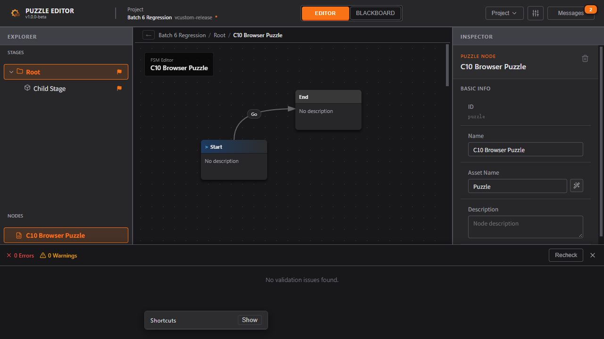
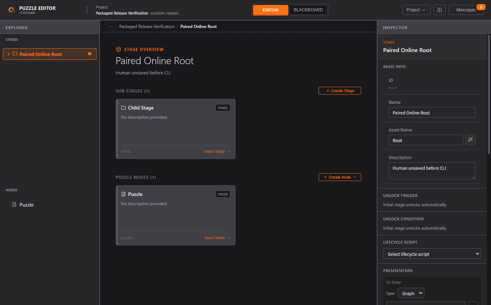

# CLI C10 实施报告：共享历史与配套发行

完成日期：2026-10-09。依据 [C6–C10 计划 §7](./CLI_Next_Development_Plan.md#7-c10cli-undoredo整体验收与发行)与代码前制定的 [技术设计](./CLI_C10_Design.md)。**C10 已完成，C1–C10 计划已全部交付**。HEAD 仍为 `511701be7b74bf75a744ee6e61c83ea72d48a3a9`；既有 C3–C9 与本批 C10 工作区改动未提交、未推送。测试仅使用虚构夹具。

## 1. 交付结果

当前 API 为 1.0.0，phase/policy 为 C10，converter 为 C7.1，共 **22 个命令入口、47 种领域操作**。新增的三个入口与 GUI 共用同一历史：

| 命令 | 行为 |
| --- | --- |
| `history list` | 显式 instance/session，读取 past/future 摘要、稳定 entryId、human/agent/system 来源、摘要、实际所需能力、顶部 ID 和当前 token |
| `history undo` | 校验 token、顶部 entryId 与 requestId 后，仅撤销顶部一条；返回内容版本、dirty、历史及保存限制 |
| `history redo` | 对称恢复顶部一条，同时复核原操作语义能力与实际永久删除影响 |

历史上限为 50 条；不提供跳过人工改动、任选旧条目或一次多步的参数。普通内容相等修改不消耗历史；新编辑清空 redo；永久删除与外部资源同步继续形成历史边界。历史只保留在当前会话内，不写入 `.puzzle.json`，重启/切换后不能继续使用旧 token。

在线协议升为 **2**，须配套使用 C10 CLI 和桌面程序；C9 协议 1 明确报告不兼容。管道名与登记目录的 v1 是端点命名格式，独立于握手协议，保留它们以便发现旧实例并说明原因。旧离线包保持原样，旧策略回执须重新预览。

实际命令示例及每个参数见 [使用说明 §8.12](./CLI_Agent_Usage.md#812-共享-gui-历史c10)；随 ZIP 分发的 AGENTS.md 唯一来源仍为 [发行包指南](./CLI_Distribution_Guide.md)。所有 assetName 创建规则及三项聊天授权约定继续适用。

## 2. 技术决策与 UX 对应

| 范围 | 实现与对应体验 |
| --- | --- |
| 同一历史与 UI 协调 | `store/documentHistory.ts` 唯一记录/恢复；HistoryEntry 将快照与 operation 分开，移动时稳定 ID 不变。继续通过 reconcileHistoryUi 修复删除恢复后的选择/导航，覆盖 UX_Flow §4–§6 的上下文 |
| 在线事务 | `sessionSchemas.ts` 与 `cli/session.ts` 复用原契约/客户端；`onlineSession.ts` 复用字段屏障、原 Store 和 compareAndDispatch，reducer 再核对顶部。恢复推进 contentEpoch，即使内容又相同，旧预览也不可复用 |
| 权限适配 | `services/onlineHistory.ts` 仅返回摘要并调用共同权限分析；Undo 检查实际移除，Redo 另保留原语义能力。未开放在线 raw 替换、任意 Action 或脚本执行 |
| 保存和关闭 | UX_Flow §2.1 的保存/消息及既有关闭保护沿用 ProjectSession 队列。Undo 仅恢复内存，保存后 Undo 正确变 dirty，不宣称磁盘回滚 |
| 永久删除 | UX_Flow §1.1/§7.6 的不可恢复边界保持。历史操作实际永久移除受保护资源时要求 permanent 声明，并清空两栈；GUI 本人确认入口保留 |

特别修正了权限延续的风险：**每次未获本次覆盖许可的 Agent Undo/Redo 都分配新的自动保存限制标记**。已被此前主动保存认可的标记不能复用，否则后续历史修改可能获得旧许可。目标快照更早未授权的限制也保留；本次 allowOverwrite 不会抹掉它们。已排队的自动保存仍在执行时核验限制。授权规则统一维护在 [CLI 方案 §1.3](./CLI_Implementation_Plan.md#13-下一阶段最高权限扩展用户已确认)。

幂等结果沿用当前实例/会话的 10 分钟、最多 256 项缓存。同 ID/同内容重试返回原结果，同 ID 不同内容拒绝。断线不自动生成第二个请求 ID；结果过期或重启后应重新读取状态，不能猜测失败并再次 Undo。

## 3. 回归结果

| 检查 | 结果与证据 |
| --- | --- |
| 全量 `npm run check` | **38 文件 / 669 用例**全部通过；UTF-8 382、格式 291、UI 所属 110，前端/Electron/CLI 类型、lint、故意错误门禁通过。[日志](./evidence/CLI_C10/check.log) |
| C10 新增自动化 | **21 项在线历史服务 + 6 项真实 CLI 子进程**；642 项既有测试继续通过 |
| 生产构建 | CLI、Vite 与 Electron 构建通过；保留既有大包和依赖注释告警。[在线构建及验证日志](./evidence/CLI_C10/electron-online.log) |
| 原 Electron 回归 | 文件会话 **11 项**、关闭 **7 场景 / 32 断言**、双实例所有权 **21 项**通过。[会话](./evidence/CLI_C10/electron-session.json)、[关闭](./evidence/CLI_C10/electron-close.json)、[所有权](./evidence/CLI_C10/electron-ownership.json) |
| 真实双实例在线 | **45 项**通过，完整生产页面、独立 CLI、实际字段及真实 61 秒自动保存等待。[结果](./evidence/CLI_C10/electron-online.json) |
| 独立 CLI ZIP | 仓库外中文空格目录、PATH 无全局 Node，包内运行时执行 **80 项**检查通过。[结果](./evidence/CLI_C10/package-verification.json) |
| 实际桌面与 CLI 配套 | 实际 ASAR/EXE 两次启动，与实际 ZIP 联动 **34 项**检查通过，Console 无 warn/error。[结果](./evidence/CLI_C10/desktop-verification.json) |
| 浏览器直接操作 | 人工编辑、Ctrl+Z/Ctrl+Shift+Z、Validate、保存、导出及重开通过；**0 Errors / 0 Warnings**，无 Console warn/error。[记录与数据对照](./evidence/CLI_C10/browser-verification.json) |

服务与子进程测试包含：人工/Agent 混合来源及稳定 ID；50 条截断、分支/no-op；顶部变化与旧 token；相同请求并发与断线重试；空栈零变化；草稿提交后冲突、非法草稿、模态/手势忙碌、只读、切换会话；同内容恢复仍推进 epoch；选择修复；保存后 Undo dirty、新限制及排队自动保存拒绝；实际受保护资源移除、Redo 原语义与永久删除边界；协议 1 拒绝和严格参数。

真实在线测试使用 GUI Undo 后 CLI Redo；发送已认证 Undo 请求后主动断开，再用相同 ID 重试，确认没有重复撤销；人工后来新增的条目不能被跳过。获授权覆盖前后分别核对内存、dirty 与磁盘 hash，无许可等待真实自动保存周期后磁盘未改变。

实际发行程序测试先在 Inspector 输入未保存的人工描述，CLI 在线修改 Stage 名称，再 GUI Undo / CLI Redo，检查两类修改均保留。未声明覆盖许可时 save 拒绝；获测试许可后覆盖成功。随后再次输入、取消关闭、Save & Close，并重启核对新值；独立 CLI 对桌面占用文件的离线覆盖始终被所有权保护拒绝。该流程由真实进程自动化执行，浏览器的共同编辑/历史/保存/导出流程另行手工操作。

浏览器使用已有 Batch 6 图夹具，改名后 assetName 保持外部提供值；GUI 保存文件经 CLI 导出，其运行时 data 与 GUI 导出完全一致。除明确改名与保存时间外，工程内容与原夹具一致。保存文件未包含历史或权限标记，重开后 Undo 不恢复旧会话历史。





## 4. Windows 配套发行

产物版本继续为 `1.0.0-beta`，具体能力由 C10 / 协议 2 区分，旧 release 目录未覆盖。

- [独立 CLI ZIP](../../release/cli/C10/PuzzleEditor-CLI-1.0.0-beta-win-x64.zip)：含锁定的 Node 24.15.0、启动器、第三方许可证、能力表、AGENTS.md 与 SHA-256 清单，无需全局 Node/npm/源码。
- [实际桌面目录版](../../release/desktop/C10/win-unpacked/Puzzle%20Editor.exe)：与上述 ZIP 配套验证，须保留整个 win-unpacked 目录。
- [Windows x64 NSIS 安装器](../../release/desktop/C10/Puzzle%20Editor%20Setup%201.0.0-beta.exe)：已生成，未签名；解包后 **74 个应用文件**与上述已验证目录版逐项 SHA-256 相同。[安装器核验](./evidence/CLI_C10/installer-verification.json)
- [桌面发行说明](../../release/desktop/C10/README.md)与 [SHA-256 清单](../../release/desktop/C10/SHA256SUMS.txt)。

桌面构建跳过 EXE 资源编辑/签名，沿用本机可用的未签名配置，不修改系统权限。首次短参数被 electron-builder 误作配置文件路径后改用结构化 API；NSIS 资源下载一度网络超时，改由同一官方 URL 下载，核对 electron-builder 固定 SHA-512 后交回其缓存流程；未修改依赖源码。目录版在安装器封装前完成实际验收，再使用 prepackaged 生成安装器，EXE/ASAR 字节保持。构建成功不代表已执行安装/卸载验收。[成功日志](./evidence/CLI_C10/desktop-installer.log)

| 产物 | SHA-256 |
| --- | --- |
| CLI ZIP | `a8dcf7a567c128277d278148052ef8519d8a09689cd20edc0f1462a3747e3974` |
| NSIS 安装器 | `184cace90b7a77d4a1b1ebfe1f05d57f4bcca6cd557d1fa35d095816028696bc` |
| 桌面 EXE | `7ec469761a4d6427d6fe3d89055aeae2741eb683960d8cc481ca6c68e73d578f` |
| app.asar | `cd2d4c640f8d2c2db8ab3ae4eacfa773b056f5208fba47e1a85a6958ed380861` |

源码、当前文档、证据和 release SHA-256 固定于 [manifest](./evidence/CLI_C10/manifest.json)。ASAR 中的 **22 个运行构建文件**与本次 dist/dist-electron/dist-node 一致，[构建对照](./evidence/CLI_C10/asar-build-verification.json)已留档。原 C5–C8 ZIP 与 C8 EXE/ASAR 的 6 项旧产物哈希保持，发行包指南与包内 AGENTS.md 逐字节相同。证据未复制会话发现文件或 HMAC 密钥。

## 5. 复跑入口与边界

按顺序执行，不并行重建共享 dist：

```powershell
npm run check
npm run test:electron:online
npm run test:electron
npm run test:cli:package -- release/cli/C10/PuzzleEditor-CLI-1.0.0-beta-win-x64.zip
node tests/electron/run-packaged-smoke.mjs "release/desktop/C10/win-unpacked/Puzzle Editor.exe" --ownership --cli-zip "release/cli/C10/PuzzleEditor-CLI-1.0.0-beta-win-x64.zip"
```

重新打包 CLI 须另用新目录，不能覆盖已固定的本批包。修改发行包指南后必须重新生成新包并验证，不能只改包内 AGENTS.md。

本批验证限 Windows x64。未执行其他操作系统、另一 Windows 登录用户、跨机器、安装/卸载/升级或 Unity 玩法验收；自动化关闭使用实际 BrowserWindow/应用退出入口，不冒充手工 X/Alt+F4 全面验收。当前用户 ACL/HMAC 不隔离同用户或管理员程序，也不能验证 Agent 声称的聊天许可。未提供跨重启历史、在线完整 JSON 替换、MCP、面板/导航/偏好命令、远程服务或软件内 AI。回归覆盖上述范围，不构成“所有历史功能绝无影响”的保证。
