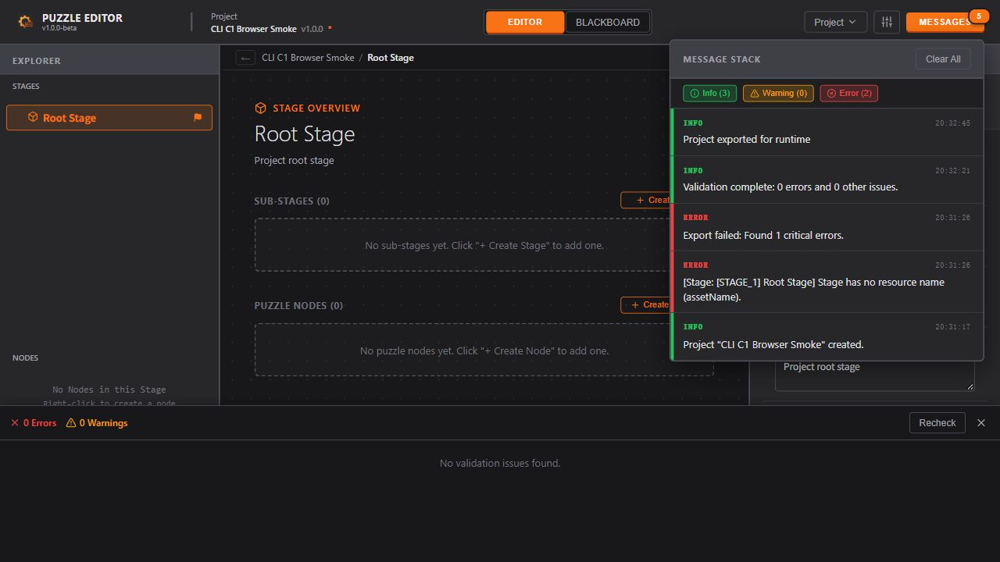

# CLI C1：契约、只读入口与独立构建

日期：2026-10-08。状态：**C1 已完成**。对应 [CLI 开发方案](./CLI_Implementation_Plan.md) 的 C1。可运行命令见 [Agent 使用说明](./CLI_Agent_Usage.md)。C2–C5 尚未实施，不把本批只读入口称为完整首版 CLI。

## 目标与约束

交付在普通 Node 中运行的 `describe`、`inspect`、`validate`、`json read`，保留完整 JSON 只读能力；写命令和人工审批在能力表中明确标为未实现。所有输出使用英文，代码意图注释和开发报告使用中文，文件使用 UTF-8。

遵循 `UX_Flow.md` §1 的领域/作用域和软删除规则、§2.1 的校验与消息行为、§2.2 的完整阶段结构：GUI 继续使用现有消息与校验面板，CLI 使用机器结果；不改变文档、选择、历史、偏好或编辑器会话。完整只读不调用会迁移的导入器，结构化查询明确报告导入格式与规范化通知。

## 技术设计（编码前）

1. **运行时契约**：`contracts/automation/` 用严格 Zod 对象定义版本、权限、只读请求、结构化结果/诊断和命名输入片段，生成 TS 类型与 JSON Schema。`assetName` 使用共用正则且非空；根 Stage 与 Puzzle 连带初始状态必须显式命名。C1 只冻结命名片段，不把未来写操作的未完成参数冒充完整契约。
2. **命令和路由**：`cli/` 使用 Node `parseArgs`，拒绝未知/重复参数、无意义的选项组合和多余位置参数。默认输出 JSON，`--json` 显式声明机器模式；`--help` 输出英文帮助。`json read --raw` 是原文 stdout 特例，失败诊断写 stderr。保留稳定退出码，未实现写命令返回明确错误。
3. **文件 IO**：`platform/node/` 只依赖 Node，提供严格 UTF-8 读取、规范路径、SHA-256 和稳定快照检查，复用现有同目录临时写入/排他发布算法。独立 tsc 编译至 `dist-node`，Electron 通过生成的 JS/声明引用，不扩大其 rootDir。CLI 构建前先编译该模块。Electron 继续在其适配层处理偏好。
4. **完整读取**：返回解析对象及完整原文、原始字节 hash/路径；未知字段和业务错误不会被裁剪或规范化。识别重复键和不可精确表示的数值，附诊断并保留原文。语法损坏的文件仍能 `--raw` 读取。读取失败、文件变化和非法 UTF-8 有稳定错误；不静默截断大文件。
5. **结构化查询**：`services/automation/` 复用导入边界和领域模型，实现 summary/tree/entities/fsm/presentation/variables/references/bindings。实体由类型、ID、所属 FSM/Graph/Stage/Node 定位；歧义返回候选，不取第一个。列表分页带源指纹，后续页可传预期指纹避免拼接不同版本；树使用有界、可检测环的遍历。引用和可见资源尽量使用共用查询函数，不另写业务规则。
6. **诊断**：在现有六组工程校验规则产生诊断处加入稳定 code，保留 GUI id/message/location。领域诊断附实体定位和可用路径；状态、迁移等保留所属上下文。导入结构失败保留字段路径；`inspect` 可以返回带业务 error 的工程，`validate` 对 error 返回 3，warnings 默认成功，`--warnings-as-errors` 显式升级退出状态。
7. **纯导出准备**：提取 `services/projectExportPreparation.ts`，输出诊断、规范化 bundle、内容和建议文件名，时间可注入。GUI 导出协调函数调用它，继续负责校验面板、消息、选择器、后缀保护和 IO。C1 不开放 CLI export 写命令。
8. **构建和维护**：独立 Node/SSR Vite 配置输出 `dist-cli/cli.js`，无 React/DOM/Electron 运行依赖；Node 内建模块保留外部引用，运行依赖打包。新目录加入类型、lint、格式、UTF-8 与依赖反向检查；生成物忽略且 `dist-node` 加入 Electron 打包清单。

## 验证计划

- 用真实 CLI 子进程验证帮助/能力 Schema、完整/原文读取、中文与空格/长路径、分页前提、歧义、非法输入、未知字段、损坏 JSON、非法编码、重复键、数值精度、大文件不截断、IO 错误和 stdout 纯净。
- 读取前后核对源文件字节、mtime 与目录文件清单，隔离偏好目录保持空；复制发行产物到没有项目源码/node_modules 的临时目录运行。
- 用嵌套 Stage、重名/局部 ID、FSM、演出图和变量/资源引用夹具验证查询、机器诊断与既有校验一致；命名片段验证所有必填/非法值。
- 测试纯导出准备与 GUI 导出结果一致、原数据不变、error 阻断与警告行为保留；运行 `npm run check`、前端构建及 Electron 文件会话/关闭回归。
- 如浏览器可用，检查 GUI 校验/导出入口；C1 不新增画布/审批 UI，不以自动测试替代人工确认功能的后续验收。

## 完成记录

### 已交付

- `contracts/automation/` 提供严格运行时输入、类型推导、JSON Schema、API `1.0.0`、权限与唯一能力表。固定 Zod `4.6.5` 为运行依赖，打入 CLI。`describe` 如实标明 4 个已实现命令、6 个后续命令；写命令即使携带 `--force` 也返回 `COMMAND_NOT_AVAILABLE`。
- `cli/` 与 `services/automation/` 实现能力查询、8 种工程视图、领域校验和完整 JSON 读取。源文件身份包含规范绝对路径、字节大小、mtime 与 SHA-256；跨页可用 `--expected-hash` 拒绝混用不同文件版本。
- 完整 JSON 读取保留文件包装、`editorState`、未知字段、BOM、空白和字段顺序。重复键或数值精度无法安全解析时返回 `parsedAvailable: false`、`file: null`、完整 `rawText` 及诊断，不把舍入/覆盖后的对象冒充完整文件。损坏 JSON 可通过 `--raw` 获取；非法 UTF-8 明确拒绝。
- 校验 code 直接由既有规则产生，不从英文消息猜类型；FSM 内部实体增加所属上下文，重复局部 ID 不误定位。Stage 父链、可见变量和 Stage 变量引用遍历增加环保护，CLI 结构化导入仍沿用现有导入器拒绝异常层级。
- `platform/node/files.ts` 成为 CLI/Electron 共用 IO，独立编译至 `dist-node`，不改变 Electron 入口布局。`projectExportPreparation.ts` 成为纯导出准备入口，GUI 外壳保留原有消息、面板、选择器和写入行为。
- 独立构建输出 `dist-cli/cli.js` 与模块声明；关闭 GUI 静态资源复制，禁止 CLI 包引入 React、DOM 或 Electron。新增源码进入编码、类型、格式、lint 和反向依赖检查。Electron 打包清单收录 `dist-node`，本批未重新制作安装包。

### 验证结果

| 检查 | 实际结果 |
| --- | --- |
| `npm run test:cli` | **45/45**：17 项契约/JSON 边界、3 项导出/遍历保护、25 项真实 Node 子进程检查 |
| `npm run check` | **22 文件 / 271 用例通过**，含原有 226 项回归；UTF-8 302 个源码/配置、格式 203 文件、UI 110 文件检查通过 |
| 反向检查 | 14 项 lint/依赖、7 项类型、3 项编码、1 项格式错误；UI 10 项错误及 2 项合法探针均符合预期 |
| `npm run build` | 前端生产构建成功，1892 模块；既有主包超过 500 kB 告警保留 |
| `npm run test:electron` | 共用 IO 接入后，真实 Electron 文件会话 **11 项**与关闭保护 **7 场景 / 32 断言**全部通过 |
| 独立产物运行 | 只复制 `dist-cli` 到不含源码/node_modules 的临时目录，由普通 Node 运行成功；未启动 GUI/读取偏好 |
| 只读与异常 | 源字节、mtime、目录清单和隔离偏好目录保持；大文件、中文/空格/长路径、重复键、危险数值、损坏 JSON、非法编码、缺文件、歧义 ID、旧 hash、未知参数均有真实子进程覆盖 |

Electron 检查覆盖创建、保存、重开、设置、排他目标失败、文件监听与运行时导入另存；关闭场景覆盖空/干净会话、取消后保存、放弃、写失败、另存与应用退出。测试使用独立工程及偏好目录，未修改用户真实工程。原始运行目录为 `D:\Temp\puzzle-batch2-electron-ii32ox` 与 `D:\Temp\puzzle-close-electron-8TrC2K`；汇总证据保存在 [electron-regression.json](./evidence/CLI_C1/electron-regression.json)。

### 浏览器手工回归与 UX 对照

在隔离的本地地址 `127.0.0.1:4177` 使用浏览器实际操作界面：

1. 新建 `CLI C1 Browser Smoke`，根 Stage 未填写资产名时执行 Export，校验面板显示 1 error，消息堆栈报告导出阻断，符合 UX §2.1 的校验/消息行为。
2. 在 Inspector 输入外部指定的 `C1BrowserRoot`，失焦提交并 Recheck，得到 **0 Errors / 0 Warnings**；未借用自动生成名称。
3. 再次 Export，实际下载成功；核对 `fileType: puzzle-export`、根资产名和运行时输出不包含 `editorState`。GUI 仍经共用准备函数执行原有流程。
4. Save Project 下载完整 `.puzzle.json`，用构建后的 CLI 执行 `validate`，退出码 0、0 error、0 warning，导入格式为 `project`、无迁移通知。CLI 读取前后文件保持一致。

测试工程及运行时输出分别保存在 [browser-project.puzzle.json](./evidence/CLI_C1/browser-project.puzzle.json) 和 [browser-runtime.export.json](./evidence/CLI_C1/browser-runtime.export.json)，CLI 结果为 [browser-cli-validation.json](./evidence/CLI_C1/browser-cli-validation.json)。下图保留先阻断、修正后校验通过、最后导出成功的消息顺序；消息内历史错误不代表最终工程仍有错误。

UX §1 的作用域/资源与 §2.2 的 Stage 层级通过共用模型、作用域函数和嵌套夹具验证。C1 没有新增画布编辑或审批交互，不把浏览器回归记录为全部 GUI 功能或 Unity 玩法验证。

### 限制与后续

- C1 只读；工程创建、领域修改、事务预览/保存和 CLI 导出属于 C2–C4。assetName 目前冻结的是身份输入片段；后续每个创建入口必须复用并在真实写入用例中验收，不能声称本批已验证尚未实现的创建功能。
- `references` 复用现有编辑器扫描器。Stage/Node 局部变量在演出图中的结果可能包含保守候选；C4 再完善共享图的实际调用上下文。`bindings` 是未标删资源目录，不保证每个资源/参数都适用于当前调用点，返回 `requiresContextValidation: true`。
- 结构化查询使用既有导入规范化；完整磁盘内容以 `json read` 为准。兼容导入生成的工程元数据不作为持久实体身份，多次读取的一致性以源 hash 和实际领域 ID 为准。未保存 GUI 内存不在本批范围内。
- Windows 启动器、附带 Node 的 companion 发行物、无开发环境验证及最高权限 JSON 写入的可信人工确认宿主属于 C5；本批没有创建 release 或提交/推送 Git。
- CLI 构建有 Zod 依赖注释位置导致的两条非阻断 Rollup 告警，产物和运行测试通过。没有完成所有操作系统、安装/升级、原生 X/Alt+F4 手工操作或 Unity 引擎联调。
