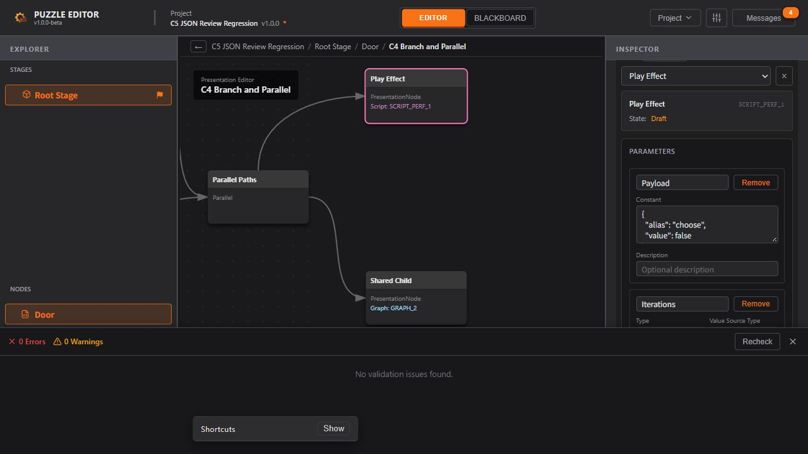

# CLI C5 实施报告：备用 JSON 编辑与独立发行

日期：2026-10-09。状态：**C5 完成，C1–C5 离线首版 CLI 已交付**。API 1.0.0，应用版本保持 1.0.0-beta。基于 C1/C2 已推送的 `511701b` 及 C3/C4 工作区继续实施；C3–C5 本轮未提交或推送 Git。设计先行记录见 [C5 技术设计](./CLI_C5_Design.md)。

## 1. 交付结果

- 实现 `json preview` 和 `json apply`，接收完整 `.puzzle.json` 候选，显示完整差异、资源引用/共享图影响、诊断和剩余错误。
- 直接 JSON 编辑遵循用户在 Agent 聊天中授予的权限。已有授权范围内无需逐条重问；无授权、撤回或超范围时由 Agent 停止相应写入。CLI 不弹应用内审批窗口，也不读取或认证聊天记录。
- `json apply` 必须显式携带 `--allow-raw-json-write`；缺少时在文件 IO 前返回退出码 6。该参数只声明已获得聊天许可，预览回执也不构成批准凭据。
- 备用入口复用命名、引用、作用域、错误基线和资源生命周期检查。输出仅创建新文件，提交保持候选原始 UTF-8 字节，不静默补默认值、ID、资产名、缩进或时间。
- 交付带固定 Node 运行时、启动器、Agent 指南、许可证及 SHA-256 清单的 Windows x64 独立 ZIP。无需全局 Node、源码、npm 或打开编辑器。

使用流程及可执行示例见 [CLI Agent 使用说明 §8.7](./CLI_Agent_Usage.md#87-备用完整-json-编辑c5)。发行包内 AGENTS.md 从 [发行包 Agent 指南](./CLI_Distribution_Guide.md) 原样生成，后续只维护这份来源。

## 2. 技术决策与唯一维护入口

| 入口 | 本批职责 |
| --- | --- |
| `contracts/automation/rawSchemas.ts` | raw 请求和独立回执契约，派生 DTO / JSON Schema |
| `cli/arguments.ts`、`cli/main.ts`、`capabilities.ts` | 参数、路由和能力描述；显式区分 read / semantic_write / raw_json_write |
| `services/automation/rawWriteService.ts` | 读取源/候选、检查规范化差异、预览、绑定内容回执、复核输入、原文发布 |
| `services/automation/rawPolicy.ts` | 按实体类型/所属/ID 匹配，检查新建与修改资产名、前后资源状态及父对象内受保护变量 |
| `services/automation/candidateValidation.ts` | 从领域 writeService 提取共用错误基线；不通过“错误总数相同”掩盖新错误 |
| `utils/resourceLifecycle.ts` | 共用自动化状态跃迁限制；领域命令和 raw policy 同源 |
| 既有 `transactionData.ts`、`impacts.ts`、`fileCommit.ts`、Node IO | 共用差异、引用影响、路径/硬链接防碰撞、排他发布与写后重读 |
| `cli/runtime-lock.json`、`scripts/package-cli.mjs` | 锁定官方运行时与 SHA-256；生成新目录和 ZIP，已有目标拒绝覆盖 |
| `scripts/cli-package-io.mjs`、`scripts/verify-cli-package.mjs` | 包脚本共用边界/清理，实际 ZIP 的隔离启动与功能验证 |

候选经共同导入器检查，但不会将其迁移或补值结果直接写盘。候选尚需补默认值、调整 editorState 或其他规范化时，返回 `CANDIDATE_NORMALIZATION_REQUIRED` 和具体 changes；调用者明确修改候选，再预览。单纯 editorVersion 来源提示、且数据未发生变化时不阻断。

新资源只能从 Draft 开始，不能借整文件替换声称实现、将 Implemented/MarkedForDelete 退回 Draft、物理删除或换 ID。删除父对象也不能隐式移除受保护的局部变量。局部变量搬移按剩余同 ID 的唯一匹配识别；身份不明确时保守拒绝。新建/改名必须外部指定有效 assetName，未改旧缺名可按既有错误基线保留。

raw 回执绑定源/候选规范路径与字节 SHA-256、目标路径及 create-new 方式。提交重新校验，再重读源、候选及回执；旧回执、输入/输出别名和硬链接冲突拒绝。相同输出字节的重试返回 `already-applied`，不重复改写或改变输出时间。无跨进程文件锁；成功表示指定快照的新文件已交付。

## 3. UX_Flow 对照

| 既有要求 | 本批实现与验证 |
| --- | --- |
| §1.1 资源生命周期、软删除 | raw 替换同样执行共同状态规则；新增已实现声明、永久移除受保护资源和退回 Draft 被拒绝 |
| §1.3 / §1.5 演出与变量上下文 | 复用 C4 引用/调用索引和校验；共享图中的失效引用会定位到图并拒绝新增候选 |
| §4–6 层级、FSM、演出图 | 完整工程保存其结构与 ID；浏览器打开 raw 文件，检查 Root Stage、Door / Idle / Replay，以及绑定的分支/并行/子图 |
| §7 条件、脚本与参数 | 共用现有参数/引用校验；浏览器确认普通 JSON 常量中的 false 及 StageLocal 参数引用显示正确 |
| 项目保存、校验、导出 | 恢复 Shared Leaf 编辑状态，Wait 1.25 → 1.5，实际保存/导出下载；GUI 和 CLI 对同一改动的运行时数据完全一致 |

本批不新增 UI、路由、Store 状态或审批弹窗；现有 GUI 永久删除能力不会因此开放为 CLI 能力。关闭保护通过现有真实 Electron 回归验证。

## 4. 测试与结果

| 验证 | 结果与证据 |
| --- | --- |
| `npm run check` | **27 文件 / 467 用例通过**；UTF-8 336 文件、格式 245 文件、UI 所属 110 文件；类型、lint、故意错误拦截全部通过，见 [check.log](./evidence/CLI_C5/check.log) |
| 新增 C5 子进程测试 | **50 项通过**：原文字节/编辑状态、无启用声明、普通入口拒绝 raw 参数、规范化差异、资产名、错误基线、生命周期、旧回执、碰撞/硬链接、并发/重试、IO 故障 |
| `npm run build` | 通过，见 [build.log](./evidence/CLI_C5/build.log)；保留已有前端主包超过 500 kB 提示 |
| `npm run test:electron` | **11 项文件会话检查、7 个关闭场景 / 32 项断言通过**，见 [electron.log](./evidence/CLI_C5/electron.log) |
| 正式独立 ZIP | **41 项检查通过**，在仓库外中文空格目录、仅系统 PATH、无全局 Node 的环境执行真实 puzzle.cmd，见 [package-verification.json](./evidence/CLI_C5/package-verification.json) |
| 实际浏览器 | 打开、恢复编辑状态、FSM/演出/参数检查、修改、保存、导出、校验均通过；**0 Errors / 0 Warnings**，Console 无 warn/error，见 [roundtrip-check.json](./evidence/CLI_C5/roundtrip-check.json) |

构建时还存在 Zod 注释位置的 Rollup 提示；构建移除了无效注释且成功完成，独立产物验证通过。没有用屏幕截图或编译成功替代文件内容核验。

实际回归工程来自 C4 已验收的测试工程副本。本批先准备 BOM、3 空格缩进、CRLF 的候选，改工程名/描述/时间和三级子图 Wait 时长为 1.25，再执行 CLI 预览、缺参数拒绝、明确启用后提交。在浏览器把时长改成 1.5 并实际下载保存/导出；另用普通领域命令完成相同修改，两边导出的 `data` 深比较一致（导出时间不参与比较）。

- [源文件](./evidence/CLI_C5/source.puzzle.json)、[完整候选](./evidence/CLI_C5/candidate.puzzle.json)、[raw 交付文件](<./evidence/CLI_C5/C5 Reviewed.puzzle.json>)。
- [预览结果](./evidence/CLI_C5/preview-result.json)、[未声明授权的拒绝结果](./evidence/CLI_C5/missing-authorization-result.json)、[提交结果](./evidence/CLI_C5/apply-result.json)、[幂等重试](./evidence/CLI_C5/apply-recheck-result.json)。
- [GUI 保存](./evidence/CLI_C5/browser-saved.puzzle.json)、[GUI 导出](./evidence/CLI_C5/browser.export.json)、[等效领域计划](./evidence/CLI_C5/edit-plan.json)、[CLI 导出](./evidence/CLI_C5/cli-edited.export.json)。
- 源文件 SHA-256 未变：`032e3c0219bc7e047fb389111160c597c30b2b96aae597c6cccf8c6261c694e5`。
- 候选与 raw 输出 SHA-256 相同：`c3567dfc7705ad8988289f84958ffea346a68d7ecc9dffd0dac538c4f75fc859`。

聊天授权工作流按本次用户澄清落实在契约说明与 Agent 指南中；本次开发验收只操作虚构测试工程。50 项测试验证的是 CLI 参数门槛和数据约束，不冒充“能识别真实用户聊天许可”的自动化证明。



## 5. 发行物与复跑

[Windows x64 CLI ZIP](../../release/cli/C5/PuzzleEditor-CLI-1.0.0-beta-win-x64.zip) · [ZIP SHA-256 文件](../../release/cli/C5/PuzzleEditor-CLI-1.0.0-beta-win-x64.zip.sha256.txt)

ZIP SHA-256：`c3ba622c92e163e1cd905ee0e80e1bc0d83110894f943b342c86aab91ab0c58c`。

包内包括 `puzzle.cmd`、`app/cli.js` / package.json、`runtime/node.exe`、Node/Zod 许可证、AGENTS.md、README、runtime-lock、capabilities，以及记录 10 个文件的 manifest。运行时使用已下载并核对官方 SHA-256 的 [Node 24.15.0 Windows x64 发行物](https://nodejs.org/dist/v24.15.0/)，运行时 ZIP 指纹锁定在 `cli/runtime-lock.json`。CLI 包不含源码、node_modules、测试工程、用户数据或聊天记录，不修改系统 PATH。

```powershell
# 从任意工作目录调用，工程相对路径以该工作目录为准。
& 'E:\Projects\Web Projects\puzzle-editor\release\cli\C5\PuzzleEditor-CLI-1.0.0-beta-win-x64\puzzle.cmd' describe --json

# 仓库内重验本次正式 ZIP。
npm run test:cli:package -- release/cli/C5/PuzzleEditor-CLI-1.0.0-beta-win-x64.zip

# 已有输出不会覆盖；重打使用新的 release 子目录。
npm run cli:package -- release/cli/C5-next
```

正式包验证覆盖文件 hash、无全局 Node、cwd 相对路径、创建/查询、领域预览与提交、raw 缺参数拒绝/成功/重试、validate/export、源文件不变和不产生编辑器偏好。初步包结果另存于 [package-validation.json](./evidence/CLI_C5/package-validation.json)，最终交付以 `package-verification.json` 及上面的 SHA-256 为准。

## 6. 明确边界与后续

- 仅支持新输出文件，未开放原地覆盖、永久删除已实现资源、任意脚本执行或在线 GUI 修改/Undo。
- raw 的源/候选必须结构可导入；完整读取支持的未知字段/损坏原文，不意味着本版能直接将其作为有效工程写回。需要明确候选文件路径。
- CLI 无法认证聊天内容，也不能限制具有任意磁盘权限的外部程序；必须由 Agent 遵守用户许可及范围。不能把启用参数命名成认证机制。
- 独立包验证在本机 Windows x64 的隔离目录进行；未验证其他操作系统/架构或另一台机器，未重打 NSIS 安装包，未执行安装/升级/卸载。
- 没有执行 Unity 游戏、用户脚本、MCP 客户端或在线会话桥验证；这些不属于 C5。回归结果说明已测范围通过，不保证所有未知工程和运行时行为绝对无影响。
- C3–C5 源码和文档仍在工作区，release 在本地忽略目录。后续提交/推送与 GUI release 可独立进行。

完整证据文件、源码和文档指纹见 [C5 验收清单](./evidence/CLI_C5/manifest.json)。C1–C4 的旧报告/manifest 保留历史快照，不因本批改文档而重写其哈希。
