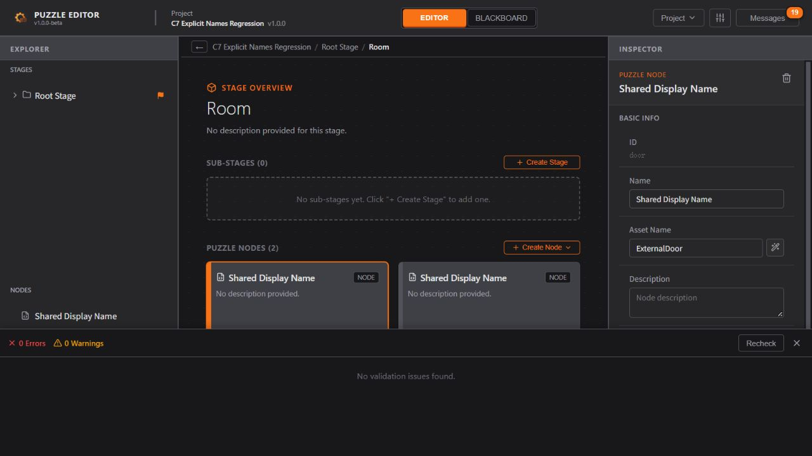
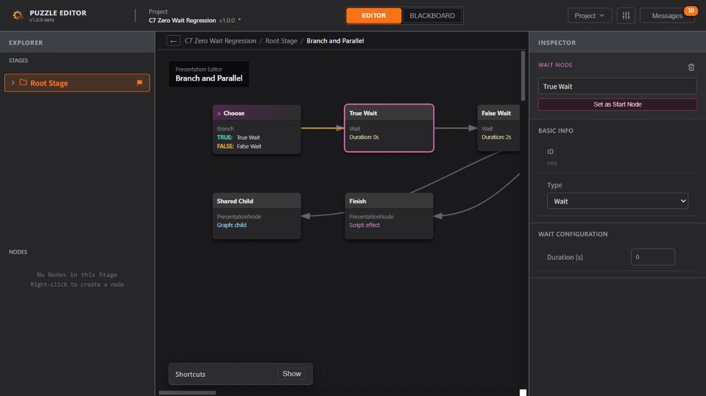

# CLI C7 完成报告：兼容格式导入与转换

日期：2026-10-09。**C7 已完成并验收**。当前为 API 1.0.0 / phase C7 / converterVersion C7.1，权限策略仍为 C6；累计 **12 个命令入口、47 种领域操作**。依据 [下一阶段计划](./CLI_Next_Development_Plan.md#4-c7兼容格式导入与转换)和实施前的 [技术设计](./CLI_C7_Design.md)。

## 1. 本批交付

| 能力 | 实际行为 |
| --- | --- |
| `import preview` | 读取并审计源文件；转换、应用外部名称映射、建立既有错误基线；返回完整候选、差异、诊断、固定上下文及回执。只有显式 receipt-out 才创建回执 |
| `import apply` | 重读源、映射和回执，使用固定 ID/时间重建同一候选；核对完整回执后排他发布新的 `.puzzle.json` |
| 四类输入 | puzzle-project、puzzle-export、raw ProjectData、legacy ExportManifest；沿用共同导入器的结构与版本规则 |
| 外部命名 | 严格 type/id/owner → assetName 映射，不生成名称、不翻译、不裁剪、不补后缀，不接受通用字段补丁 |
| 可追溯转换 | detectedFormat、importNotices、migrated、editorStateDefaulted、missingAssetNames、nameChanges、remainingErrors、candidateFile/candidateHash、完整 changes |
| 文件保护 | 源/映射/回执不作为目标，别名/硬链接受保护；拒绝已有不同输出，支持同字节幂等与并发排他发布 |

所有输入必须为可安全解释的 UTF-8 JSON；重复键、不安全数值、未知字段/格式版本、损坏树及已知有损旧格式拒绝。完整 JSON 只读入口仍可读取原文，导入失败不会自动转为备用 JSON 编辑。

已有缺名可按旧错误基线原样保留，明确报告且继续阻断运行时导出；映射字段不全、目标不存在/重复、非法名或新增冲突均拒绝。当前转换只补元数据、画布坐标和参数辅助 ID，不创建新的命名业务资产。若后续迁移新增资产，必须扩展外部命名契约，不能使用旧错误基线豁免。

## 2. 技术与权限决策

- [转换契约](../../contracts/automation/importSchemas.ts)统一维护命令、映射和回执 Schema，describe/帮助同步发现。全局变量用 project owner 且不带生成的 ownerId；局部变量和 State 必须明确所属对象，避免跨层同 ID 误改。
- [转换服务](../../services/automation/importService.ts)复用原文审计、importProject、serializeProject、validateCandidate、targetPath/publishNew。[命名服务](../../services/automation/importNames.ts)复用实体索引及共同命名类型白名单，仅修改 assetName。
- [导入上下文](../../utils/projectImport/readers.ts)允许注入 now/runtimeProjectId。预览固定缺省元数据与运行时项目 UUID，提交重建；已有 meta.id/createdAt 保留，保存时间固定为预览时间。GUI 未注入时仍按原交互生成当前时间/UUID。
- [默认编辑状态](../../utils/projectEditorState.ts)由 GUI Store 和 CLI 共用；GUI 可继承当前面板尺寸，CLI 使用共同默认尺寸。已有 editorState 沿用共同导入规范化结果；源未保存的信息不能恢复。
- 回执绑定源/映射规范路径与字节 SHA-256、目标、转换器、权限策略、固定 context 和 candidateHash。源或映射变化、候选/上下文篡改、版本或目标变化均拒绝；回执不承担聊天授权功能。
- 转换到新工程是普通领域能力，保留源中 Implemented/MarkedForDelete 声明，不合并当前工程。Agent 不能先未经聊天授权直接修改源 JSON，再通过 import 绕过 raw 规则。raw、permanent 和未来 overwrite 仍为独立最高权限，规范唯一维护在 [CLI 方案](./CLI_Implementation_Plan.md#13-下一阶段最高权限扩展用户已确认)。

本批没有权限语义变动，因此 policyVersion 保持 C6；新增转换流程单独使用 converterVersion C7.1。没有 UI 组件、路由、偏好或审批弹窗的新增维护点。

## 3. 实测发现并修复的旧问题

浏览器核验发现旧运行时导出器把合法的 `Wait.duration=0` 改成 `1`，与校验器允许有限非负数的规则不一致。已在 [共同导出器](../../utils/exportNormalizer.ts)保留合法零值；GUI 与 CLI 同时受益。

增加了原工程→运行时导出→兼容导入→再次导出的直接零值断言；四格式真实 CLI 往返也直接断言 Wait=0，避免仅对比两个经过同一规范化函数的结果而漏报。首轮 Runtime/Names 文件保留当时已导出的 1 秒源值；另建 [Zero 源](./evidence/CLI_C7/Zero-source.json)独立验证零值全链路。测试文件均为本批虚构工程，没有修改用户业务项目。

开发服务器热更新后旧页面曾继续使用缓存的导出服务；重新打开页面加载最新代码后，实际 GUI 导出与 CLI 完全一致。验收采用刷新后的文件，未以热更新后的界面显示代替导出文件核验。

## 4. 回归与 UX 验收

| 检查 | 结果 |
| --- | --- |
| `npm run check` | **31 文件 / 576 测试通过**，其中 C7 新增 **59 项**（11 个领域/共用规则，48 个真实 CLI 子进程场景） |
| 静态与规范检查 | UTF-8 351 份、格式 260 份、UI 所属规则 110 份、类型检查及 lint 通过；15 lint / 7 类型 / 3 编码 / 1 格式反向探针及 10 错误 / 2 合法 UI 探针通过 |
| `npm run build` | 生产构建通过 |
| `npm run test:electron` | **11 项文件会话检查、7 个关闭场景 / 32 条断言通过** |
| 独立 Windows x64 包 | 仓库外中文空格路径、PATH 无全局 Node，以真实启动器完成 **55 项检查** |
| 浏览器直接操作 | 兼容文件导入、演出/黑板值核验、下载保存、运行时导出、转换工程重开与命名检查、工程校验均通过；最终页面无 warn/error |

C7 自动回归覆盖：四种格式；元数据固定与默认 UI；旧条件/空 triggers 迁移；全部命名域和局部同 ID；旧缺名与修复；未知/有损结构、重复键、数值精度和编码拒绝；映射越权字段/缺失/重复/非法/冲突；源/映射/回执/输出变化；版本/能力篡改；输入碰撞、硬链接、已有目标、幂等及并发提交。

按照 UX_Flow 的相关范围实际验证：

- **§2.1 加载、保存、导出、校验与消息**：运行时文件导入后标记未保存；浏览器下载副本仍保留未保存状态；切换工程遵循统一未保存保护。转换工程可直接打开，校验显示 **0 Errors / 0 Warnings**，导入 notices 可见。
- **§1.1 资源状态**：全局 false、局部整数 0、MarkedForDelete 变量与 Implemented 脚本/事件在文件往返中保持；浏览器黑板及 Inspector 确认局部标删状态和零值。
- **§1.3–1.5 演出、监听与作用域**：嵌套 Stage、Puzzle/FSM、Branch/Parallel/Wait 和共享子图、参数/监听引用通过真实文件对照；GUI 演出画布与 Inspector 均显示零秒等待。
- **层级与编辑入口**：打开 CLI 命名转换工程并进入 Room/Puzzle，Inspector 显示外部传入的 `ExternalDoor`，另一同显示名称节点保持原资产名；GUI 再保存后完整业务项目相等。

比较范围明确记录在 [GUI/CLI 对照](./evidence/CLI_C7/gui-comparison.json)：

1. 同一 runtime 源分别经 GUI 和 CLI 导入，比较完整 project，排除各自生成的 meta.id/createdAt 和保存时间 updatedAt；业务对象、引用、坐标和参数辅助信息一致。editorState 单独按导航行为处理，未假装两次导航状态相同。
2. 两端运行时导出的 data **完全相等**，包含 Wait=0，无排除业务字段。
3. CLI 命名结果在 GUI 打开后保存，完整 project 仅排除 updatedAt，元数据 ID 与创建时间也相等。

## 5. 发行与证据

C7 独立包：[PuzzleEditor CLI Windows x64 ZIP](../../release/cli/C7/PuzzleEditor-CLI-1.0.0-beta-win-x64.zip)。包含固定 Node 运行时、启动器、能力描述、Agent 指引、许可证和 SHA-256 清单。包内 AGENTS.md 原样来自 [唯一发行指南](./CLI_Distribution_Guide.md)；旧 C5/C6 包保留。

ZIP SHA-256：`81d928d441ae7e7b2c7be0c5689fa41804c9a3a66a785dc34223daec931a067a`。

- [验收清单与源码快照](./evidence/CLI_C7/manifest.json)、[独立包检查](./evidence/CLI_C7/package-verification.json)。
- [Electron 会话](./evidence/CLI_C7/electron-session.json)、[关闭保护](./evidence/CLI_C7/electron-close.json)、[浏览器日志](./evidence/CLI_C7/browser-console.json)。
- 四格式预览样例：[完整工程](./evidence/CLI_C7/Project-preview.json)、[运行时](./evidence/CLI_C7/Runtime-preview.json)、[原始项目](./evidence/CLI_C7/Raw-preview.json)、[旧 Manifest](./evidence/CLI_C7/Legacy-preview.json)。
- [外部名称映射](./evidence/CLI_C7/Names-map.json)、[对应回执](./evidence/CLI_C7/Names-receipt.json)、[完整转换结果](./evidence/CLI_C7/Names-converted.puzzle.json)。
- [零值 CLI 导出](./evidence/CLI_C7/CLI-Zero.export.json)、[零值 GUI 导出](./evidence/CLI_C7/GUI-Zero-export.json)。

构建保留已有的 >500 kB 前端包提示及 Zod 注释移除提示；Electron 关闭测试期间出现 GPU 日志，但全部场景断言通过。没有把这些日志计作页面零 warn/error 的一部分。

## 6. 边界及下一步

**C1–C7 已完成；C8–C10 尚未实施。** 下一批 C8 是获得聊天授权后的覆盖保存、备份和工程所有权协调；C9 是在线编辑桥，C10 是 CLI Undo/Redo 与配套发行。CLI 当前仍只写新文件，不修改正在打开的 GUI 内存，不产生 GUI Undo。

本批没有重打 GUI 安装包、测试 Unity 玩法或其他操作系统，也不声称有限回归能证明所有可能工程都无影响。浏览器文件选择通过真实网页 filechooser 完成，没有声称手动操作 Windows 原生选择器。

Git HEAD 保持 `511701be7b74bf75a744ee6e61c83ea72d48a3a9`；保留原 C3–C6 工作区修改，本批 C7 也未提交或推送。开发规范、架构、状态、覆盖清单与 [使用说明 §8.9](./CLI_Agent_Usage.md#89-兼容格式导入与转换c7)已同步。
