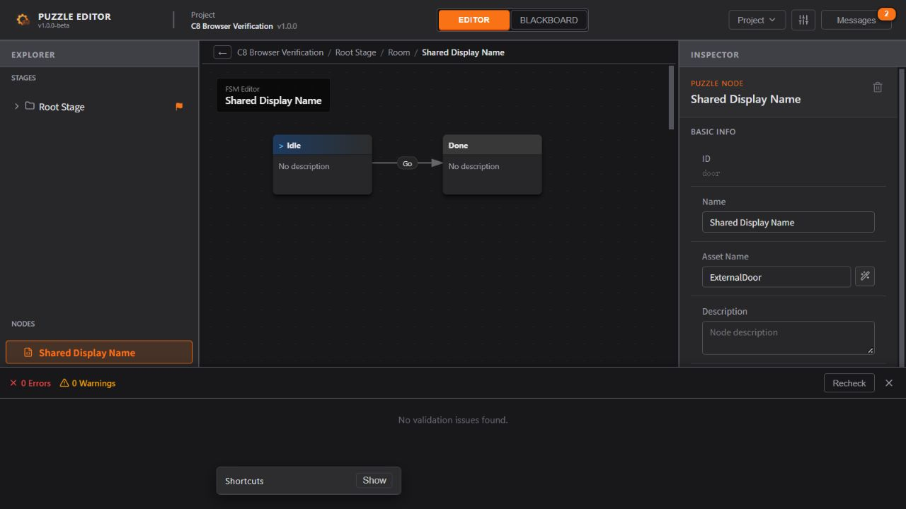

# C8 完成报告：授权覆盖、备份重试与工程所有权

完成日期：2026-10-09。**C8 已完成；C1–C8 均已交付，C9/C10 待实施。** 范围按 [下一阶段计划 §5](./CLI_Next_Development_Plan.md#5-c8获授权的覆盖保存与工程所有权)及 [本批技术设计](./CLI_C8_Design.md)执行。所有写入、永久删除权限组合和故障注入均只针对隔离的虚构测试工程；未操作用户业务工程。

## 1. 已交付功能

| 内容 | 本批结果 |
| --- | --- |
| 领域覆盖 | preview/apply 增加 `--in-place`，apply 必须声明 `--allow-overwrite`；与 `--out` 互斥，只覆盖该源 `.puzzle.json` |
| raw 覆盖 | 共用同一覆盖事务；同时要求 raw 与 overwrite 许可，候选含永久删除时再要求 permanent；保留 BOM、缩进、换行和时间原文 |
| 默认另存 | 原有新文件排他发布保持；create/import/export 不获得覆盖参数，其他输入始终受保护 |
| 权限与回执 | 用户在 Agent 聊天中明确授权，CLI 只检查显式声明；当前 phase/policy C8、API 1.0.0、converter C7.1，仍为 12 个入口 / 47 种领域操作；旧回执重新预览 |
| 备份与记录 | 源旁独立事务目录存原文备份、源身份和前后 hash、提交阶段；备份核验通过后才发布，不自动清理 |
| 恢复与重试 | 同回执重建原候选并重验能力；已知后态返回 already-applied，不重复应用；第三方更新、未知记录或坏备份拒绝 |
| 桌面所有权 | Windows 规范路径 + 文件身份 OS lease；打开/新建/另存先取得候选，失败保留旧 Store/历史/路径/dirty/所有权，成功转移；关闭取消继续持有 |

覆盖的最小调用示例（须已取得对应聊天许可）：

```powershell
node dist-cli/cli.js preview Demo.puzzle.json --plan plan.json --in-place --receipt-out preview.json
node dist-cli/cli.js apply Demo.puzzle.json --plan plan.json --receipt preview.json --in-place --allow-overwrite
```

所有 assetName 继续由外部指定；没有新增自动命名或直接 JSON 的普通权限入口。raw、overwrite、permanent 同等级且彼此独立，不增加应用内审批弹窗。完整使用说明见 [§8.10](./CLI_Agent_Usage.md#810-获授权的原地覆盖与工程所有权c8)及 [随包 Agent 指南](./CLI_Distribution_Guide.md)。

## 2. 主要技术决策

- `overwriteSchemas.ts` 唯一维护覆盖模式、严格文件身份与输出互斥；权限名称、等级、策略版本继续由 `permissions.ts` 单点维护。
- `projectOwnership.ts` 使用 Windows OS named pipe 排他句柄，同时锁规范路径与 dev/ino；按进程实例 UUID 标识，退出由 OS 释放。不根据 PID/超时删除他人锁，不把无响应或未知所有者当作无人占用。硬链接工程拒绝，junction/重命名别名有真实文件测试。
- `projectOverwrite.ts` 统一领域/raw 文件事务：核对前态 → 重建候选 → 原文备份且回读 → 临时文件 fsync/校验 → 记录 replacing → 发布前重核输入/源身份/备份 → 替换 → 回读 → written。记录 ID 由回执原字节 hash 与规范源推导，备份位置不由不可信记录指定。
- 替换前失败保留原文件；替换后回读/记录失败返回 `COMMIT_RESULT_UNCERTAIN` 及目标、预期 hash、备份和记录位置。已知后态从备份重建并检查权限，不能自动再次编辑当前结果，也没有无条件回滚命令。
- 桌面按 webContents 管理 active/pending lease，ProjectSession 在提交 Store 前 claim；主进程写入、导出和兼容创建入口共用所有权服务。偏好/监听更新失败与取得所有权失败分开。保存过程复用和刷新文件身份，不新增 UI 样式维护点。

已存在工程被兼容桌面持有时，离线 apply 返回 PROJECT_OWNED；读取与预览仍对应磁盘。C8 没有在线修改未保存 Store，也没有 CLI Undo/Redo。三个高权限动作的聊天规范仍统一在 [CLI 方案 §1.3](./CLI_Implementation_Plan.md#13-下一阶段最高权限扩展用户已确认)。

## 3. UX 与回归结果

对应 UX_Flow §2.1 的打开、保存、校验、Messages，以及原有未保存关闭保护。C8 失败在切换提交前被报告，原工程仍可继续编辑；实际已保存的版本才确认 dirty。GUI 原有确认窗口、英文文案、取消/重试流程继续复用。浏览器版保持导入/下载模式，不声称可取得本地桌面所有权。

| 验证 | 实际结果与证据 |
| --- | --- |
| 全量 `npm run check` | **33 文件 / 609 项通过**；UTF-8 360、格式 269、UI 110；类型、lint、15 lint/7 type/3 encoding/1 format 反向探针、10 错误/2 合法 UI 探针通过。[日志](./evidence/CLI_C8/check.log) |
| C8 新增 | **33 项**：18 项真实 CLI 子进程，10 项文件故障/别名，5 项 ProjectSession 生命周期 |
| CLI 权限与一致性 | 两类覆盖、三能力缺任一项零文件修改、模式/源/计划/回执/身份/策略篡改、原文备份、同回执并发及重试通过 |
| 文件故障 | 备份创建、临时写、rename 失败；发布后回读/记录失败；备份/记录损坏、发布前第三方更新、junction、重命名身份保护通过 |
| 真实进程中断 | 在 after-backup / after-replace 强制终止进程；OS 自动释放锁，同回执分别恢复 written / already-applied，原文备份正确 |
| 原 Electron 会话/关闭 | **11 项会话 + 7 场景 / 32 断言**通过：完整设置保存、外部同步、失败保留、恢复/另存、未提交字段、取消和 Save & Close。[会话](./evidence/CLI_C8/electron-session.json)、[关闭](./evidence/CLI_C8/electron-close.json) |
| 双 Electron 实例 + 独立 CLI | **21 项通过**：清洁/未保存工程阻止离线覆盖、第二实例拒绝、失败/取消切换保留旧工程、成功释放旧工程、另存冲突/成功、取消关闭和强制退出释放。[结果](./evidence/CLI_C8/electron-ownership.json) |
| 生产前端构建 | 通过；保留已有 >500 kB 提示。[日志](./evidence/CLI_C8/build.log) |
| 独立 Windows CLI ZIP | **80 项检查通过**；仓库外中文空格路径、PATH 无全局 Node，真实启动器完成另存、raw、转换、覆盖、备份、缺许可和重试。[结果](./evidence/CLI_C8/package-verification.json) |
| 实际桌面 ASAR | **22 项通过**：隔离偏好启动、真实输入草稿、统一关闭窗、Cancel/Save & Close、重启恢复、退出释放；运行期间外部所有者被拒绝。[结果](./evidence/CLI_C8/desktop-verification.json) |
| 浏览器实际操作 | 文件选择器打开 CLI 覆盖结果 → Room → Door FSM，ExternalDoor 及标删变量状态保持 → Validate → 保存/导出；**0 Errors / 0 Warnings**，页面无 warn/error。[对照结果](./evidence/CLI_C8/browser-verification.json) |

浏览器对照逐项确认：无关业务数据与原 editorState 保持、备份与源原文逐字节相等、覆盖后 hash 等于提交结果、GUI 保存后的业务数据保持、GUI/CLI 运行时 export.data 完全相同。没有把仅启动页面当作功能验证。



测试过程中的问题已处理并保留记录：最初并行运行共用 dist-cli 的构建/测试，导致临时缺少产物；现已顺序重跑全量检查。旧关闭测试的替身补齐 claim 接口。新的 Electron 双进程测试在 Windows 改用隔离 named pipe 控制测试进程，生产代码没有该测试控制接口。初次失败不计作验收通过。

## 4. 交付与边界

- CLI ZIP：`release/cli/C8/PuzzleEditor-CLI-1.0.0-beta-win-x64.zip`；SHA-256：`c3d540e50ed8d2595e7aed4a5d948836d3cc86872bfff4939cff20abb0c5f7e6`。包内指南与工作区单一源逐字节一致，旧 C6/C7 包未改。
- 兼容桌面目录版：`release/desktop/C8/win-unpacked/Puzzle Editor.exe`（须保留整个目录）。实际运行的是该目录的 `resources/app.asar`。**本批未制作 NSIS 安装器**；本机解压 winCodeSign 的 Darwin 符号链接权限不足，因此仅本次构建设 `win.signAndEditExecutable=false`，跳过 EXE 资源编辑/签名，未提升或修改系统权限。应用自身版本仍为 1.0.0-beta。[构建日志](./evidence/CLI_C8/desktop-build.log)
- 所有权与 in-place 首轮只验 Windows；旧桌面和不遵守协议的第三方工具不能受此协调机制保证。发布前 hash/身份复查不等于排除任意第三方写入的最后时间窗口。
- 验证了进程中断和磁盘故障，未进行物理断电、跨用户 ACL 或其他操作系统测试；C9 在线写接口尚未开放，其通信安全与编辑屏障仍按下一批验收。未测试 Unity 玩法。
- C9 为在线会话读取/编辑/保存，C10 为 CLI Undo/Redo 与配套发行。有限回归不能证明所有可能工程和操作序列都无影响。

源码/文档/证据快照见 [manifest](./evidence/CLI_C8/manifest.json)。Git HEAD 保持 `511701be7b74bf75a744ee6e61c83ea72d48a3a9`；原 C3–C7 修改保留，C8 也未提交或推送。架构、使用说明、发行指南、覆盖清单、阶段计划和状态均已同步。
