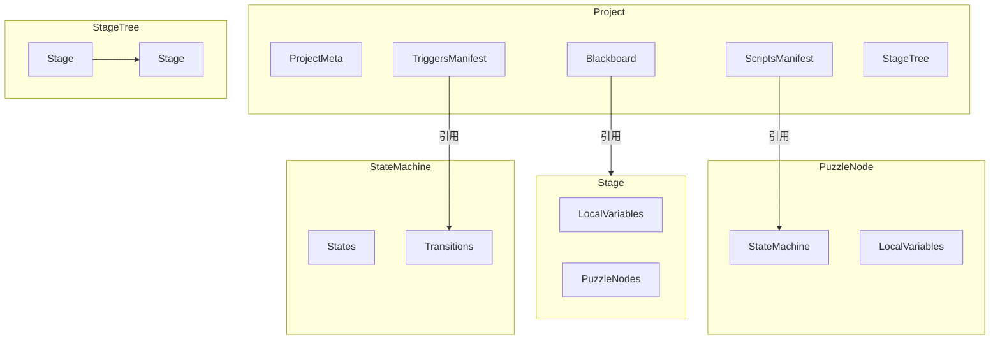

# 领域模型（Domain Model）

> 本文档描述项目的核心数据结构和类型定义，与 `types/*` 代码保持同步。
>
> **版本**: 1.0.0 | **更新时间**: 2025-12-09 | **覆盖任务**: P1-T01, P1-T02

---

## 1. 核心概念

### 1.1 资源分类

| 分类 | 说明 | 示例 |
|------|------|------|
| **黑板资源（唯一）** | 全局定义，被各处引用 | Script, Trigger, Event, Global Variable |
| **结构实体（可实例化）** | 可在项目中多次创建 | Stage, PuzzleNode, State, Transition |
| **复合结构** | 嵌套的数据结构 | StateMachine, PresentationGraph, ConditionExpression |
| **元数据枚举** | 类型标识符 | ResourceState, VariableScope, ScriptCategory |

### 1.2 概念关系图



---

## 2. ID/Key 与引用规则

- **ID 前缀（内部稳定引用）**
  - `proj-*` 项目；`stage-*` 阶段；`node-*` 解谜节点
  - `fsm-*` 状态机，`state-*` 状态，`trans-*` 转移
  - `pres-*` 演出子图，`pnode-*` 演出节点
  - `script-*` 脚本；触发器/事件/变量推荐 `trigger-*` / `event-*` / `var-*` 或约定俗成大写 token
- **Key（重命名稳定）**：脚本、触发器、变量、事件都携带 `key`，供外部或兼容场景稳定引用。
- **引用方式**：在项目内部一律用 `id` 字段；变量引用必须带 `scope`（`Global | StageLocal | NodeLocal | Temporary`）。若未来需要兼容重命名，可在 API 边界使用 `StableRef = {id}|{key}` 再解析为 `id`。

---

## 3. 顶层 JSON Manifest 结构

```json
{
  "manifestVersion": "1.0.0",
  "exportedAt": "2025-12-09T00:00:00.000Z",
  "project": {
    "meta": {
      "id": "proj-xxx",
      "name": "项目名称",
      "description": "项目描述",
      "version": "0.0.1",
      "createdAt": "2025-12-09T00:00:00.000Z",
      "updatedAt": "2025-12-09T00:00:00.000Z"
    },
    "blackboard": {
      "globalVariables": { /* VariableId -> VariableDefinition */ },
      "events": { /* EventId -> EventDefinition */ }
    },
    "scripts": {
      "version": "1.0.0",
      "scripts": { /* ScriptId -> ScriptDefinition */ }
    },
    "triggers": {
      "triggers": { /* TriggerId -> TriggerDefinition */ }
    },
    "stageTree": {
      "rootId": "stage-root",
      "stages": { /* StageId -> StageNode */ }
    },
    "nodes": { /* PuzzleNodeId -> PuzzleNode */ },
    "stateMachines": { /* StateMachineId -> StateMachine */ },
    "presentationGraphs": { /* PresentationGraphId -> PresentationGraph */ }
  }
}
```

---

## 4. 主要类型概要（与代码同步）

```ts
// 通用基础
type ResourceState = 'Draft' | 'Implemented' | 'MarkedForDelete';
type VariableType = 'boolean' | 'integer' | 'float' | 'string' | 'enum';
type VariableScope = 'Global' | 'StageLocal' | 'NodeLocal' | 'Temporary';
type ScriptCategory = 'Performance' | 'Lifecycle' | 'Condition' | 'Trigger';

interface Entity { id: string; name: string; description?: string; }

type ValueSource =
  | { type: 'Constant'; value: any }
  | { type: 'VariableRef'; variableId: string; scope: VariableScope };

interface ParameterModifier {
  targetVariableId: string;
  targetScope: VariableScope;
  operation: 'Set' | 'Add' | 'Subtract';
  source: ValueSource;
}

interface ParameterBinding { paramName: string; source: ValueSource; }

type PresentationBinding =
  | { type: 'Script'; scriptId: string; parameters: ParameterBinding[] }
  | { type: 'Graph'; graphId: string };

type EventAction =
  | { type: 'InvokeScript'; scriptId: string; parameters?: ParameterBinding[] }
  | { type: 'ModifyParameter'; modifier: ParameterModifier };

interface EventListener { eventId: string; action: EventAction; }
```

### 4.1 黑板资源
```ts
interface VariableDefinition extends Entity {
  id: string;
  key: string;
  type: VariableType;
  defaultValue: any;
  enumOptions?: string[];
  state: ResourceState;
  scope: VariableScope;
}

interface EventDefinition extends Entity { id: string; key: string; state: ResourceState; }

interface ScriptParameterDefinition {
  name: string;
  type: VariableType | 'asset' | 'nodeReference';
  required: boolean;
  defaultValue?: any;
  options?: string[];
}

interface ScriptDefinition extends Entity {
  id: string;
  key: string;
  category: ScriptCategory;
  parameters: ScriptParameterDefinition[];
  state: ResourceState;
}
```

### 4.2 阶段树
```ts
interface StageNode extends Entity {
  id: string;               // stage-*
  parentId: string | null;  // stage-*
  childrenIds: string[];    // stage-*
  isInitial?: boolean;
  localVariables: Record<string, VariableDefinition>;
  unlockCondition?: ConditionExpression;
  lifecycleScriptId?: string;  // script-*
  onEnterPresentation?: PresentationBinding;
  onExitPresentation?: PresentationBinding;
  eventListeners: EventListener[];
  isExpanded?: boolean;
}

interface StageTreeData { rootId: string; stages: Record<string, StageNode>; }
```

### 4.3 解谜节点
```ts
interface PuzzleNode extends Entity {
  id: string;              // node-*
  stageId: string;         // stage-*
  stateMachineId: string;  // fsm-*
  localVariables: Record<string, VariableDefinition>;
  onCreateScriptId?: string;
  onDestroyScriptId?: string;
  eventListeners: EventListener[];
}
```

### 4.4 状态机
```ts
interface StateMachine {
  id: string;                      // fsm-*
  initialStateId: string | null;   // state-*
  states: Record<string, State>;
  transitions: Record<string, Transition>;
}

interface State extends Entity {
  id: string;                // state-*
  position: { x: number; y: number };
  onEnterScriptId?: string;  // script-*
  onExitScriptId?: string;   // script-*
  eventListeners: EventListener[];
}

interface TriggerConfig {
  type: 'Always' | 'OnEvent' | 'CustomScript';
  eventId?: string;    // event-*
  scriptId?: string;   // script-*（自定义触发脚本）
}

interface Transition extends Entity {
  id: string;                 // trans-*
  fromStateId: string;        // state-*
  toStateId: string;          // state-*
  fromSide?: 'top' | 'right' | 'bottom' | 'left';
  toSide?: 'top' | 'right' | 'bottom' | 'left';
  priority: number;
  triggers: TriggerConfig[];
  condition?: ConditionExpression;
  presentation?: PresentationBinding;
  parameterModifiers: ParameterModifier[];
}
```

### 4.5 条件表达式
```ts
interface ConditionExpression {
  type: 'AND' | 'OR' | 'NOT' | 'COMPARISON' | 'LITERAL' | 'VARIABLE_REF' | 'SCRIPT_REF';
  children?: ConditionExpression[];
  operand?: ConditionExpression;
  operator?: '==' | '!=' | '>' | '<' | '>=' | '<=';
  left?: ConditionExpression;
  right?: ConditionExpression;
  value?: any;
  variableId?: string;
  variableScope?: VariableScope;
  scriptId?: string; // 自定义条件脚本
}
```

### 4.6 演出子图
```ts
type PresentationNodeType = 'ScriptCall' | 'Wait' | 'Branch' | 'Parallel';

interface PresentationNode extends Entity {
  id: string;                  // pnode-*
  type: PresentationNodeType;
  position: { x: number; y: number };
  scriptId?: string;
  parameters?: ParameterBinding[];
  duration?: number;
  nextIds: string[];           // pnode-*
}

interface PresentationGraph extends Entity {
  id: string;                        // pres-*
  startNodeId: string | null;        // pnode-*
  nodes: Record<string, PresentationNode>;
}
```

### 4.7 项目数据
```ts
interface ProjectMeta {
  id: ProjectId;
  name: string;
  description?: string;
  version: string;
  createdAt: string;  // ISO8601
  updatedAt: string;  // ISO8601
}

interface ProjectData {
  meta: ProjectMeta;
  blackboard: BlackboardData;
  scripts: ScriptsManifest;
  triggers: TriggersManifest;  // 触发器类型清单
  stageTree: StageTreeData;
  nodes: Record<PuzzleNodeId, PuzzleNode>;
  stateMachines: Record<StateMachineId, StateMachine>;
  presentationGraphs: Record<PresentationGraphId, PresentationGraph>;
}

interface ExportManifest {
  manifestVersion: '1.0.0';
  exportedAt: string;  // ISO8601
  project: ProjectData;
}
```

---

## 5. 唯一性与引用约束

- **全局唯一**：Script/Trigger/Event，`globalVariables` 的 key/ID。
- **局部唯一**：
  - Stage Local Variable：同一 Stage 内 key 不重复
  - Node Local Variable：同一 PuzzleNode 内 key 不重复
  - State / Transition：限定在所属 StateMachine 内唯一
  - PresentationNode：限定在所属 PresentationGraph 内唯一
- **引用必须携带作用域**：凡是 `variableId` 引用，须带 `variableScope`，禁止通过名称解析。

---

## 6. 与现代码的对齐要点

- 所有模型已在 `types/identity.ts` 定义模板字符串 ID/Key；文档中的 ID 前缀与代码一致。
- `ProjectData` 使用 `nodes`（非 puzzleNodes）字段；黑板脚本清单为 `scripts`（`ScriptsManifest`）。
- 所有引用字段均使用 `id`，`key` 仅作稳定标识或外部兼容，不参与运行时解析。
