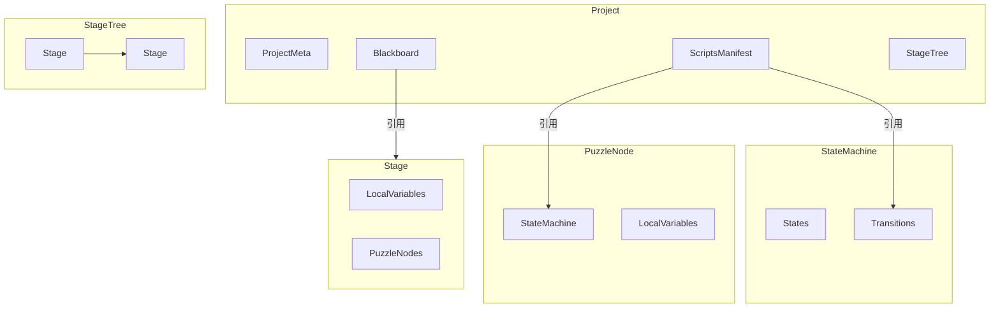

# 领域模型（Domain Model）
> 本文档描述项目的核心数据结构与类型定义，需与 `types/*` 代码保持同步。  
> **版本**: 1.3.0 | **更新时间**: 2026-01-09 | **同步至**: 移除冗余的 TriggersManifest，触发器脚本统一使用 ScriptsManifest 管理

---

## 1. 基础概览

### 1.1 资源分类

| 分类 | 说明 | 示例 |
|------|------|------|
| **基础资源（不可实例化）** | 全局定义，被各处引用 | Script、Event、Global Variable |
| **结构实体（可实例化）** | 在项目中可多次创建 | Stage、PuzzleNode、State、Transition |
| **复合结构** | 嵌套的数据结构 | StateMachine、PresentationGraph、ConditionExpression |
| **枚举数据集合** | 类型标识符 | ResourceState、VariableScope、ScriptCategory |

### 1.2 模型关系图


---

## 2. ID/Key 与引用规则

- **ID 前缀（内部强约束）**
  - `proj-*` 项目，`stage-*` 阶段，`node-*` 解谜节点
  - `fsm-*` 状态机，`state-*` 状态，`trans-*` 转移
  - `pres-*` 演出图，`pnode-*` 演出节点
  - `script-*` 脚本（包含触发器类型）；事件/变量推荐 `event-*` / `var-*`
- **Key（稳定标识，需唯一）**：脚本、变量、事件都携带 `key`，用于外部或跨版本兼容。
- **引用方式**：项目内部统一使用 `id` 字段；变量引用必须携带 `scope`（Global | StageLocal | NodeLocal | Temporary）。如需兼容 key，可在 API 层引入 `StableRef = {id}|{key}` 再解析为 `id`。

---

## 3. 顶层 JSON Manifest 结构

```json
{
  "manifestVersion": "1.0.0",
  "exportedAt": "2025-12-09T00:00:00.000Z",
  "project": {
    "meta": { "...": "..." },
    "blackboard": { "globalVariables": {}, "events": {} },
    "scripts": { "version": "1.0.0", "scripts": {} },
    "stageTree": { "rootId": "stage-root", "stages": {} },
    "nodes": {},
    "stateMachines": {},
    "presentationGraphs": {}
  }
}
```

---

## 4. 主要类型摘要（与代码同步）

```ts
// 通用基础
type ResourceState = 'Draft' | 'Implemented' | 'MarkedForDelete';
type VariableType = 'boolean' | 'integer' | 'float' | 'string';
type VariableScope = 'Global' | 'StageLocal' | 'NodeLocal' | 'Temporary';
type ScriptCategory = 'Performance' | 'Lifecycle' | 'Condition' | 'Trigger';

interface Entity { id: string; name: string; description?: string; }

type ValueSource =
  | { type: 'Constant'; value: any }
  | { type: 'VariableRef'; variableId: string; scope: VariableScope };

interface ParameterModifier {
  targetVariableId: string;
  targetScope: VariableScope;
  operation: 'Set' | 'Add' | 'Subtract' | 'Multiply' | 'Divide' | 'Toggle';
  source: ValueSource;
}

interface ParameterBinding {
  paramName: string;
  source: ValueSource;
  id?: string;                       // 前端渲染辅助 ID
  kind?: 'Variable' | 'Temporary';   // 参数来源类型
  description?: string;              // 参数描述
  tempVariable?: {                   // 临时参数元数据，仅当 kind === 'Temporary'
    id: string;
    name: string;
    type: VariableType;
    description?: string;
  };
}

type PresentationBinding =
  | { type: 'Script'; scriptId: string; parameters: ParameterBinding[] }
  | { type: 'Graph'; graphId: string };

type EventAction =
  | { type: 'InvokeScript' } // 隐式调用当前对象绑定的生命周期脚本
  | { type: 'ModifyParameter'; modifiers: ParameterModifier[] };

interface EventListener { eventId: string; action: EventAction; }
```

### 4.1 基础资源
```ts
// 资产名（assetName）用于生成代码标识符，遵循变量命名规则：字母/下划线开头，只含字母数字下划线
interface VariableDefinition extends Entity {
  id: string;
  assetName?: string;    // 资产名（可选）
  type: VariableType;
  value: any;            // 变量的当前值
  state: ResourceState;
  scope: VariableScope;
  displayOrder?: number; // 显示顺序
}

interface EventDefinition extends Entity {
  id: string;
  assetName?: string;    // 资产名（可选）
  state: ResourceState;
  displayOrder?: number; // 显示顺序
}

// 演出脚本的参数由用户在绑定时动态配置，不预定义在脚本中
interface ScriptDefinition extends Entity {
  id: string;
  assetName?: string;    // 资产名（可选）
  category: ScriptCategory;
  lifecycleType?: LifecycleScriptTarget;     // 仅 Lifecycle 类型有效
  state: ResourceState;
  displayOrder?: number; // 显示顺序
}
```

### 4.2 阶段树
```ts
interface StageNode extends Entity {
  id: string;               // stage-*
  assetName?: string;       // 资产名（可选）
  parentId: string | null;  // stage-*
  childrenIds: string[];    // stage-*
  isInitial?: boolean;      // 每个父级的首个子节点应标记为 true
  localVariables: Record<string, VariableDefinition>;
  unlockTriggers?: TriggerConfig[]; // 解锁触发器
  unlockCondition?: ConditionExpression;
  lifecycleScriptId?: string;  // script-*
  onEnterPresentation?: PresentationBinding;
  onExitPresentation?: PresentationBinding;
  eventListeners: EventListener[];
  isExpanded?: boolean;        // UI 展开状态（持久化）
}

interface StageTreeData { rootId: string; stages: Record<string, StageNode>; }
```

### 4.3 解谜节点
```ts
interface PuzzleNode extends Entity {
  id: string;              // node-*
  assetName?: string;      // 资产名（可选）
  stageId: string;         // stage-*
  stateMachineId: string;  // fsm-*
  localVariables: Record<string, VariableDefinition>;
  lifecycleScriptId?: string;  // script-* 生命周期脚本
  eventListeners: EventListener[];
  displayOrder?: number;       // 显示顺序
}
```

### 4.4 状态机
```ts
interface StateMachine {
  id: string;                      // fsm-*
  initialStateId: string | null;   // state-*
  states: Record<string, State>;
  transitions: Record<string, Transition>;
  displayOrder?: number;           // 显示顺序
}

interface State extends Entity {
  id: StateId;               // state-*
  assetName?: string;        // 资产名（可选）
  position: Vector2;         // 画布坐标
  lifecycleScriptId?: ScriptId; // 统一的生命周期脚本（含进入/退出回调，由脚本内部处理）
  eventListeners: EventListener[];
}

interface TriggerConfig {
  type: 'Always' | 'OnEvent' | 'CustomScript' | 'HandledByScript';
  eventId?: string;    // event-*（OnEvent 类型）
  scriptId?: string;   // script-*（CustomScript 类型）
  // HandledByScript：由后端代码手动触发，无需额外参数
}

interface Transition extends Entity {
  id: string;                 // trans-*
  fromStateId: string;        // state-*
  toStateId: string;          // state-*
  fromSide?: 'top' | 'right' | 'bottom' | 'left';
  toSide?: 'top' | 'right' | 'bottom' | 'left';
  priority: number;
  triggers: TriggerConfig[];
  condition?: ConditionExpression;
  presentation?: PresentationBinding;
  invokeEventIds?: string[];  // event-*（Event Invoker：转移执行时触发的事件，可多个）
  parameterModifiers: ParameterModifier[];
}
```

### 4.5 条件表达式
```ts
interface ConditionExpression {
  type: 'AND' | 'OR' | 'NOT' | 'COMPARISON' | 'LITERAL' | 'SCRIPT_REF';
  children?: ConditionExpression[];
  operand?: ConditionExpression;
  operator?: '==' | '!=' | '>' | '<' | '>=' | '<=';
  left?: ValueSource;
  right?: ValueSource;
  value?: boolean;   // Literal 仅用于 boolean (Always True/False)
  scriptId?: string; // 自定义条件脚本
}
```

### 4.6 演出子图
```ts
type PresentationNodeType = 'PresentationNode' | 'Wait' | 'Branch' | 'Parallel';

interface PresentationNode extends Entity {
  id: string;                  // pnode-*
  type: PresentationNodeType;
  position: { x: number; y: number };
  presentation?: PresentationBinding; // 统一演出绑定（脚本或子图）
  duration?: number;
  nextIds: string[];           // pnode-*
  condition?: ConditionExpression; // Branch 类型：分支条件
}

interface PresentationGraph extends Entity {
  id: string;                        // pres-*
  startNodeId: string | null;        // pnode-*
  nodes: Record<string, PresentationNode>;
  edgeProperties?: Record<string, PresentationEdgeProperties>; // 连线视觉属性
  displayOrder?: number;             // 显示顺序
}
```

### 4.7 项目数据
```ts
interface ProjectMeta {
  id: ProjectId;
  name: string;
  description?: string;
  version: string;
  createdAt: string;  // ISO8601
  updatedAt: string;  // ISO8601
  exportFileName?: string;  // 自定义导出文件名
  exportPath?: string;      // 项目导出目录路径
}

interface ProjectData {
  meta: ProjectMeta;
  blackboard: BlackboardData;
  scripts: ScriptsManifest;  // 包含所有类型：Performance、Lifecycle、Condition、Trigger
  stageTree: StageTreeData;
  nodes: Record<PuzzleNodeId, PuzzleNode>;
  stateMachines: Record<StateMachineId, StateMachine>;
  presentationGraphs: Record<PresentationGraphId, PresentationGraph>;
}


```

---

## 5. 唯一性与引用约束

- **全局唯一**：Script / Event，`globalVariables` 的 key/ID。
- **局部唯一**：
  - Stage Local Variable：同一 Stage 内 key 不重复
  - Node Local Variable：同一 PuzzleNode 内 key 不重复
  - State / Transition：限定在所属 StateMachine 内唯一
  - PresentationNode：限定在所属 PresentationGraph 内唯一
- **引用必须携带作用域**：凡是 `variableId` 引用，需带 `variableScope`，禁止通过名称解析。

---

## 6. UI 消息堆栈模型

- **UiMessage**
  - `id: string`（唯一标识）
  - `level: 'info' | 'warning' | 'error'`
  - `text: string`（可读提示）
  - `timestamp: ISO8601 string`
- **存储位置**：`ui.messages: UiMessage[]`，所有全局提示（加载/导入/校验/保存等）都需写入；支持清空。
- **展示**：顶栏 `Messages` 下拉列表，按时间倒序显示，可一键清空。

---

## 7. Store 状态结构

编辑器全局状态 `EditorState` 由以下部分组成（通过 7 个 Slice 管理）：

```ts
interface EditorState {
  // 项目数据（projectSlice 管理）
  project: {
    isLoaded: boolean;
    meta: ProjectMeta;
    stageTree: StageTreeData;
    nodes: Record<PuzzleNodeId, PuzzleNode>;
    stateMachines: Record<StateMachineId, StateMachine>;
    presentationGraphs: Record<PresentationGraphId, PresentationGraph>;
    blackboard: BlackboardData;
    scripts: ScriptsManifest;
  };
  
  // 历史记录（主 reducer 管理）
  history: {
    past: ProjectContent[];   // Undo 栈
    future: ProjectContent[]; // Redo 栈
  };
  
  // 全局可用脚本清单（blackboardSlice 管理）
  manifest: {
    scripts: ScriptDefinition[];
    isLoaded: boolean;
  };
  
  // UI 状态（uiSlice, navigationSlice 管理）
  ui: {
    isLoading: boolean;
    errorMessage?: string | null;
    readOnly: boolean;
    view: 'EDITOR' | 'BLACKBOARD';
    currentStageId: string | null;
    currentNodeId: string | null;
    currentGraphId: string | null;
    lastEditorContext: { stageId: string | null; nodeId: string | null };
    navStack: { stageId: string | null; nodeId: string | null; graphId: string | null }[];
    stageExpanded: Record<string, boolean>;
    messages: UiMessage[];  // 全局消息堆栈
    blackboardView: { /* 黑板视图状态 */ };
    selection: { /* 选择状态 */ };
    panels: { explorerWidth: number; inspectorWidth: number; stagesHeight: number };
  };
}
```

**Store Slices 职责划分**：
- **fsmSlice**: 状态机、状态、转移的 CRUD
- **presentationSlice**: 演出图、节点、连线的 CRUD
- **nodeParamsSlice**: 节点局部变量管理
- **blackboardSlice**: 全局变量、事件、脚本的 CRUD 与软删除
- **navigationSlice**: 视图切换、面包屑导航
- **projectSlice**: Stage 树、Node 更新
- **uiSlice**: 选择状态、面板大小、消息堆栈

---

## 8. 与现代表达的对齐要求

- 所有模型已在 `types/identity.ts` 定义模板字符型 ID/Key；文档中的 ID 前缀与代码一致。
- `ProjectData` 使用 `nodes`（非 puzzleNodes）字段；黑板脚本清单为 `scripts`（`ScriptsManifest`）。
- 所有引用字段均使用 `id`，`key` 仅作稳定标识或外部兼容，不参与运行时解析。
